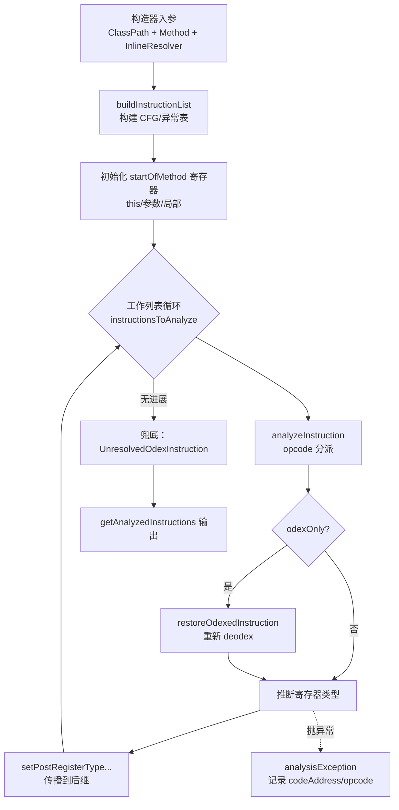
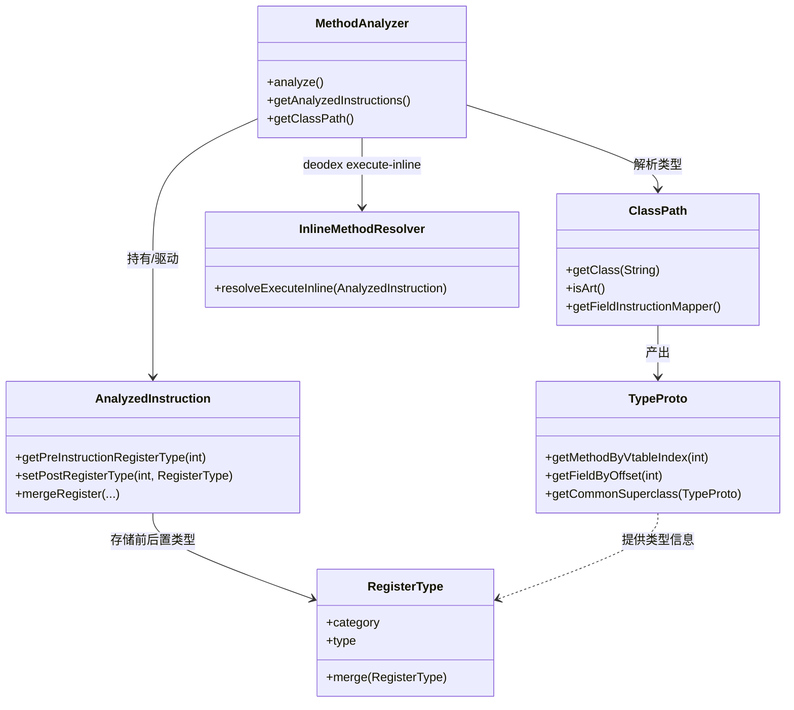

# 🔍 MethodAnalyzer 指令分析与类型推断

`MethodAnalyzer` 是 `org.jf.dexlib2.analysis` 包的方法级分析中枢。它对一条 `Method` 的指令流做三件事：

1. **类型推断** — 为每条指令的每个寄存器推断前/后置类型（`RegisterType`），用于 baksmali 反汇编时输出更精确的寄存器类型信息。
2. **去 odex 化（deodex）** — 将 `odexOnly()` 的优化指令（如 `iget-quick`、`invoke-virtual-quick`、`execute-inline`）还原为标准 dalvik 指令，依赖运行时 vtable/字段偏移与 `ClassPath` 解析。
3. **校验** — 在方法完全分析完毕后做一次校验（与推断分离，避免重复执行）。

源码位置：`dexlib2/src/main/java/org/jf/dexlib2/analysis/MethodAnalyzer.java`。

> ⚠️ 前置条件：调用前必须先用 `ClassPath.initClassPath` 初始化类路径，否则 odex 解析会抛 `AnalysisException`（见 `MethodAnalyzer.java:1578`）。

## 🧩 类的角色定位

构造器即触发分析（`MethodAnalyzer.java:98-131`）：构造完成后结果只读。它本身不输出 smali，而是产出 `AnalyzedInstruction` 列表，供 baksmali 的 `Adaptors` 消费。ART 下还实现了 `instance-of` + `if-eqz/if-nez` 的窥孔优化类型收窄（`MethodAnalyzer.java:1241`）。

## 📦 关键字段

| 字段 | 类型 | 作用 |
|---|---|---|
| `method` / `methodImpl` | `Method` / `MethodImplementation` | 被分析的方法及其实现（不可为 null） |
| `classPath` | `ClassPath` | 类路径，提供 `TypeProto`、vtable、字段偏移解析 |
| `inlineResolver` | `InlineMethodResolver` | 仅 deodex 时非 null，用于 `execute-inline` 解析 |
| `normalizeVirtualMethods` | `boolean` | 是否将虚方法引用归一化到实际实现类 |
| `analyzedInstructions` | `SparseArray<AnalyzedInstruction>` | 按代码地址索引的指令表 |
| `analyzedState` | `BitSet` | 已完成分析的指令位图 |
| `startOfMethod` | `AnalyzedInstruction` | 哑指令（NOP），承载入口寄存器初值（`this`/参数）向后续传播 |
| `analysisException` | `AnalysisException` | 分析期间捕获的异常，可由 `getAnalysisException()` 取出 |

## ⚙️ 关键方法

| 方法 | 作用 | 备注 |
|---|---|---|
| `analyze()` | 主分析循环：初始化入口寄存器 → 工作列表迭代 → 兜底处理无法解析的 odex | `MethodAnalyzer.java:138` |
| `buildInstructionList()` | 构建指令表、异常处理表、前驱/后继图 | 处理 switch/fill-array-data/try 块 |
| `analyzeInstruction(AnalyzedInstruction)` | 按 opcode 分派的类型推断与 deodex 总入口 | 返回 `false` 表示对象寄存器为 null 暂缓；`MethodAnalyzer.java:607` |
| `propagateChanges(BitSet,int,boolean)` | 将寄存器类型变更沿后继图传播 | 用工作列表避免深递归 |
| `setPostRegisterTypeAndPropagateChanges(...)` | 设置后置类型并传播，处理 wide 对 | `MethodAnalyzer.java:399` |
| `analyzeIfEqzNez(...)` | ART 下 `instance-of` 后的类型收窄 | `canPropagateTypeAfterInstanceOf` 判定非宽化转换 |
| `analyzeIputIgetQuick(...)` | `*-quick` 字段按偏移还原为标准 iget/iput | 处理不可访问类的层级上溯 |
| `analyzeInvokeVirtualQuick(...)` | `invoke-virtual-quick/super-quick` 按 vtable 索引还原 | `MethodAnalyzer.java:1777` |
| `analyzeExecuteInline(...)` | `execute-inline` 经 `inlineResolver` 还原为标准 invoke | `MethodAnalyzer.java:1577` |
| `normalizeMethodReference(...)` | 虚方法引用上溯至可见的最深实现 | 受 `normalizeVirtualMethods` 控制 |
| `getAnalyzedInstructions()` / `getInstructions()` | 取结果（含/不含分析元信息） | 前者返回 `AnalyzedInstruction` |
| `isNotWideningConversion(...)` | 判断类型转换是否非宽化（instance-of 收窄用） | 静态方法 |

## 🔄 分析数据流



## 🗂️ 与相关类的协作



## 📐 典型用法

构造器内即完成全部分析，无需显式调 `analyze()`：

```java
// 前置：ClassPath 必须已初始化
ClassPath classPath = ClassPath.InitializeClassPath(...);

// 构造即分析；inlineResolver 仅 deodex 时传入，否则 null
MethodAnalyzer analyzer = new MethodAnalyzer(
        classPath,
        method,
        inlineMethodResolver,   // deodex 时非 null
        /* normalizeVirtualMethods */ true);

// 取带类型信息的指令列表
List<AnalyzedInstruction> analyzed = analyzer.getAnalyzedInstructions();

// 取 deodex 后的标准指令流（供反汇编输出）
List<Instruction> instructions = analyzer.getInstructions();

// 检查分析期是否抛异常（不致命，可继续）
AnalysisException ex = analyzer.getAnalysisException();
```

## 🧩 源码要点

- **入口寄存器初始化**（`MethodAnalyzer.java:149-171`）：非 static 方法把 `this` 寄存器置为 `REFERENCE`（构造器置 `UNINIT_THIS`），其余局部寄存器置 `UNINIT`，再通过 `startOfMethod` 的后继传播。
- **暂缓语义**：`analyzeInstruction` 返回 `false` 表示对象寄存器为 `NULL`，无法解析 odex，标记到 `undeodexedInstructions`，下一轮带更多类型信息时重试（`MethodAnalyzer.java:200-206`）。
- **wide 对处理**：`LONG_LO`/`DOUBLE_LO` 设定后自动配对设定 `*_HI`，并校验寄存器对边界（`checkWidePair`，`MethodAnalyzer.java:1960`）。
- **ART 窥孔优化**：`instance-of` 紧跟 `if-eqz/if-nez` 时，按分支方向收窄对象寄存器类型，复刻 ART verifier 行为（`MethodAnalyzer.java:1241-1281`）。
- **不可访问类上溯**：`*-quick` 解析时若目标类不可访问，沿父类链找到第一个可访问类再用同一 vtable 索引/字段偏移重解析（`MethodAnalyzer.java:1700-1724`、`1831-1859`）。
- **`ReparentedMethodReference`**：当解析出的方法属于接口时，用内部静态类改写 `definingClass` 为对象寄存器类型，保证反汇编输出正确（`MethodAnalyzer.java:2007`）。

## 延伸阅读

- baksmali deodex 命令
