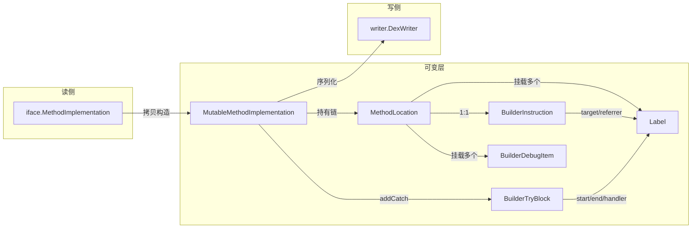

# 📦 MutableMethodImplementation — 可变方法体

`org.jf.dexlib2.builder.MutableMethodImplementation`（源码：`dexlib2/src/main/java/org/jf/dexlib2/builder/MutableMethodImplementation.java`）是 `builder` 包里**可变方法体**的核心容器，实现只读接口 `org.jf.dexlib2.iface.MethodImplementation`。它把一条方法的指令序列建模成一条 `MethodLocation` 链（每条指令一个位置，链尾挂一个 null 指令的空位代表方法末尾），并以此承载 try/catch 与 debug 信息。

它是连接 `iface/`（读）与 `writer/`（写）之间的**编辑中转站**：既能用 `MutableMethodImplementation(MethodImplementation)` 把任意已读出的方法体包进来原地改写，也能用 `MutableMethodImplementation(int registerCount)` 从零开始逐条 `addInstruction` 拼装新方法体——这正是 smali 树 walker（`smali/src/main/antlr/smaliTreeWalker.g`）组装指令的目标落点。

## 🧩 角色定位

| 维度 | 说明 |
|---|---|
| 所在包 | `org.jf.dexlib2.builder` |
| 实现接口 | `iface.MethodImplementation`（`getRegisterCount` / `getInstructions` / `getTryBlocks` / `getDebugItems`） |
| 上游输入 | 任意 `MethodImplementation`（`DexBacked*` 或 `Immutable*`） |
| 下游消费 | `writer/builder/` 与 `writer/pool/` 的 `DexWriter` 子序列化器 |
| 可变性来源 | `BuilderInstruction` + `Label` + `MethodLocation` 三元组 |
| 修正时机 | 惰性——结构性改动只置脏 `fixInstructions`，读取时才统一算地址 |

## 🔄 与相关类的协作



## 🗂️ 关键字段

| 字段 | 类型 | 作用 | 源码位置 |
|---|---|---|---|
| `registerCount` | `int` (final) | 寄存器总数，构造时定死 | `MutableMethodImplementation.java:57` |
| `instructionList` | `ArrayList<MethodLocation>` | 指令位置链，初始含一个代表"方法起点"的空位 | `:58` |
| `tryBlocks` | `ArrayList<BuilderTryBlock>` | try 块集合，start/end/handler 全用 Label | `:59` |
| `fixInstructions` | `boolean` | 脏标记，true 表示下次读取需重算地址/对齐/降级 GOTO | `:60` |

> 注意 `instructionList` 始终以一个 null 指令的 `MethodLocation` 收尾，这个"空位"既是方法末尾的标签锚点，也使 `addInstruction(末尾)` 无需特判（见 `:204-214`）。

## ⚙️ 关键方法

| 方法 | 作用 | 备注 |
|---|---|---|
| `MutableMethodImplementation(MethodImplementation)` | 从既有方法体拷贝构造，重建 Location 链、try、debug | switch payload 延后转换以保证引用标签已建好（`:82-103`） |
| `MutableMethodImplementation(int registerCount)` | 空方法体构造 | 用于从零拼装 |
| `getInstructions()` | 返回 `List<BuilderInstruction>` 视图 | 返回的是实时映射 instructionList 的 `AbstractList`，读取触发 `fixInstructions()`（`:139-163`） |
| `getTryBlocks()` | 返回不可变 try 列表 | 同样先 fix（`:165-170`） |
| `getDebugItems()` | 拼接所有 location 的 debug 项 | 迭代期间若再被改动会抛 `IllegalStateException`（`:172-187`） |
| `addInstruction(int index, BuilderInstruction)` | 在指定位置插入指令 | 重算后续 index/codeAddress，置脏（`:203-235`） |
| `addInstruction(BuilderInstruction)` | 末尾追加指令 | 占用链尾空位并新建新空位（`:237-246`） |
| `replaceInstruction(int index, BuilderInstruction)` | 原地替换 | 解绑旧指令 location、重算后续地址（`:248-275`） |
| `removeInstruction(int index)` | 删除指令 | `mergeInto` 把标签/debug 转嫁给下一位置（`:277-303`） |
| `swapInstructions(int i1, int i2)` | 交换两条指令 | 仅交换 location 内的 instruction 引用并重算区间地址（`:305-342`） |
| `addCatch(...)` | 追加 try 块 | 三个重载：`TypeReference` / `String` / catch-all（`:189-201`） |
| `newLabelForAddress(int codeAddress)` | 按字节地址建 Label | 用 `mapCodeAddressToIndex` 定位 location（`:513-520`） |
| `newLabelForIndex(int index)` | 按指令下建 Label | 直接取 location（`:522-529`） |
| `fixInstructions()`（private） | 重算地址、GOTO 降级、payload 对齐与回收 | 循环到稳定，结束置 `fixInstructions=false`（`:357-471`） |

## 📐 fixInstructions 的三件事

1. **switch payload 反查**：遍历 `SPARSE_SWITCH`/`PACKED_SWITCH`，校验其 target 必须是匹配类型的 `BuilderSwitchPayload`，并回填 `referrer`，禁止多对一（`:360-401`）。
2. **GOTO 降级**：`GOTO` 偏移越界 → `GOTO_16` → `GOTO_32`；`GOTO_16` 越界 → `GOTO_32`。用 `replaceInstruction` 重写后再循环（`:411-436`）。
3. **payload/数组对齐**：`*_PAYLOAD`/`ARRAY_PAYLOAD` 必须落在偶地址，否则移除前一 NOP 或插入 NOP；无人引用的 payload 直接删除（`:438-464`）。

## 🧱 典型用法

从既有方法体改写（注入一条返回指令）：

```java
MutableMethodImplementation impl =
        new MutableMethodImplementation(method.getImplementation());
Label retTarget = impl.newLabelForIndex(2);
impl.addInstruction(2, new BuilderInstruction11x(Opcode.MOVE_RESULT, 0));
impl.addInstruction(3, new BuilderInstruction11x(Opcode.RETURN, 0));
// 读取时自动触发 fixInstructions：重算地址、降级 GOTO、对齐 payload
List<? extends Instruction> out = impl.getInstructions();
```

从零拼装一个新方法体：

```java
MutableMethodImplementation impl = new MutableMethodImplementation(1);
Label loop = impl.newLabelForIndex(0);
impl.addInstruction(new BuilderInstruction12x(Opcode.ADD_INT, 0, 0));
impl.addInstruction(new BuilderInstruction10t(Opcode.GOTO, loop));
```

带异常处理：

```java
Label from = impl.newLabelForIndex(0);
Label to   = impl.newLabelForIndex(2);
Label hand = impl.newLabelForIndex(3);
impl.addCatch("Ljava/lang/NullPointerException;", from, to, hand);
```

## 🔍 源码要点

- **链尾空位约定**：`addInstruction`、`replaceInstruction`、`removeInstruction`、`swapInstructions` 的越界判断都用 `>= size()-1`，因为末尾那个 null 指令的 location 不算"真实指令"（`:207, :249, :278, :306`）。
- **地址重算循环**：结构性改动后，从改动点向后扫 `location.codeAddress += instruction.getCodeUnits()`，因此改动是 O(n)；适合批量改完再读，而非每改一条读一次（`:222-232, :261-272`）。
- **payload 延后转换**：拷贝构造时，`PACKED_SWITCH_PAYLOAD`/`SPARSE_SWITCH_PAYLOAD` 收集成 `Task` 最后执行，确保前面 switch 指令已经把引用标签放好（`:82-103`）。
- **switch 偏移基准**：`newBuilderPackedSwitchPayload` 用 `findSwitchForPayload` 找到 switch 指令的 codeAddress 作为 base，把绝对偏移换算回 Label（`:1007-1030`）。

## 延伸阅读

- [builder — 方法体构造层](./builder.md)
- [iface — 只读接口层](./iface.md)
- [iface/instruction 指令格式](./iface-instruction.md)
- [writer — 序列化层](./writer.md)
- [writer/builder 策略](./writer-builder.md)
