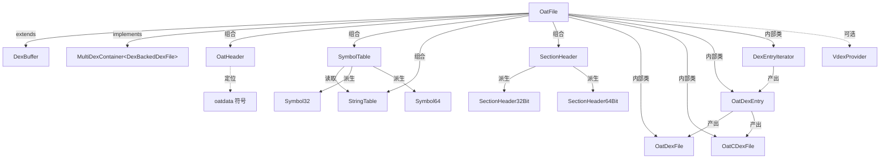

# 📦 OatFile — OAT 文件解析

`OatFile` 是 dexlib2 解析 Android ART 运行时 **OAT 文件**的入口。OAT 本质是一个 **ELF** 文件，内部嵌入了 `.dex` 文件及 ART 编译产物（quickening、boot image 等）。该类位于 `dexlib2/src/main/java/org/jf/dexlib2/dexbacked/OatFile.java:54`，继承 `DexBuffer` 并实现 `MultiDexContainer<DexBackedDexFile>`，对外暴露一个 **多 dex 容器**视图。

## 🧩 角色定位

- **ELF 解析器**：手工解析 32/64 位 ELF 头、节区表（Section Header）、符号表（Symbol Table）、字符串表，无需第三方 ELF 库。
- **OAT 头解析器**：通过 ELF 符号 `oatdata` 定位 OAT header，校验 `oat\n` 魔数与版本号。
- **多 dex 容器**：按版本相关的 dex 列表布局，逐条枚举内嵌 dex，支持传统 OAT 与新版 **vdex** 外挂容器。
- **opcode 版本映射**：依据 OAT 版本号经 `Opcodes.forArtVersion` 选定指令集，使 `DexBackedDexFile` 能正确解读优化指令。

## 🔄 类关系图



## 🗂️ 关键字段

| 字段 | 类型 | 说明 | 源码 |
| --- | --- | --- | --- |
| `ELF_MAGIC` | `byte[]` | ELF 魔数 `0x7f 'E' 'L' 'F'`，校验输入是否为 ELF | `OatFile.java:55` |
| `OAT_MAGIC` | `byte[]` | OAT 魔数 `'o','a','t','\n'`，校验 OAT header | `OatFile.java:56` |
| `MIN_OAT_VERSION` / `MAX_OAT_VERSION` | `int` | 已人工核对源码的版本区间（56–178），区间外视情况标记为 `UNSUPPORTED`/`UNKNOWN` | `OatFile.java:61-62` |
| `is64bit` | `boolean` | 来自 ELF `buf[4]`（1=32 位，2=64 位），决定节区/符号布局 | `OatFile.java:68` |
| `oatHeader` | `OatHeader` | 由 `oatdata` 符号定位的 OAT 头包装 | `OatFile.java:69` |
| `opcodes` | `Opcodes` | 由 ART 版本号导出的指令集 | `OatFile.java:70` |
| `vdexProvider` | `VdexProvider` | 可选回调，新版本（≥87）下提供 vdex 字节，dex 实际从 vdex 取 | `OatFile.java:71` |

## ⚙️ 关键方法

| 方法 | 作用 | 备注 |
| --- | --- | --- |
| `OatFile(byte[] buf, VdexProvider)` | 构造：校验 ELF 魔数、识别字长、查 `oatdata` 符号定位 OAT 头、校验 OAT 魔数、推导 `Opcodes` | 构造期即完成所有结构定位；`OatFile.java:77-114` |
| `fromInputStream(InputStream, VdexProvider)` | 流式加载：先读 4 字节头校验魔数再全量读入 | 要求流支持 `mark`；`OatFile.java:128-149` |
| `getOatVersion()` | 返回 OAT 版本号（3 位十进制字符串转 int） | `OatFile.java:151` |
| `isSupportedVersion()` | 返回 `SUPPORTED`/`UNSUPPORTED`/`UNKNOWN` 三态 | 仅区间内返回 `SUPPORTED`；`OatFile.java:155-164` |
| `getBootClassPath()` | 从 key-value store 读 `bootclasspath`，按 `:` 切分 | 版本 <75 返回空；`OatFile.java:166-176` |
| `getDexFiles()` | 惰性顺序列表，迭代时逐条产出 `DexBackedDexFile` | 基于 `DexEntryIterator`；`OatFile.java:178-195` |
| `getDexEntryNames()` | 同上，产出各 dex 的文件名 | `OatFile.java:197-213` |
| `getEntry(String)` | 按名查找单个 dex 条目 | `OatFile.java:215-226` |
| `OatHeader.getVersion()` | 从 header 偏移 +4 读 3 字符版本 | `OatFile.java:283-285` |
| `OatHeader.getKeyValue(String)` | 解析以 `\0` 分隔的 key-value 存储 | 用于 bootclasspath 等；`OatFile.java:306-338` |
| `OatHeader.getDexListStart()` | 计算 dex 列表起始偏移；≥127 走字段指针，否则紧随 header | `OatFile.java:340-346` |
| `getSymbolTable()` | 遍历节区，取 type=11（动态符号表）构造 `SymbolTable` | `OatFile.java:386-394` |

## 📐 结构布局要点

`DexEntryIterator`（`OatFile.java:610-677`）是版本差异最大的部分，按 OAT 版本号增减字段：

- ≥73：lookup table offset
- ≥75：class offsets table 指针；<75 则 class offsets 内联
- ≥87：若提供 `vdexProvider`，dex 字节改从 vdex 取，偏移不加 header
- ≥127：method bss mapping offset
- ≥131：dex sections layout offset
- ≥135：type/string bss mapping（8 字节）
- ≥138：`dexOffset==0` 表示该 dex 仍在 APK 内，跳过

`OatDexEntry.getDexFile()`（`OatFile.java:578-595`）按 cdex 魔数分流：cdex 走 `OatCDexFile`，否则用 `DexUtil.verifyDexHeader` 校验后构造 `OatDexFile`，二者均 `supportsOptimizedOpcodes() == true`。

## 🔍 典型用法

```java
// 从文件加载 OAT 并枚举内嵌 dex
try (RandomAccessFile raf = new RandomAccessFile("boot.oat", "r")) {
    byte[] buf = new byte[(int) raf.length()];
    raf.readFully(buf);
    OatFile oat = new OatFile(buf);
    if (oat.isSupportedVersion() != OatFile.SUPPORTED) {
        // 版本未核对，谨慎处理
    }
    for (DexBackedDexFile dex : oat.getDexFiles()) {
        // dex.supportsOptimizedOpcodes() == true
        for (ClassDef c : dex.getClasses()) { /* ... */ }
    }
}

// 流式加载（要求 markSupported）
OatFile oat = OatFile.fromInputStream(new BufferedInputStream(is));

// 按名定位单个 dex
OatFile.OatDexEntry entry = oat.getEntry("classes.dex");
if (entry != null) { DexBackedDexFile dex = entry.getDexFile(); }
```

> 注：`OatDexFile`/`OatCDexFile` 为包级可见的内部类，外部主要通过 `getDexFiles()`/`getEntry()` 获取实例。

## 🧩 与相关类的协作

- `DexFileFactory`：上层入口，对 `.oat`/`.odex`/`.vdex` 统一分发，最终构造 `OatFile`。
- `DexBackedDexFile` / `CDexBackedDexFile`：OAT 内嵌 dex 的实际解析器，由 `OatDexEntry` 实例化。
- `Opcodes.forArtVersion`：把 OAT 版本号映射到指令集，保证优化指令可读。
- `VdexProvider`：当 OAT 不直接含 dex（≥87）时，由调用方注入 vdex 字节，典型为 `DexFileFactory` 加载同名 `.vdex`。

## 延伸阅读

- baksmali CLI：`/home/cc11001100/github/android-security-engineer/smali-skills/website/cli.md`
- dexlib2 总览：`/home/cc11001100/github/android-security-engineer/smali-skills/website/reference/dexlib2/README.md`
