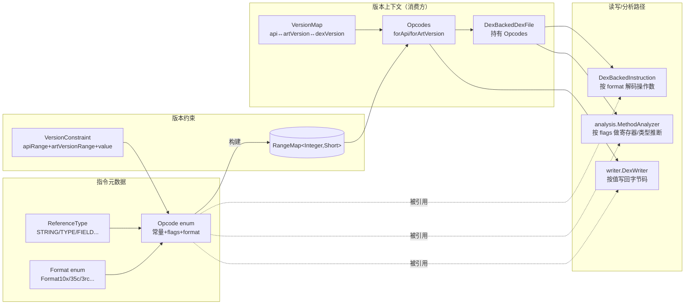

# 🧩 Opcode — Dalvik 指令枚举

`Opcode` 是 dexlib2 对 **每一条 Dalvik/ART 字节码指令**的静态描述。它是一个 `enum`，每个常量（如 `MOVE`、`INVOKE_VIRTUAL`、`IGET_QUICK`、`INVOKE_CUSTOM`）绑定一个或多个“字节码值 → 版本”约束，并附带助记名、引用类型、指令格式、行为标志位。该类位于 `dexlib2/src/main/java/org/jf/dexlib2/Opcode.java:42`。

与 [`Opcodes`](./opcodes.md) 的区别：`Opcode` 是**单条指令的元数据**（无版本上下文），`Opcodes` 则是**绑定到具体 API/ART 版本的指令集视图**——它在构造时遍历所有 `Opcode` 常量、查各自的 `RangeMap`，重建出该版本下值↔枚举的映射。

## 📐 角色定位

- **指令元数据表**：约 230 条常量，覆盖 dalvik 标准指令、odex/quick 指令、volatile 指令、ART 新增指令（`invoke-polymorphic`、`invoke-custom`、`const-method-handle` 等）以及三种 payload 伪指令。
- **版本感知**：同一条逻辑指令在不同版本下值可能不同（如 `RETURN_VOID_BARRIER` 在 dalvik 是 0xf1，在 ART r60 后被 `RETURN_VOID_NO_BARRIER` 的 0x73 取代）；`Opcode` 用 `VersionConstraint` 列表 + `RangeMap` 描述这种映射。
- **标志位压缩**：用 `int flags` 的位掩码记录 10 种行为（可抛异常、可继续、写寄存器、写宽寄存器、quick/volatile/static 字段访问、jumbo、可初始化引用等），避免类型爆炸。
- **零版本依赖**：枚举本身不锁定版本，所有版本相关查询交给 `Opcodes` 在持有版本上下文后完成。

## 🗂️ 关键字段

| 字段 | 类型 | 作用 |
|---|---|---|
| `name` | `String` | smali 助记名，如 `"invoke-virtual/range"`、`"const-string/jumbo"` |
| `referenceType` | `int` | 主引用类型（`ReferenceType.NONE/STRING/TYPE/FIELD/METHOD/METHOD_PROTO/CALL_SITE/METHOD_HANDLE`） |
| `referenceType2` | `int` | 第二引用类型，仅 `invoke-polymorphic` 用（同时引用 METHOD + METHOD_PROTO），其余为 `-1` |
| `format` | `Format` | 指令编码格式（如 `Format35c`、`Format3rc`、`ArrayPayload`），决定操作数布局与长度 |
| `flags` | `int` | 行为标志位掩码，见下表 |
| `apiToValueMap` | `RangeMap<Integer,Short>` | API 区间 → 字节码值；`Opcodes.forApi()` 据此查值 |
| `artVersionToValueMap` | `RangeMap<Integer,Short>` | ART 版本区间 → 字节码值；`Opcodes.forArtVersion()` 据此查值 |

## ⚙️ 行为标志位（flags 掩码）

定义于 `Opcode.java:318-338`。

| 常量 | 值 | 含义 |
|---|---|---|
| `CAN_THROW` | `0x1` | 指令可能抛异常（除零、NPE、类未找到等） |
| `ODEX_ONLY` | `0x2` | odex/ART 专用指令，标准 dex 中不应出现 |
| `CAN_CONTINUE` | `0x4` | 执行可继续到下一条（非无条件跳转/返回） |
| `SETS_RESULT` | `0x8` | 写入隐藏 result 寄存器（`invoke-*`、`filled-new-array`） |
| `SETS_REGISTER` | `0x10` | 写入第一个寄存器 |
| `SETS_WIDE_REGISTER` | `0x20` | 写入的寄存器是宽类型（long/double，占 2 槽） |
| `QUICK_FIELD_ACCESSOR` | `0x40` | `*get-quick`/`*put-quick` 指令（已解析字段偏移） |
| `VOLATILE_FIELD_ACCESSOR` | `0x80` | `*get-volatile`/`*put-volatile` 指令 |
| `STATIC_FIELD_ACCESSOR` | `0x100` | `sget-*`/`sput-*` 静态字段访问 |
| `JUMBO_OPCODE` | `0x200` | jumbo 变体（如 `const-string/jumbo`） |
| `CAN_INITIALIZE_REFERENCE` | `0x400` | 可初始化未初始化对象引用（`invoke-direct`、`invoke-direct-empty`） |

## 🔍 关键方法

| 方法 | 作用 | 备注 |
|---|---|---|
| `canThrow()` | 是否可抛异常 | `flags & CAN_THROW` |
| `canContinue()` | 是否可落到下一条指令 | 非跳转/返回指令为 true |
| `setsRegister()` / `setsWideRegister()` | 是否写第一寄存器 / 写宽寄存器 | 寄器分配分析依赖此标志 |
| `setsResult()` | 是否写 result 寄存器 | `move-result*` 紧随其后读取 |
| `odexOnly()` | 是否 odex/ART 专用 | baksmali 反汇编时给出 odex 标记 |
| `isQuickFieldaccessor()` / `isVolatileFieldAccessor()` / `isStaticFieldAccessor()` | 字段访问子类 | 反 odex（deodex）时用于识别待重写的指令 |
| `isJumboOpcode()` / `canInitializeReference()` | jumbo 变体 / 可初始化引用 | 类型推断/构造器调用分析使用 |
| `firstApi(v, api)` / `lastApi(...)` / `betweenApi(...)` / `firstArtVersion(...)` / `allApis(...)` / `allArtVersions(...)` / `combine(...)` | 构造 `VersionConstraint` 列表的工厂方法 | 私有，仅在枚举常量声明中调用 |

## 🔄 类关系



## 📦 枚举声明形式

每条常量按 `(值, 名, 引用类型, 格式, flags)` 声明；odex/ART 指令则改用 `firstApi/firstArtVersion/combine` 等 `VersionConstraint` 工厂方法替代裸值。摘录关键签名：

```java
// 标准指令：值在所有版本恒定
NOP(0x00, "nop", ReferenceType.NONE, Format.Format10x, Opcode.CAN_CONTINUE),

// odex 指令：仅在特定 API 区间存在，值可能随版本迁移
RETURN_VOID_BARRIER(
    combine(firstApi(0xf1, 11), lastArtVersion(0x73, 59)),
    "return-void-barrier", ReferenceType.NONE, Format.Format10x, Opcode.ODEX_ONLY),

// 双引用类型指令：invoke-polymorphic 同时引用 METHOD 与 METHOD_PROTO
INVOKE_POLYMORPHIC(
    firstArtVersion(0xfa, 87), "invoke-polymorphic",
    ReferenceType.METHOD, ReferenceType.METHOD_PROTO, Format.Format45cc,
    Opcode.CAN_THROW | Opcode.CAN_CONTINUE | Opcode.SETS_RESULT),

// payload 伪指令：值超出单字节，flags=0
ARRAY_PAYLOAD(0x300, "array-payload", ReferenceType.NONE, Format.ArrayPayload, 0);
```

构造器（`Opcode.java:369-394`）把 `VersionConstraint` 列表展开成两个 `ImmutableRangeMap`：

```java
Opcode(List<VersionConstraint> versionConstraints, String opcodeName,
       int referenceType, int referenceType2, Format format, int flags) {
    ImmutableRangeMap.Builder<Integer, Short> apiToValueBuilder = ImmutableRangeMap.builder();
    ImmutableRangeMap.Builder<Integer, Short> artVersionToValueBuilder = ImmutableRangeMap.builder();
    for (VersionConstraint vc : versionConstraints) {
        if (!vc.apiRange.isEmpty())
            apiToValueBuilder.put(vc.apiRange, (short) vc.opcodeValue);
        if (!vc.artVersionRange.isEmpty())
            artVersionToValueBuilder.put(vc.artVersionRange, (short) vc.opcodeValue);
    }
    this.apiToValueMap = apiToValueBuilder.build();
    this.artVersionToValueMap = artVersionToValueBuilder.build();
    // ...
}
```

## 🧭 典型消费场景

`Opcode` 本身只提供元数据，真正“按版本查值/查枚举”由 `Opcodes` 完成。读取 dex 时，`DexBackedDexFile` 先用 `Opcodes.forApi(api)` 构造版本视图，再由 `DexBackedInstruction` 子类按 `opcode.format` 解码操作数；分析阶段 `MethodAnalyzer` 依据 `flags` 判断寄存器读写与控制流；写回阶段 `DexWriter` 经 `Opcodes.getOpcodeValue()` 取回该版本下的字节码值。

```java
// 由 API 级别得到版本化的指令集（Opcodes 内部查各 Opcode 的 RangeMap）
Opcodes opcodes = Opcodes.forApi(28);

// 取该版本下 INVOKE_CUSTOM 的字节码值（ART r111+ 为 0xfc）
short value = opcodes.getOpcodeValue(Opcode.INVOKE_CUSTOM);

// 指令元数据查询（无需版本上下文）
if (opcode.canThrow())      { /* 接 try 块 */ }
if (opcode.setsRegister())  { /* 标记目标寄存器已定义 */ }
if (opcode.odexOnly())      { /* 反 odex 时需重写为标准 invoke/iget */ }
Format f = opcode.format;   // 据此选择 InstructionDecoder 子类
```

## 📝 源码要点

- `Opcode.java:263-302`：odex/ART 专用指令集中声明，大量使用 `firstApi/lastApi/betweenApi/firstArtVersion/allArtVersions/combine` 描述“同一助记名跨版本迁移到不同字节码值”的情形——这是 deodex 的核心依据。
- `Opcode.java:276-277`：`INVOKE_DIRECT_EMPTY`(0xf0, API≤13) 与 `INVOKE_OBJECT_INIT_RANGE`(0xf0, ART≥14) 共用同一字节码值但分属不同版本空间，靠 `VersionConstraint` 区分。
- `Opcode.java:304-306`：三种 payload 伪指令值 ≥ `0x100`，无法装入单字节 `opcodesByValue[256]`，故 `Opcodes.getOpcodeByValue` 对其单独硬编码处理。
- `Opcode.java:308-315`：`invoke-polymorphic`、`invoke-custom`、`const-method-handle`、`const-method-type` 是为支持 Java 8+ 语言特性在 ART 中引入的，均以 `firstArtVersion` 声明，dalvik 下不存在。
- `VersionConstraint`（`Opcode.java:482-493`）：内部静态类，封装一对 `Range<Integer>`（apiRange、artVersionRange）与一个 `opcodeValue`，是 `RangeMap` 构建的输入单元。

## 延伸阅读

- [Opcodes — 指令集与版本映射](./opcodes.md)
- [VersionMap — 版本号互转](./version-map.md)
- [iface/instruction — 指令接口与格式](./iface-instruction.md)
- [iface/formats — 指令格式枚举](./iface-formats.md)
- [dexbacked — 原始字节缓冲解析](./dexbacked.md)
- [DexFileFactory — dex/odex/oat 入口](./dexfile-factory.md)
