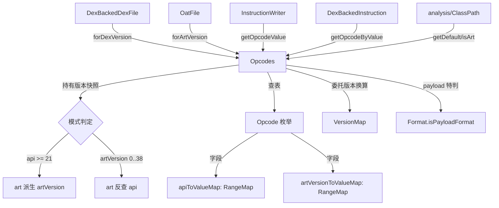

# 📦 Opcodes — 指令集与版本映射

`Opcodes` 是 dexlib2 中 **绑定到特定 Android 版本**的 Dalvik 指令集视图。同一个 `Opcode` 枚举常量在不同 API/ART 版本下可能对应不同的字节码值（甚至不存在），`Opcodes` 负责在构造时根据版本从 `Opcode` 的 `RangeMap` 中查表，构建出 **值→枚举**、**名称→枚举**、**枚举→值** 三套查找表。该类位于 `dexlib2/src/main/java/org/jf/dexlib2/Opcodes.java:46`，是一个轻量不可变对象，被 `DexBackedDexFile`、`OatFile`、`InstructionWriter`、`MethodAnalyzer` 等几乎所有读写/分析路径持有。

## 🧩 角色定位

- **版本快照**：构造时锁定一个 `api` 与 `artVersion`，之后所有查询都基于这个版本下“哪些 opcode 存在、值是多少”。
- **三重索引**：内部维护 `opcodesByValue[256]`、`opcodesByName`、`opcodeValues` 三个表，O(1) 双向解析。
- **dalvik/art 二选一**：通过 `isArt()` 区分两种指令空间——dalvik 走 `apiToValueMap`，art 走 `artVersionToValueMap`。
- **payload 特判**：`PACKED_SWITCH_PAYLOAD`(0x100)、`SPARSE_SWITCH_PAYLOAD`(0x200)、`ARRAY_PAYLOAD`(0x300) 三种伪指令超出单字节范围且不进 `opcodesByValue` 数组，由 `getOpcodeByValue` 单独硬编码处理。

## 🗂️ 关键字段

| 字段 | 类型 | 作用 |
|---|---|---|
| `api` | `int` | dalvik 指令集的 API level；art 模式下为派生值 |
| `artVersion` | `int` | ART 指令集版本号；dalvik 模式下为 `NO_VERSION(-1)` |
| `opcodesByValue` | `Opcode[256]` | 单字节值→枚举查表；payload 格式不入此表 |
| `opcodeValues` | `EnumMap<Opcode,Short>` | 枚举→字节值；包含 payload opcode |
| `opcodesByName` | `HashMap<String,Opcode>` | 小写名称→枚举，供 smali 解析器使用 |

## ⚙️ 关键方法

| 方法 | 作用 | 备注 |
|---|---|---|
| `forApi(int api)` | 构建 dalvik 模式实例 | `artVersion` 由 `mapApiToArtVersion` 派生 |
| `forArtVersion(int v)` | 构建 art 模式实例 | 用于 OAT 解析 |
| `forDexVersion(int v)` | 由 dex 版本号反查 API | 不支持的版本抛 `RuntimeException` |
| `getDefault()` | 返回 API 20（最后一个 pre-art） | 用于无需精确版本的默认场景 |
| `getOpcodeByName(String)` | 名称→枚举 | 大小写不敏感 |
| `getOpcodeByValue(int)` | 值→枚举 | 含 0x100/0x200/0x300 三个 payload 硬编码分支 |
| `getOpcodeValue(Opcode)` | 枚举→`Short` | 不存在返回 `null`；被 `InstructionWriter` 与 `SyntheticAccessorFSM` 使用 |
| `isArt()` | 是否 art 模式 | `artVersion != NO_VERSION` |

## 🔄 类关系图



## 📐 构造逻辑要点

构造函数 `Opcodes(int api, int artVersion)`（`Opcodes.java:85`）的版本归一化规则：

```java
// 关键签名：私有构造，所有工厂方法都汇聚到这里
private Opcodes(int api, int artVersion) {
    if (api >= 21) {                     // art 时代：api 主导
        this.api = api;
        this.artVersion = mapApiToArtVersion(api);
    } else if (artVersion >= 0 && artVersion < 39) {  // 早期纯 art
        this.api = mapArtVersionToApi(artVersion);
        this.artVersion = artVersion;
    } else {                             // pre-art dalvik 或无效组合
        this.api = api;
        this.artVersion = artVersion;
    }
    // ...遍历 Opcode.values()，按 isArt() 选 RangeMap，填三张表
}
```

填表循环（`Opcodes.java:107`）对每个 `Opcode`：

1. 据 `isArt()` 取 `opcode.artVersionToValueMap` 或 `opcode.apiToValueMap`；
2. 用归一化后的 `version` 查 `RangeMap`，得到 `Short opcodeValue`；
3. 仅当 `!opcode.format.isPayloadFormat` 时写入 `opcodesByValue`（payload 值 ≥0x100，越界）；
4. `opcodeValues` 与 `opcodesByName` 无条件写入（payload 也进这两表）。

`getOpcodeByValue`（`Opcodes.java:133`）因此必须对 0x100/0x200/0x300 走 `switch` 硬分支，其余落回 `opcodesByValue[0..255]`。

## 🔍 典型用法

### 1. 解析 dex 时按 dex 版本选定指令集

`dexlib2/src/main/java/org/jf/dexlib2/dexbacked/DexBackedDexFile.java:163`：

```java
@Override
protected Opcodes getDefaultOpcodes(int version) {
    return Opcodes.forDexVersion(version);
}
```

`CDexBackedDexFile`（compact-dex）因无独立版本号，直接固定 `Opcodes.forApi(28)`（`CDexBackedDexFile.java:89`）。

### 2. 解析 OAT 时按 ART 版本选定指令集

`dexlib2/src/main/java/org/jf/dexlib2/dexbacked/OatFile.java:112`：

```java
this.opcodes = Opcodes.forArtVersion(oatHeader.getVersion());
```

### 3. 反序列化指令字节→Opcode 枚举

`DexBackedInstruction.java:67`：

```java
Opcode opcode = dexFile.getOpcodes().getOpcodeByValue(opcodeValue);
```

### 4. 写出指令时反向取字节值

`writer/InstructionWriter.java:107`：

```java
Short value = opcodes.getOpcodeValue(opcode);
```

## 🧩 版本映射的底层依赖

`Opcodes` 自身不硬编码版本号对照表，全部委托 `VersionMap`（`dexlib2/src/main/java/org/jf/dexlib2/VersionMap.java`）：

| VersionMap 方法 | 用途 |
|---|---|
| `mapDexVersionToApi(int)` | dex header 版本→API（`forDexVersion` 用） |
| `mapApiToArtVersion(int)` | API→ART 版本（构造函数 art 派生） |
| `mapArtVersionToApi(int)` | ART 版本→API（构造函数 api 派生） |
| `NO_VERSION = -1` | “未知/未指定”哨兵 |

`Opcode` 枚举自身的版本区间则在其构造函数（`Opcode.java:373`）里由 `VersionConstraint` 列表构建为两个 `ImmutableRangeMap`，供 `Opcodes` 按版本切片查询。

## 📌 源码要点速查

- 工厂方法集中：`Opcodes.java:58`、`:63`、`:68`、`:80`。
- 私有构造 + 版本归一化：`Opcodes.java:85`。
- 三表填充循环：`Opcodes.java:107`。
- payload 特判（写入跳过 `opcodesByValue`）：`Opcodes.java:118`。
- `getOpcodeByValue` 硬编码三分支：`Opcodes.java:135`。
- `isArt()` 判定：`Opcodes.java:154`。

## 延伸阅读

- [Opcode 与 Format](iface-instruction.md) — 单条指令的枚举定义与格式描述。
- [DexBackedDexFile](dexbacked.md) — 持有 `Opcodes` 并驱动零拷贝指令读取。
- [OatFile](oat-file.md) — 用 `forArtVersion` 锁定 OAT 指令集。
- [Writer 模块](writer.md) — `InstructionWriter` 经 `getOpcodeValue` 序列化指令。
- [immutable 模块](immutable.md) — `ImmutableDexFile` 用 `getDefault()` 构造默认实例。
