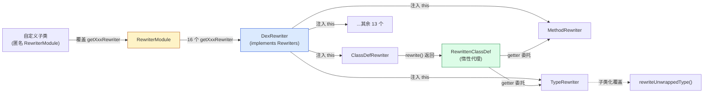

# 🧩 RewriterModule — 变换模块装配

`RewriterModule` 位于 `dexlib2/src/main/java/org/jf/dexlib2/rewriter/RewriterModule.java`，是 dexlib2 rewriter 子系统的**工厂基类**。它本身不执行任何变换逻辑，而是为 16 类 dex 元素各自 `new` 出一个对应的 `Rewriter` 实现并把 `Rewriters` 上下文注入进去，从而把“整套变换流水线”拼装成一个可被替换、可被继承覆盖的对象。

## 🎯 角色定位

rewriter 子系统的设计哲学是**模板方法 + 惰性代理**：每个具体 `Rewriter`（如 `ClassDefRewriter`）在 `rewrite()` 中并不复制数据，而是返回一个 `RewrittenXxx` 包装类，该包装类在 getter 被调用时才**委托回 `Rewriters` 取下游 rewriter** 逐项改写。这样：

- 遍历是惰性的（只在真正读取时发生），不一次性物化整个 dex；
- 变换是组合的（重命名类型会自动传导到字段、方法、注解、引用等所有持有类型的地方）；
- 定制是局部的（只需覆盖 `RewriterModule` 的某一个 `getXxxRewriter` 即可插桩）。

`RewriterModule` 正是这套装配的“总装车间”：`DexRewriter` 在构造时逐一调用它的 16 个 `getXxxRewriter`，把返回的 rewriter 缓存进自身字段。

## 📦 关键字段

`RewriterModule` 是无状态工厂类，**没有任何实例字段**。所有“状态”由传入的 `Rewriters rewriters` 参数承担——它既是各 `getXxxRewriter` 的入参，也是返回的 rewriter 内部持有的上下文。

## 🔧 关键方法

每个方法签名一致：`@Nonnull Rewriter<T> getTRewriter(@Nonnull Rewriters rewriters)`，返回该元素的默认 rewriter。

| 方法 | 作用的 dex 元素 | 默认实现 | 备注 |
| --- | --- | --- | --- |
| `getDexFileRewriter` | `DexFile` | `DexFileRewriter` | 顶层入口，递归改写所有 `ClassDef` |
| `getClassDefRewriter` | `ClassDef` | `ClassDefRewriter` | 改写类型/超类/接口/字段/方法/注解 |
| `getFieldRewriter` | `Field` | `FieldRewriter` | 改写字段类型与初始 `EncodedValue` |
| `getMethodRewriter` | `Method` | `MethodRewriter` | 改写方法引用、参数、实现体 |
| `getMethodParameterRewriter` | `MethodParameter` | `MethodParameterRewriter` | 保留参数名与注解的参数改写 |
| `getMethodImplementationRewriter` | `MethodImplementation` | `MethodImplementationRewriter` | 改写指令、try/catch、调试项 |
| `getInstructionRewriter` | `Instruction` | `InstructionRewriter` | 改写指令引用的 `Reference` |
| `getTryBlockRewriter` | `TryBlock` | `TryBlockRewriter` | 改写异常处理表 |
| `getExceptionHandlerRewriter` | `ExceptionHandler` | `ExceptionHandlerRewriter` | 改写异常类型 |
| `getDebugItemRewriter` | `DebugItem` | `DebugItemRewriter` | 改写调试项中的类型/字符串 |
| `getTypeRewriter` | `String` | `TypeRewriter` | **数组感知**的类型字符串改写（见下） |
| `getFieldReferenceRewriter` | `FieldReference` | `FieldReferenceRewriter` | 改写字段引用的类/类型 |
| `getMethodReferenceRewriter` | `MethodReference` | `MethodReferenceRewriter` | 改写方法引用的类/参数/返回值 |
| `getAnnotationRewriter` | `Annotation` | `AnnotationRewriter` | 改写注解类型与可见性 |
| `getAnnotationElementRewriter` | `AnnotationElement` | `AnnotationElementRewriter` | 改写注解元素的值 |
| `getEncodedValueRewriter` | `EncodedValue` | `EncodedValueRewriter` | 递归改写编码值（含嵌套） |

> 16 个方法一一对应 `Rewriters` 接口（`Rewriters.java:43`）的 16 个 getter，二者构成“接口/工厂”对偶。

## 🗂️ 类协作关系



要点：

1. `DexRewriter`（`DexRewriter.java:86`）构造时把自身 `this`（实现了 `Rewriters`）传给 `RewriterModule` 的每个工厂方法，形成**双向引用**——子 rewriter 持有父 `Rewriters` 以便委托兄弟节点。
2. `RewrittenXxx` 包装类通过 `rewriters.getTypeRewriter().rewrite(...)` 这类调用把改写**递归下推**，自然完成跨层级传导。
3. `RewriterUtils`（`RewriterUtils.java:41`）提供 `rewriteNullable` / `rewriteSet` / `rewriteList` / `rewriteIterable`，让包装类对集合的改写也保持惰性。

## 📐 TypeRewriter 的数组感知

`getTypeRewriter` 返回的 `TypeRewriter`（`TypeRewriter.java:36`）是少数有内置逻辑的默认实现：它先剥离 `[` 数组前缀，对元素类型调用 `rewriteUnwrappedType`，再把前缀拼回去。子类只需覆盖 `rewriteUnwrappedType` 即可透明处理数组类型。

```java
// TypeRewriter.java:37
@Nonnull @Override public String rewrite(@Nonnull String value) {
    if (value.length() > 0 && value.charAt(0) == '[') {
        int dimensions = 0;
        while (value.charAt(dimensions) == '[') dimensions++;
        String unwrappedType = value.substring(dimensions);
        String rewrittenType = rewriteUnwrappedType(unwrappedType);
        if (unwrappedType != rewrittenType) { /* 用 == 做 fast path */ }
        return value;
    } else {
        return rewriteUnwrappedType(value);
    }
}
```

## ⚙️ 典型用法：匿名子类插桩

`DexRewriter` 的 javadoc（`DexRewriter.java:52`）给出的官方范式——匿名覆盖单个工厂方法：

```java
// 改写实现：把所有 Lorg/blah/MyBlah; 重命名为 Lorg/blah/YourBlah;
DexRewriter rewriter = new DexRewriter(new RewriterModule() {
    @Override
    public Rewriter<String> getTypeRewriter(Rewriters rewriters) {
        return new Rewriter<String>() {
            @Override public String rewrite(String value) {
                if (value.equals("Lorg/blah/MyBlah;")) {
                    return "Lorg/blah/YourBlah;";
                }
                return value;
            }
        };
    }
});
DexFile rewritten = rewriter.rewriteDexFile(dexFile);
```

仅覆盖 `getTypeRewriter` 一处，重命名就会经由 `ClassDefRewriter.getType()` → `MethodRewriter.getReturnType()` → `FieldReferenceRewriter` 等所有持有类型的节点自动传导，无需手写遍历。

## 🔄 baksmali 中的实战

`baksmali/transform/` 下的几个变换全部基于 `RewriterModule` 匿名子类 + `DexRewriter` 组合：

| 变换类 | 覆盖的工厂方法 | 效果 |
| --- | --- | --- |
| `AccessFlagTransform.java:97` | `getClassDefRewriter` / `getFieldRewriter` / `getMethodRewriter` | 改写访问标志（如去 final、改 public） |
| `StripDebugTransform.java:66` | `getMethodImplementationRewriter` | 剥离调试信息 |
| `ForceReturnTransform.java:216` | `getInstructionRewriter` | 强制方法提前返回 |
| `StringReplaceTransform.java:135` | `getInstructionRewriter` | 替换字符串常量 |

每个变换都以 `new DexRewriter(module).getDexFileRewriter().rewrite(in)` 收尾（如 `AccessFlagTransform.java:137`），即“装配模块 → 取顶层 rewriter → 喂入 DexFile”。

## 🧩 与“复制即默认”的关系

`DexRewriter` 的 javadoc 明确指出：开箱即用时它**只做一份原样拷贝**。这一性质完全由 `RewriterModule` 的默认实现保证——每个默认 rewriter 都把 getter 委托回原对象，覆盖方法的默认实现是“原样返回”（`TypeRewriter.rewriteUnwrappedType` 即 `return value;`）。因此 `new DexRewriter(new RewriterModule())` 等价于一次惰性深拷贝（`RewriteArrayTypeTest.java:98` 正是据此测试无操作场景）。

## 📌 源码要点索引

- 工厂方法集中定义：`dexlib2/src/main/java/org/jf/dexlib2/rewriter/RewriterModule.java:43-107`
- 对偶接口：`dexlib2/src/main/java/org/jf/dexlib2/rewriter/Rewriters.java:43-64`
- 装配调用点：`dexlib2/src/main/java/org/jf/dexlib2/rewriter/DexRewriter.java:86-103`
- 惰性代理典型：`dexlib2/src/main/java/org/jf/dexlib2/rewriter/ClassDefRewriter.java:54-128`
- 方法改写的兄弟委托：`dexlib2/src/main/java/org/jf/dexlib2/rewriter/MethodRewriter.java:64-103`
- 集合惰性工具：`dexlib2/src/main/java/org/jf/dexlib2/rewriter/RewriterUtils.java:41-71`
- baksmali 装配范例：`baksmali/src/main/java/org/jf/baksmali/transform/AccessFlagTransform.java:97,137`

## 延伸阅读

- [DexRewriter](./dex-rewriter.md) — 装配 RewriterModule 的运行时入口
- [Rewriter 接口](./rewriter.md) — 所有改写器的最小契约
- baksmali transform 包 — RewriterModule 的真实用例集
- dexlib2 iface 概览 — 被 rewriter 包装的只读模型层
