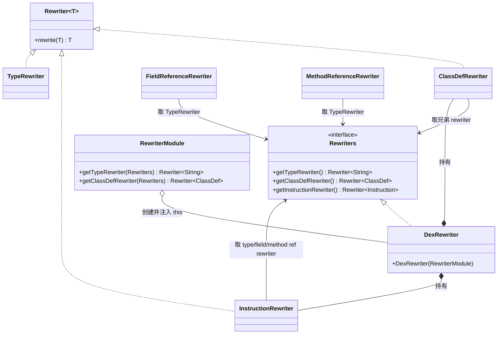

# 🔄 rewriter — 变换层

`org.jf.dexlib2.rewriter` 提供了一套**不修改原始对象的、惰性包装式**的 dex 变换框架。它不复制字节、不重建 dex——而是用一层一层实现了 `iface/` 接口的"代理对象"包裹原始 `DexFile`，在被读取时按需把类型字符串、字段/方法引用、指令引用等改写后再返回。

它的设计目标是：**用最小代价对整份 dex 做一次全局、一致的改写**。开箱即用的 `DexRewriter` 配默认 `RewriterModule` 时是"逐字节的完美副本"（什么都不改）；只需覆盖其中一两个 `getXxxRewriter` 钩子，就能做到"把所有 `Lorg/blah/MyBlah;` 改名为 `Lorg/blah/YourBlah;`"这类全局重写——既覆盖类型定义，也覆盖指令中的引用、注解、字段初值等所有出现点。

## 🧩 设计要点
- **三角色协作**：`Rewriter<T>`（单点改写函数）+ `Rewriters`（16 个 rewriter 的访问接口）+ `RewriterModule`（工厂，负责 new 出每个 rewriter 并把 `Rewriters` 注入进去）。
- **`DexRewriter` 既是聚合器又是 `Rewriters` 实现**：构造时让 module 把自己（`this`）传给每个 rewriter，于是任何 rewriter 都能拿到兄弟 rewriter（例如 `FieldRewriter` 改字段时调用 `FieldReferenceRewriter` 改引用），形成自洽的改写图。
- **惰性、只读、零拷贝**：每个 rewriter 的 `rewrite()` 返回的不是新对象图，而是一个 `RewrittenXxx` 代理；它持有原对象，只在 getter 被调用时才递归委托子 rewriter。`RewriterUtils.rewriteList/Set/Iterable` 返回的也是懒视图。
- **按指令 format 分发**：`InstructionRewriter` 按 `Opcode.format` 选 `RewrittenInstruction21c/22c/31c/35c/3rc/45cc/20bc`，只为带 reference 的 format 生成代理；无 reference 的指令直接原样返回。
- **数组类型感知**：`TypeRewriter.rewrite` 会先剥掉 `[` 前缀数组维数再调用 `rewriteUnwrappedType`，子类只需关心元素类型，并能保留数组维度。
- **不可变 + 装饰器**：`RewrittenClassDef` 等内部类继承 `BaseTypeReference`/`BaseMethodReference` 等 base 类，复用其 `hashCode/equals/toString`，对外行为与原对象一致。

## 📋 类清单
| 类名 | 职责 | 关键方法 |
|------|------|----------|
| `Rewriter` | 单值改写函数接口，泛型 `<T>` | `T rewrite(T value)` |
| `Rewriters` | 16 个 rewriter 的访问接口 | `getTypeRewriter()` / `getInstructionRewriter()` / `getClassDefRewriter()` … |
| `RewriterModule` | 工厂基类，为每个 rewriter 提供 default 实现 | `getTypeRewriter(Rewriters)` / `getClassDefRewriter(Rewriters)` … |
| `DexRewriter` | 聚合器；构造 module→持有 16 个 rewriter；自身实现 `Rewriters` | 构造器 `DexRewriter(RewriterModule)` |
| `RewriterUtils` | 懒视图工具 | `rewriteNullable` / `rewriteList` / `rewriteSet` / `rewriteIterable` / `rewriteTypeReference` |
| `DexFileRewriter` | 改写 `DexFile`，产出 `RewrittenDexFile` | `rewrite(DexFile)` |
| `ClassDefRewriter` | 改写类定义（类型/超类/接口/字段/方法/注解） | `rewrite(ClassDef)` |
| `FieldRewriter` | 改写字段定义 | `rewrite(Field)`，委托 `FieldReferenceRewriter` |
| `MethodRewriter` | 改写方法定义 | `rewrite(Method)`，委托 `MethodReferenceRewriter` 与 `MethodParameterRewriter` |
| `MethodParameterRewriter` | 改写方法参数（保留 name/signature） | `rewrite(MethodParameter)` |
| `MethodImplementationRewriter` | 改写方法体 | `rewrite(MethodImplementation)`：指令/try 块/debug |
| `InstructionRewriter` | 改写带 reference 的指令 | `rewrite(Instruction)`，按 `format` 分发 |
| `TryBlockRewriter` | 改写 try 块 | `rewrite(TryBlock)` |
| `ExceptionHandlerRewriter` | 改写异常处理器 | `rewrite(ExceptionHandler)` |
| `DebugItemRewriter` | 改写 debug 项（StartLocal/EndLocal/RestartLocal） | `rewrite(DebugItem)` |
| `TypeRewriter` | 改写类型字符串（含数组维度处理） | `rewrite(String)` / `rewriteUnwrappedType(String)` |
| `FieldReferenceRewriter` | 改写字段引用 | `rewrite(FieldReference)` |
| `MethodReferenceRewriter` | 改写方法引用 | `rewrite(MethodReference)` |
| `AnnotationRewriter` | 改写注解 | `rewrite(Annotation)` |
| `AnnotationElementRewriter` | 改写注解元素 | `rewrite(AnnotationElement)` |
| `EncodedValueRewriter` | 改写编码值（type/field/method/enum/array/annotation） | `rewrite(EncodedValue)`，按 `ValueType` 分发 |

## 📐 核心类关系



## ⚙️ 典型用法：全局重命名类型

`DexRewriter.java:50-66` 给出的经典示例——把某个类名整体改名（定义与所有引用一并替换）：

```java
DexRewriter rewriter = new DexRewriter(new RewriterModule() {
    @Override
    public Rewriter<String> getTypeRewriter(Rewriters rewriters) {
        return new Rewriter<String>() {
            @Override
            public String rewrite(String value) {
                if (value.equals("Lorg/blah/MyBlah;")) {
                    return "Lorg/blah/YourBlah;";
                }
                return value;
            }
        };
    }
});
DexFile rewrittenDexFile = rewriter.getDexFileRewriter().rewrite(dexFile);
```

只覆盖 `getTypeRewriter` 一个钩子，就能让所有依赖 `TypeRewriter` 的兄弟（`ClassDefRewriter.getType/getSuperclass/getInterfaces`、`MethodReferenceRewriter.getDefiningClass/getReturnType/getParameterTypes`、`FieldReferenceRewriter.getDefiningClass/getType`、`InstructionRewriter` 的 TYPE 引用、注解类型、异常类型、debug 局部变量类型、`EncodedValue` 中的 TYPE 值……）一并改写。

### 自定义数组元素类型改写

`TypeRewriter.java:36-56` 会先剥数组维度再调子类钩子，因此子类只关心元素类型：

```java
new RewriterModule() {
    @Override public Rewriter<String> getTypeRewriter(Rewriters rw) {
        return new TypeRewriter() {
            @Override protected String rewriteUnwrappedType(String value) {
                return value.equals("Lorg/blah/MyBlah;") ? "Lorg/blah/YourBlah;" : value;
            }
        };
    }
};
```
这样 `[Lorg/blah/MyBlah;`（一维数组）和 `[[Lorg/blah/MyBlah;`（二维数组）都会被正确改写为对应维度的 `YourBlah` 数组。该行为由 `dexlib2/src/test/java/org/jf/dexlib2/rewriter/RewriteArrayTypeTest.java` 的 `testRewriteArrayTypeTest` 覆盖：传入参数类型 `[[[Lcls1;`，断言改写后为 `[[[Lcls2;`。

## 🔄 自定义指令/编码值改写（生产示例）

rewriter 框架默认只改写 type/field/method 引用，对 STRING 引用与字符串型 `EncodedValue` 是透传。若要全局替换字符串常量，需同时覆盖 `getInstructionRewriter` 与 `getEncodedValueRewriter` 两个钩子。`baksmali/src/main/java/org/jf/baksmali/transform/StringReplaceTransform.java` 即为此模式：

```java
RewriterModule module = new RewriterModule() {
    @Override public Rewriter<Instruction> getInstructionRewriter(Rewriters rewriters) {
        return new InstructionRewriter(rewriters) {
            @Override public Instruction rewrite(Instruction instruction) {
                if (instruction instanceof ReferenceInstruction
                        && ((ReferenceInstruction) instruction).getReferenceType() == ReferenceType.STRING) {
                    String original = ((StringReference) ((ReferenceInstruction) instruction)
                            .getReference()).getString();
                    String replaced = replace(original);
                    if (!replaced.equals(original)) {
                        int reg = ((OneRegisterInstruction) instruction).getRegisterA();
                        ImmutableStringReference ref = new ImmutableStringReference(replaced);
                        if (instruction.getOpcode() == Opcode.CONST_STRING) {
                            return new ImmutableInstruction21c(instruction.getOpcode(), reg, ref);
                        }
                        return new ImmutableInstruction31c(instruction.getOpcode(), reg, ref);
                    }
                }
                return super.rewrite(instruction);
            }
        };
    }
    // 同理覆盖 getEncodedValueRewriter：对 ValueType.STRING 的 StringEncodedValue
    // 用 replace(...) 后包成 ImmutableStringEncodedValue 返回，其余走 super.rewrite(...)
};
return new DexRewriter(module).getDexFileRewriter().rewrite(in);
```

要点：继承具体 rewriter 类（`InstructionRewriter`/`EncodedValueRewriter`）而非从零实现 `Rewriter<T>`，对非目标情形 `return super.rewrite(...)` 即可复用框架默认行为；改写后用 `immutable/` 的不可变指令/引用重新组装，保持对象图可被 `writer/` 序列化。

## 🗂️ 与其他包的协作

- **`iface/`**：rewriter 的代理对象（`RewrittenClassDef` 等）全部实现 `iface` 接口，因此改写后的 `DexFile` 对下游完全透明——可继续被 `writer/` 序列化、被 `baksmali` 反汇编、被 `analysis/` 分析。
- **`base/`**：代理类继承 `base/` 下的 `BaseTypeReference`/`BaseMethodReference`/`BaseFieldReference`/`BaseAnnotation` 等，复用 `hashCode/equals/toString`；`RewriterUtils.rewriteTypeReference` 也用 `BaseTypeReference` 包装改写后的类型字符串。
- **`immutable/`**：若需要把惰性代理"固化"成可独立持有的内存对象，可再喂给 `ImmutableDexFile` 物化。
- **`writer/`**：改写后的 dex 通常交给 `DexPool`（`writer/pool`）重新序列化落盘，实现"读 → 改 → 写"流水线。
- **`analysis/`**：deodex/类型推断结果可通过 rewriter 注入回 dex；`InstructionRewriter` 对 `Format45cc`（polymorphic invoke）的双引用也做了处理。

## 🔍 惰性与一致性细节

- `RewriterUtils.rewriteList/Set/Iterable`（`RewriterUtils.java:47-106`）返回的是 `AbstractList`/`AbstractSet` 的匿名子类视图，`size()` 委托原集合、`get(i)`/`next()` 才调用 rewriter——遍历前不分配新容器。
- `MethodRewriter.getParameters`（`MethodRewriter.java:76-82`）刻意不委托给 `MethodReferenceRewriter`，因为后者只看参数类型、会丢失参数名与注解；参数改写走 `MethodParameterRewriter`，纯引用场景走 `MethodReferenceRewriter`，二者各司其职。
- `InstructionRewriter`（`InstructionRewriter.java:53-75`）对非 `ReferenceInstruction` 直接 `return instruction`，对 STRING 引用也原样返回（字符串不在 TypeRewriter 管辖范围），仅 TYPE/FIELD/METHOD 引用被改写；`EncodedValueRewriter`（`EncodedValueRewriter.java:52-69`）按 `ValueType` switch，仅 type/field/method/enum/array/annotation 六类需要改写，其余基本值原样返回。

## 延伸阅读

- [iface — 只读接口层](./iface-reference.md)
- [base — 公共基类](./base.md)
- [writer — 序列化写入层](./writer.md)
- [immutable — 不可变实现](./immutable.md)
- [analysis — 分析与类型推断](./analysis.md)
- baksmali transform（基于 rewriter 框架的真实消费者，见 `baksmali/src/main/java/org/jf/baksmali/transform/`：`StringReplaceTransform` / `AccessFlagTransform` / `StripDebugTransform` / `ForceReturnTransform`）
