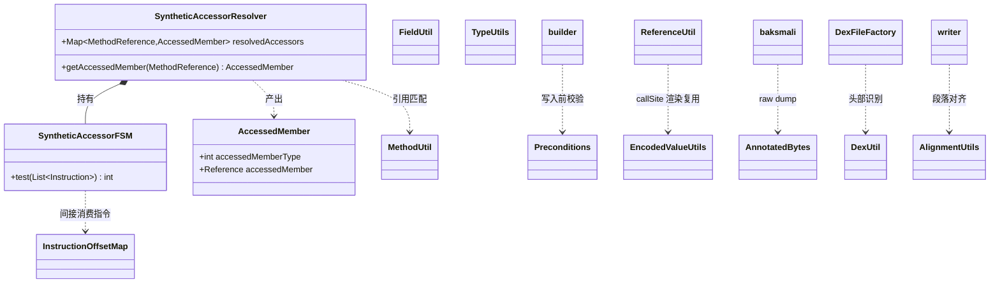

# 🧰 util — 工具层

`org.jf.dexlib2.util` 是 dexlib2 的「横切工具箱」。它不建模 dex 结构本身（那是 `iface/`、`dexbacked/`、`immutable/` 的职责），而是为这些层提供**无状态、可复用**的静态工具方法：类型/方法/字段的访问性判断、引用的人类可读格式化、指令编码校验、字节对齐、十六进制注解输出，以及合成访问器（synthetic accessor）的反向解析。

这些工具被 `builder/`、`writer/`、`rewriter/`、`analysis/` 以及 baksmali 大量复用，是理解 dexlib2 行为的「快捷参考」。

## 📦 包定位

- **依赖方向**：依赖 `iface/`（数据模型）、`AccessFlags`/`Opcode`/`ValueType` 等常量枚举，以及 `org.jf.util`（`Hex`、`StringUtils`、`TwoColumnOutput`）。
- **不可实例化**：除 `AnnotatedBytes`、`InstructionOffsetMap`、`SyntheticAccessorResolver`、`SyntheticAccessorFSM` 外，其余类均为 `final` + 私有构造的纯静态工具类。
- **生成代码**：`SyntheticAccessorFSM.java` 由 ragel 从 `dexlib2/src/main/ragel/SyntheticAccessorFSM.rl` 生成，**不要手改**；改 fsm 后跑 `./gradlew ragel` 重生成。

## 🗂️ 类清单

| 类名 | 职责 | 关键方法 / 字段 |
|---|---|---|
| `AlignmentUtils` | dex 段落对齐计算（4 字节等） | `alignOffset(int,int)`、`isAligned(int,int)` |
| `AnnotatedBytes` | 收集并渲染「hex + 注解」双栏输出，baksmali raw dump 核心 | `annotate(int,String,Object...)`、`moveTo(int)`、`writeAnnotations(Writer,byte[],int)` |
| `DexUtil` | 校验 dex/cdex/odex 头部魔数与字节序 | `verifyDexHeader(byte[],int)`、`verifyCdexHeader(...)`、`verifyOdexHeader(...)`；内部异常 `InvalidFile`、`UnsupportedFile` |
| `EncodedValueUtils` | 判断 encoded value 是否为默认值；格式化为可读字符串（已废弃，改用 `DexFormatter`） | `isDefaultValue(EncodedValue)`、`writeEncodedValue(Writer,EncodedValue)` |
| `FieldUtil` | 字段静态/实例分类的 Guava `Predicate` | `FIELD_IS_STATIC`、`FIELD_IS_INSTANCE`、`isStatic(Field)` |
| `InstructionOffsetMap` | 指令索引 ↔ 字节码偏移的双向映射 | `getInstructionIndexAtCodeOffset(int,boolean)`、`getInstructionCodeOffset(int)` |
| `InstructionUtil` | 指令语义快速判断 | `isInvokeStatic(Opcode)`、`isInvokePolymorphic(Opcode)` |
| `MethodUtil` | 方法的直接/虚方法分类、参数寄存器数计算、shorty 生成、签名匹配 | `isDirect(Method)`、`getParameterRegisterCount(...)`、`getShorty(...)`、`methodSignaturesMatch(...)` |
| `Preconditions` | builder/writer 写入前的参数范围校验，越界即抛 `IllegalArgumentException` | `checkNibbleRegister(int)`、`checkByteLiteral(int)`、`checkFormat(Opcode,Format)`、`checkReference(int,Reference)` |
| `ReferenceUtil` | 把各类 `Reference` 渲染成 smali 风格描述符（已废弃，改用 `DexFormatter`） | `getMethodDescriptor(MethodReference,boolean)`、`getFieldDescriptor(...)`、`getReferenceString(Reference,String)` |
| `SyntheticAccessorFSM` | ragel 生成的有限状态机，识别合成访问器方法体的指令模式 | `test(List<Instruction>)` 返回访问类型常量 |
| `SyntheticAccessorResolver` | 缓存式解析合成访问器方法 → 其真正访问的字段/方法 | `getAccessedMember(MethodReference)`、`looksLikeSyntheticAccessor(String)`；内部类 `AccessedMember` |
| `TypeUtils` | 类型描述符的宽类型/原始类型/包名判断与类访问性 | `isWideType(String)`、`isPrimitiveType(String)`、`getPackage(String)`、`canAccessClass(String,ClassDef)` |

## 📐 类关系与数据流



## 🔍 核心工具详解

### ⚙️ `MethodUtil` — 方法分类与寄存器计数

直接方法（direct）= `static | private | constructor`，其余为虚方法。参数寄存器数：`J`/`D` 占 2 个，其余占 1 个；非 static 还要加 `this`。

```java
// dexlib2/src/main/java/org/jf/dexlib2/util/MethodUtil.java:45
private static int directMask = AccessFlags.STATIC.getValue() | AccessFlags.PRIVATE.getValue() |
        AccessFlags.CONSTRUCTOR.getValue();

public static int getParameterRegisterCount(@Nonnull Collection<? extends CharSequence> parameterTypes,
                                            boolean isStatic) {
    int regCount = 0;
    for (CharSequence paramType: parameterTypes) {
        int firstChar = paramType.charAt(0);
        if (firstChar == 'J' || firstChar == 'D') { regCount += 2; } else { regCount++; }
    }
    if (!isStatic) { regCount++; }
    return regCount;
}
```

`getShorty(...)` 把方法签名压缩成单字符 shorty 串（对象类型一律映射为 `L`），是 dex `method_id`/`proto_id` 的核心派生量。

### 🧩 `Preconditions` — 编码边界守门

builder 在构造每条指令时调用对应 `checkXxx`，确保寄存器号、字面量、码偏移落在该指令格式允许的位宽内。例如 `checkNibbleRegister` 保证 4-bit 寄存器 ∈ `[0,15]`，`checkIntegerHatLiteral` 要求低 16 位为零（hat 字面量）。`checkReference` 校验 `ReferenceType` 与 `Reference` 实例类型一致，是 `35c`/`3rc` 等引用指令的写入前提。

```java
// dexlib2/src/main/java/org/jf/dexlib2/util/Preconditions.java:52
public static int checkNibbleRegister(int register) {
    if ((register & 0xFFFFFFF0) != 0) {
        throw new IllegalArgumentException(
                String.format("Invalid register: v%d. Must be between v0 and v15, inclusive.", register));
    }
    return register;
}
```

### 🔄 `SyntheticAccessorResolver` — 还原编译器合成方法

Java 编译器对私有字段的内部访问会生成 `access$NNN` 形态的合成方法。baksmali 反汇编时调用本类把这些「间接访问」还原成原始字段/方法引用，使输出更贴近源码语义。

- 构造时按 `classDefMap`（类名 → `ClassDef`）建索引；
- `getAccessedMember` 先查 `resolvedAccessors` 缓存（并发安全），未命中则定位方法体，要求其带 `SYNTHETIC` 标志，再用 `SyntheticAccessorFSM.test(instructions)` 跑状态机判定访问类型（getter/setter/各种赋值/自增等 18 种，见常量 `GETTER..USHR_ASSIGNMENT`）。

```java
// dexlib2/src/main/java/org/jf/dexlib2/util/SyntheticAccessorResolver.java:92
@Nullable
public AccessedMember getAccessedMember(@Nonnull MethodReference methodReference) {
    AccessedMember accessedMember = resolvedAccessors.get(methodReference);
    if (accessedMember != null) { return accessedMember; }
    // ... 定位方法、校验 SYNTHETIC、跑 FSM
    int accessType = syntheticAccessorFSM.test(instructions);
    if (accessType >= 0) {
        AccessedMember member = new AccessedMember(accessType,
                ((ReferenceInstruction)instructions.get(0)).getReference());
        resolvedAccessors.put(methodReference, member);
        return member;
    }
    return null;
}
```

### 📦 `AnnotatedBytes` — 十六进制 + 注解双栏输出

baksmali `raw` 子命令生成 `dex` 字节级 dump 时核心渲染器。内部用 `TreeMap<Integer, AnnotationEndpoint>` 维护「端点 → 注解」结构，支持两类注解：

- **range 注解**：覆盖一段字节区间，区间不可重叠（重叠抛 `ExceptionWithContext`）；
- **point 注解**：挂在字节之间，可多条，按插入顺序输出。

`indent()`/`deindent()` 控制缩进层级；`writeAnnotations` 借助 `org.jf.util.TwoColumnOutput` 把左侧 `Hex.dump` 与右侧注解拼成定宽双栏。

### 📐 `InstructionOffsetMap` — 索引↔偏移二分查找

构造时累加每条指令的 `getCodeUnits()` 得到 `instructionCodeOffsets[]`。`getInstructionIndexAtCodeOffset(offset, exact)` 用 `Arrays.binarySearch` 反查；`exact=false` 时返回「该偏移落在哪条指令」的索引（用于异常表、try 块定位），`exact=true` 时偏移必须精确落在某条指令起点，否则抛 `InvalidInstructionOffset`。

## 🧩 与其他包的协作

| 协作方 | util 提供 |
|---|---|
| `builder/` | `Preconditions` 在每条 builder 指令构造时校验位宽；`MethodUtil.getParameterRegisterCount` 计算寄存器分配 |
| `writer/` | `AlignmentUtils` 对齐各 dex section；`Preconditions.checkReference` 校验池引用类型 |
| `dexbacked/raw/` + `DexFileFactory` | `DexUtil.verifyDexHeader` 识别魔数/版本/字节序；`AnnotatedBytes` 渲染 raw dump |
| `analysis/` | `InstructionOffsetMap` 用于异常/调试信息定位；`SyntheticAccessorResolver` 还原合成访问 |
| `rewriter/` + `formatter/` | `ReferenceUtil`/`EncodedValueUtils` 已被 `DexFormatter` 取代，仅作向后兼容 |
| baksmali `Adaptors/` | `TypeUtils.canAccessClass`、`MethodUtil.isPackagePrivate` 辅助可见性分析 |

## 🔧 典型用法

```java
// 计算非 static 方法的参数寄存器数（含 this）
int regs = MethodUtil.getParameterRegisterCount(method);  // MethodUtil.java:78

// 校验 35c 指令寄存器数（≤5）与引用类型
Preconditions.check35cAnd45ccRegisterCount(4);              // Preconditions.java:132
Preconditions.checkReference(ReferenceType.METHOD, ref);    // Preconditions.java:252

// 解析合成 getter
SyntheticAccessorResolver resolver = new SyntheticAccessorResolver(opcodes, classDefs);
AccessedMember m = resolver.getAccessedMember(methodRef);
if (m != null && m.accessedMemberType == SyntheticAccessorResolver.GETTER) { /* ... */ }

// 对齐到 4 字节
int aligned = AlignmentUtils.alignOffset(offset, 4);        // AlignmentUtils.java:35
```

## 📌 注意事项

- `ReferenceUtil` 与 `EncodedValueUtils` 标注了 `@Deprecated`，新代码请用 `org.jf.dexlib2.formatter.DexFormatter`，二者仅保留作兼容。
- `FieldUtil.FIELD_IS_STATIC` / `MethodUtil.METHOD_IS_DIRECT` 是 Guava `Predicate`（非 Java 8 `Predicate`），用于 `Iterables.filter` 等老式集合 API。
- `SyntheticAccessorFSM.java` 是 ragel 生成物，编辑 `SyntheticAccessorFSM.rl` 后须 `./gradlew ragel` 重生成并提交。

## 延伸阅读

- [iface — 数据模型接口](./iface.md)
- [iface-reference — 引用类型](./iface-reference.md)
- [builder — 可变方法体构造](./builder.md)
- [writer — dex 序列化](./writer.md)
- [analysis — deodex 与类型推断](./analysis.md)
- [formatter — 统一格式化器](./formatter.md)
