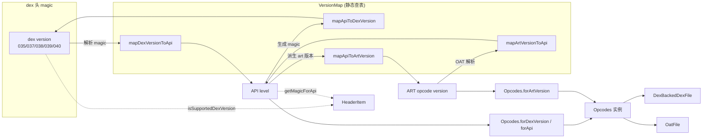

# 📐 VersionMap — dex/API/ART 版本映射

`VersionMap` 是 dexlib2 顶层包 `org.jf.dexlib2` 下的一个**纯静态查表工具类**，定义于 `dexlib2/src/main/java/org/jf/dexlib2/VersionMap.java:34`。它本身不持有任何状态，只提供四个静态方法，在 dex 文件头中的 `version`（如 `035`/`037`/`038`/`039`/`040`）、Android API level（如 `23`/`30`）与 ART 指令集版本号（如 `64`/`188`）三个维度之间做双向映射。它是 `Opcodes`、`HeaderItem`、`AnalysisArguments` 等组件解析字节码、生成 magic、判定支持性时共同的“版本字典”。

## 🧩 角色定位

- **三域转换中枢**：dex version ↔ API ↔ ART version 三者两两之间的转换都收敛到这一个类。
- **支持性边界**：未识别的 dex version 一律返回 `NO_VERSION`，供调用方判断“是否支持此 dex”。
- **单向权威**：`mapDexVersionToApi` 是 switch 精确匹配（无回退），而 `mapApiToArtVersion`/`mapArtVersionToApi` 对 API 31+ 走“保守下界”策略——ART opcode 集自 Android 12 起保持稳定，统一以 `188` 作下界。
- **无状态、线程安全**：纯函数，可被任意线程并发调用。

## 🗂️ 关键常量

| 常量 | 值 | 作用 |
|---|---|---|
| `NO_VERSION` | `-1` | “未识别/无对应版本”哨兵值；`mapDexVersionToApi` 的 default 分支、`mapApiToArtVersion` 的 `api < 19` 分支返回此值 |

## ⚙️ 关键方法

| 方法 | 作用 | 备注 |
|---|---|---|
| `mapDexVersionToApi(int dexVersion)` | dex 头版本号 → API level | switch 精确匹配 `35/37/38/39/40`；不识别返回 `NO_VERSION` |
| `mapApiToDexVersion(int api)` | API level → dex 头版本号 | 区间回退：`≤23→35`、`≤25→37`、`≤27→38`、`≤29→39`、`30+→40` |
| `mapArtVersionToApi(int artVersion)` | ART opcode 版本 → API level | 阈值回退；`artVersion<39` 返回 `19`；`≥189` 返回 `31` |
| `mapApiToArtVersion(int api)` | API level → ART opcode 版本 | switch 精确匹配；`api<19` 返回 `NO_VERSION`；API 31+ 返回 `188` 作下界 |

## 🔄 与相关类的协作



核心联动点：

- `Opcodes.forDexVersion(int)` 调 `mapDexVersionToApi` 把 dex 头版本转成 API，再构造 `Opcodes`（见 `dexlib2/src/main/java/org/jf/dexlib2/Opcodes.java:68`）；构造体内部又调 `mapApiToArtVersion` 派生 art 版本（`Opcodes.java:88`）。
- `HeaderItem.isSupportedDexVersion(int)` 直接用 `mapDexVersionToApi(...) != NO_VERSION` 判定（`dexlib2/src/main/java/org/jf/dexlib2/dexbacked/raw/HeaderItem.java:314`）；`getMagicForApi(int)` 经 `mapApiToDexVersion` 反查 dex magic（`HeaderItem.java:241`）。
- `baksmali` 的 `AnalysisArguments` 在 deodex 路径上用 `mapApiToArtVersion` 从 dex 的 `Opcodes.api` 推出 ART 版本以构造 `ClassPath`（`baksmali/src/main/java/org/jf/baksmali/AnalysisArguments.java:106`）。

## 📐 版本对照表

`VersionMap` 内置的映射关系（合并自四个方法）：

| dex version | API level 区间 | ART version |
|---|---|---|
| `035` | 23 及以下 | 64（API 23）|
| `037` | 24–25 | 79（API 24/25）|
| `038` | 26–27 | 124 / 131 |
| `039` | 28–29 | 138 / 170 |
| `040` | 30 及以上 | 188（API 30）；API 31+ 仍返回 188 作下界 |
| — | 19–20 | 7 |
| — | 21 / 22 | 39 / 45 |

> 注：dex version `040` 由 Android 11（API 30）引入，用于支撑额外的 hiddenapi 限制（greylist-max-target-r 等），见源码注释 `VersionMap.java:48`。

## 🔍 典型用法

```java
// 1) 从 dex 头 magic 解析出的 version（如 35/37/38/39/40）转 API
int dexVersion = HeaderItem.getVersionUnchecked(buf, 0); // 读 magic 偏移 4..6
if (VersionMap.mapDexVersionToApi(dexVersion) == VersionMap.NO_VERSION) {
    throw new RuntimeException("Unsupported dex version " + dexVersion);
}
Opcodes opcodes = Opcodes.forDexVersion(dexVersion);

// 2) 按 API level 反查应当写入 dex 的 magic
byte[] magic = HeaderItem.getMagicForApi(30); // 内部走 mapApiToDexVersion -> 040

// 3) deodex 时由 dex 的 API 派生 ART opcode 版本以构造 ClassPath
int artVersion = VersionMap.mapApiToArtVersion(dexFile.getOpcodes().api);
Opcodes artOpcodes = Opcodes.forArtVersion(artVersion);
```

## 📌 源码要点

- `mapDexVersionToApi` 用 `switch` 精确匹配，**不做区间回退**——这是有意的：一个 dex version 严格对应一个引入它的最低 API，模糊回退会让旧 magic 被误判为支持。default 分支返回 `NO_VERSION`（`VersionMap.java:51`）。
- `mapApiToDexVersion` 用连续 `if (api <= X)` 区间回退，覆盖 API 之间未单独发版的 dex 版本（如 API 24 仍用 `037`）。
- `mapApiToArtVersion` 对 **API 31+ 统一返回 `188`** 并附注释说明 ART opcode 集自 Android 12 起稳定，`188` 是保守下界（`VersionMap.java:137`）；`mapArtVersionToApi` 则用 `>=` 阈值回退，`artVersion >= 189` 归为 API 31（`VersionMap.java:74`）。
- 两类方法互为近似逆函数但**非严格互逆**：`mapApiToArtVersion(mapArtVersionToApi(v))` 在阈值边界不一定还原原 `v`，因为 ART→API 是区间映射；调用方不应假设严格可逆。

## 延伸阅读

- [Opcodes — 指令集与版本映射](./opcodes.md)：`VersionMap` 的主要消费方，构造版本绑定的 opcode 查找表。
- [HeaderItem 与 raw 层](./dexbacked-raw.md)：dex 头 magic 解析、`isSupportedDexVersion`、`getMagicForApi` 的实现位置。
- [DexFileFactory — 解析入口](./dexfile-factory.md)：解析 dex/oat 时如何确定版本并构造 `Opcodes`。
- [OatFile — OAT 容器](./oat-file.md)：deodex 路径上 ART version → API 的反向使用场景。
