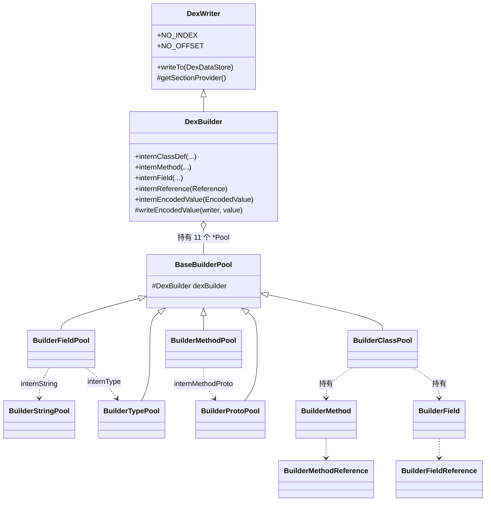
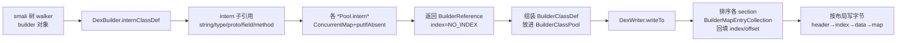

# 📦 writer/builder — builder 写入策略

`org.jf.dexlib2.writer.builder` 是 `org.jf.dexlib2.writer` 的两套具体写入策略之一。它在 intern 时**返回带索引的 `BuilderReference`** 供调用方回填到指令操作数里，专为"从头汇编 dex"的场景（smali 树 walker）设计；与之相对的 `writer/pool`（`DexPool`）则直接 intern `iface.ClassDef`，适合"读 → 改 → 写"。

整个包由三类构件组成：一个 `DexBuilder` 编排器、十一个 `*Pool` 池化器、以及一批 `Builder*` 不可变值对象（reference / class / method / field / encoded value …）。所有去重基于 `ConcurrentMap` + `putIfAbsent`，索引/偏移在 `DexWriter.writeTo` 排序阶段通过 `BuilderMapEntryCollection` 回写。

## 🗂️ 包定位

- **上游**：smali 树 walker（`smaliTreeWalker`）、`dexlib2.builder.MutableMethodImplementation` 产出的 builder 对象。
- **本包职责**：把字符串、类型、proto、field/method 引用、call site、method handle、annotation、type list、encoded array 全部 intern 成带 `index`/`offset` 字段的 `Builder*` 对象；把 class/method/field 包成 `BuilderClassDef`/`BuilderMethod`/`BuilderField`。
- **下游**：继承 `org.jf.dexlib2.writer.DexWriter`，由其 `writeTo` 按 dex 二进制布局（string → type → proto → field → method → … → class_def → map → header）序列化字节并计算签名/校验和。

## 🧩 类清单

### 编排器

| 类名 | 职责 | 关键方法 |
|---|---|---|
| `DexBuilder` | `DexWriter` 的 builder 具体子类，对外暴露 `intern*` API，提供 `SectionProvider` | `internClassDef`、`internField`、`internMethod`、`internReference`、`internEncodedValue`、`writeEncodedValue` |
| `DexBuilder.DexBuilderSectionProvider` | 内部类，按需 `new` 出各 `*Pool` 实例 | `getStringSection` / `getTypeSection` / … / `getEncodedArraySection` |

### 池化器（`*Pool`）

| 类名 | 实现的 Section 接口 | intern 入口 | 去重键 |
|---|---|---|---|
| `BuilderStringPool` | `StringSection` | `internString(String)` | `String` |
| `BuilderTypePool` | `TypeSection` | `internType(String)` | `String`(类型描述符) |
| `BuilderProtoPool` | `ProtoSection` | `internMethodProto(MethodProtoReference)` | `MethodProtoReference` |
| `BuilderFieldPool` | `FieldSection` | `internField(FieldReference)` | `FieldReference` |
| `BuilderMethodPool` | `MethodSection` | `internMethod(MethodReference)` | `MethodReference` |
| `BuilderClassPool` | `ClassSection` | `internClass(BuilderClassDef)` | `String`(类类型) |
| `BuilderCallSitePool` | `CallSiteSection` | `internCallSite(CallSiteReference)` | `CallSiteReference` |
| `BuilderMethodHandlePool` | `MethodHandleSection` | `internMethodHandle(MethodHandleReference)` | `MethodHandleReference` |
| `BuilderTypeListPool` | `TypeListSection` | `internTypeList(List)` | `List<CharSequence>` |
| `BuilderAnnotationPool` | `AnnotationSection` | `internAnnotation(Annotation)` | `Annotation` |
| `BuilderAnnotationSetPool` | `AnnotationSetSection` | `internAnnotationSet(Set)` | `Set<Annotation>` |
| `BuilderEncodedArrayPool` | `EncodedArraySection` | `internArrayEncodedValue(ArrayEncodedValue)` | `ArrayEncodedValue` |

所有 `*Pool`（除 `BuilderStringPool`）继承 `BaseBuilderPool`，持有一个 `dexBuilder` 引用以便跨池 intern 子对象（例如 `BuilderFieldPool.internField` 会调用 `dexBuilder.typeSection.internType`）。

### 值对象（`Builder*`）

| 类名 | 父类/接口 | 回填字段 |
|---|---|---|
| `BuilderReference` | `Reference`（接口） | `getIndex()`/`setIndex(int)` |
| `BuilderStringReference` | `BaseStringReference` | `int index` |
| `BuilderTypeReference` | `BaseTypeReference` | `int index` |
| `BuilderFieldReference` | `BaseFieldReference` | `int index` |
| `BuilderMethodReference` | `BaseMethodReference` | `int index` |
| `BuilderMethodProtoReference` | `BaseMethodProtoReference` | `int index` |
| `BuilderCallSiteReference` | `BaseCallSiteReference` | `int index` |
| `BuilderMethodHandleReference` | `BaseMethodHandleReference` | `int index` |
| `BuilderTypeList` | `AbstractList<BuilderTypeReference>` | `int offset` |
| `BuilderAnnotation` | `BaseAnnotation` | `int offset` |
| `BuilderAnnotationSet` | `AbstractSet<BuilderAnnotation>` | `int offset` |
| `BuilderClassDef` | `BaseTypeReference`+`ClassDef` | `int classDefIndex`、`int annotationDirectoryOffset` |
| `BuilderMethod` | `BaseMethodReference`+`Method` | `int annotationSetRefListOffset`、`int codeItemOffset` |
| `BuilderField` | `BaseFieldReference`+`Field` | （索引借 `fieldReference.index`） |
| `BuilderEncodedValues` | （静态工厂+内部类聚合） | — |

`BuilderEncodedValues` 是一个聚合类，里面定义了 `BuilderEncodedValue` 接口与 18 个具体子类（`BuilderAnnotationEncodedValue`、`BuilderArrayEncodedValue`、`BuilderFieldEncodedValue`、`BuilderStringEncodedValue`、`BuilderMethodHandleEncodedValue` …），每个都把引用型成员替换成 `Builder*` 引用，便于序列化时直接取索引。

## 📐 类关系



## 🔄 intern 与索引回填流程



`DexBuilder.internReference`（`dexlib2/src/main/java/org/jf/dexlib2/writer/builder/DexBuilder.java:196`）按 `Reference` 实际类型分派到对应池，是树 walker 写指令操作数时的统一入口：

```java
@Nonnull public BuilderReference internReference(@Nonnull Reference reference) {
    if (reference instanceof StringReference)
        return internStringReference(((StringReference) reference).getString());
    if (reference instanceof TypeReference)
        return internTypeReference(((TypeReference) reference).getType());
    if (reference instanceof MethodReference)
        return internMethodReference((MethodReference) reference);
    if (reference instanceof FieldReference)
        return internFieldReference((FieldReference) reference);
    // ... MethodProto / CallSite / MethodHandle
    throw new IllegalArgumentException("Could not determine type of reference");
}
```

索引/偏移的回填由 `BuilderMapEntryCollection` 完成（`dexlib2/src/main/java/org/jf/dexlib2/writer/builder/BuilderMapEntryCollection.java:40`）：它把池里的 `Builder*` 值对象包装成 `Map.Entry<Key, Integer>` 视图，`setValue` 直接写入对象的可变 `index`/`offset` 字段，供 `DexWriter` 在排序阶段赋值。

## ⚙️ 典型用法

汇编一个 dex 的标准三步：构造 `DexBuilder` → `intern*` 喂入类/字段/方法 → `writeTo` 写盘。摘自 `smali/src/main/java/org/jf/smali/Smali.java:95`：

```java
final DexBuilder dexBuilder = new DexBuilder(Opcodes.forApi(options.apiLevel));
// 树 walker 期间调用 dexBuilder.internClassDef / internField / internMethod ...
dexBuilder.writeTo(new FileDataStore(new File(options.outputDexFile)));
```

`internClassDef`（`DexBuilder.java:107`）展示了一次 intern 如何递归下沉到多个子池：类型走 `typeSection`、源文件走 `stringSection`、接口走 `typeListSection`、注解走 `annotationSetSection`、静态初始值数组走 `encodedArraySection`，最后组装 `BuilderClassDef` 交 `classSection.internClass`：

```java
return classSection.internClass(new BuilderClassDef(
        typeSection.internType(type),
        accessFlags,
        typeSection.internNullableType(superclass),
        typeListSection.internTypeList(interfaces),
        stringSection.internNullableString(sourceFile),
        annotationSetSection.internAnnotationSet(annotations),
        staticFields,
        instanceFields,
        methods,
        internedStaticInitializers));
```

`writeEncodedValue`（`DexBuilder.java:241`）是 `EncodedValue` 序列化的分派器，按 `ValueType` 把 `Builder*EncodedValue` 转交给 `InternalEncodedValueWriter`，使注解元素值、静态初始值数组都能引用已 intern 的 `BuilderReference` 取索引。

## 🔍 设计要点

- **线程安全**：所有池用 `ConcurrentMap` + `putIfAbsent`，intern 无锁；构造阶段可并行（smali 多文件汇编）。
- **不可变值对象 + 可变索引槽**：`Builder*` 的业务字段全部 `final`，仅 `index`/`offset`/`*Offset` 几个 int 在写盘阶段被 `DexWriter` 改写——把"内容稳定"与"位置待定"解耦。
- **类型校验守卫**：`BuilderClassPool.checkTypeReference`/`checkStringReference`（`BuilderClassPool.java:347`）在写 debug item 时强制只接受本 `DexBuilder` intern 出来的引用，避免外部 `Reference` 混入导致索引错位。
- **jumbo strings**：`BuilderStringPool.hasJumboIndexes` 在条目数超过 65536 时返回 true，触发 `DexWriter` 使用 `opcode 31c` 的 jumbo 变体。
- **静态初始值**：`internClassDef` 用 `StaticInitializerUtil.getStaticInitializers` 收集非默认值字段，拼成单个 `BuilderArrayEncodedValue`，对应 dex 的 `encoded_array_item`，写盘时按字段顺序对齐。
- **方法引用的 proto 复用**：`BuilderMethodReference` 持有一个 `BuilderMethodProtoReference`，多个签名相同的方法共享同一 proto 条目，匹配 dex `proto_id` 表的去重语义。

## 🤝 与其他包的协作

- **`dexlib2.writer`**：本包所有 `*Pool` 实现其声明的 `*Section` 接口（`StringSection`、`FieldSection`、`ClassSection`…），`DexBuilder` 继承 `DexWriter`；`DexWriter.writeTo`（`dexlib2/src/main/java/org/jf/dexlib2/writer/DexWriter.java:312`）编排 21 个 section 的写出顺序。
- **`dexlib2.builder`**：`BuilderMethod` 持有 `MethodImplementation`（通常即 `MutableMethodImplementation`），`BuilderClassPool.makeMutableMethodImplementation` 在需要原地改指令时把它包装/返回。
- **`dexlib2.immutable`**：intern 时常用 `ImmutableFieldReference`/`ImmutableMethodProtoReference` 作去重键（见 `BuilderFieldPool.java:54`、`BuilderProtoPool.java:72`）。
- **`dexlib2.iface` / `base`**：`Builder*` 全部实现 `iface.*` 并继承 `base.*`，可与读侧（`DexBacked*`）共用同一套 `Reference`/`EncodedValue` 抽象。
- **`smali`**：树 walker 产出 `BuilderClassDef`/`BuilderMethod` 交给 `DexBuilder`，是 `smali` 模块与 `dexlib2` 的接线点（见 `Smali.java:95`）。

## 延伸阅读

- [writer — 写入框架](./writer.md)（`DexWriter` 编排与本包所属的策略层）
- [builder — 可变构造](./builder.md)（`MutableMethodImplementation` 等，`BuilderMethod` 的输入侧）
- [immutable — 不可变实现](./immutable.md)（intern 时用作去重键的 `Immutable*Reference`）
- [iface — 只读接口](./iface.md)（`Builder*` 实现的 `ClassDef`/`Method`/`Field` 契约）
- [iface-reference — 引用接口](./iface-reference.md)（`BuilderReference` 的根契约）
