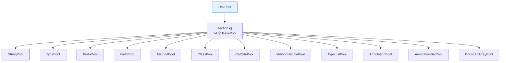
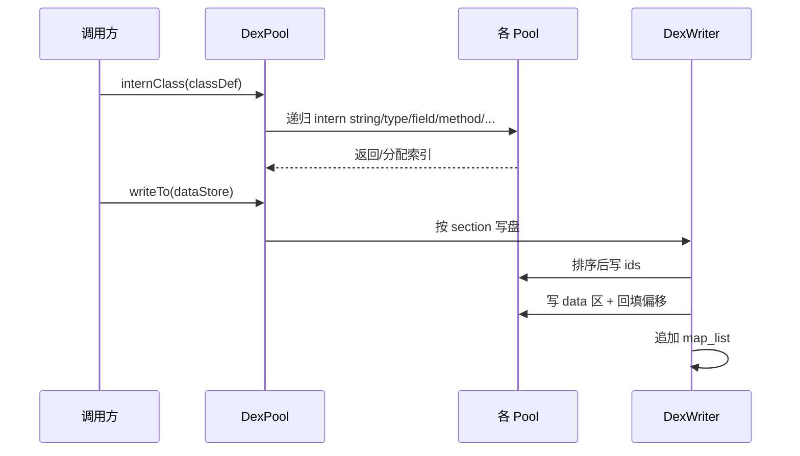

# 📤 writer/pool — 池化写入策略

`writer/pool/` 是 `DexWriter` 的池化实现策略，把 iface 对象 intern 到各池、排序、分配索引后写盘。是 `smali assemble` 与 `baksmali transform` 写回 dex 的实际路径。

## DexPool —— 编排入口

`DexPool`（`writer/pool/DexPool.java:53`）继承 `DexWriter`，把 14 个 section 池装配进 `sections[]` 数组：



## 关键类

| 类 | 职责 |
|----|------|
| `DexPool` | 编排入口，internClass + writeTo |
| `BasePool` | 池基类：去重 + 排序 + 索引分配 |
| `BaseIndexPool` | 按索引排序的池基类 |
| `BaseOffsetPool` / `BaseNullableOffsetPool` | 按偏移定位的池（data 区条目） |
| `StringPool` / `TypePool` / `ProtoPool` | string/type/proto 池 |
| `FieldPool` / `MethodPool` | field/method id 池 |
| `ClassPool` / `PoolClassDef` | class_def 池与可变类定义 |
| `CallSitePool` / `MethodHandlePool` | call site / method handle 池 |
| `TypeListPool` | 类型列表（接口、参数、异常）池 |
| `AnnotationPool` / `AnnotationSetPool` / `EncodedArrayPool` | 注解与编码数组池 |
| `PoolMethod` | 可变方法（写回时持有） |
| `StringTypeBasePool` | string/type 共用基类（type 引用 string） |

## intern 与排序



去重靠各 `BasePool` 的 `ConcurrentReferenceHashMap`（按值语义），同一字符串/方法在整个 dex 只占一个 id。排序遵循 dex 规范（string 按 MUTF-8 字节序、type 按 string 索引序、method 按 class→name→proto）。

## 偏移的两阶段

data 区条目（code_item、annotation、type_list）需先写盘知偏移，而 class_def/proto 又引用这些偏移。`DexWriter` 用 `OffsetSection`/`NullableOffsetSection` 先预留占位、后回填。

## 写入入口

```java
// DexPool.java 概念
DexPool pool = new DexPool(opcodes);
for (ClassDef c : classes) pool.internClass(c);
pool.writeTo(new FileDataStore(new File("out.dex")));
```

`FileDataStore` / `DexDataStore`（`writer/io/`）是底层字节输出抽象，支持文件与内存。

## 与 builder 策略的区别

- `writer/pool`：消费任意 iface 对象，通用、是默认策略。
- `writer/builder`：专消费 builder 对象，smali 汇编路径可直接用，省一次转换。

## 实战

```bash
# 汇编——内部走 DexPool
java -jar smali.jar assemble input.smali -o out.dex
# 写回变换——修改后重新池化写盘
java -jar baksmali.jar transform unlock app.apk -o unlocked.apk
```

## 延伸阅读

- [dexlib2 writer 层](./writer.md) — 池化策略的抽象骨架
- [DexPool 详解](./dex-pool.md) — 编排入口
- [DexWriter 详解](./dex-writer.md) — 序列化编排
- [池化写入机制](../../internals/pool-writing.md)
- [零拷贝解析](../../internals/zero-copy.md) — 读端对应
