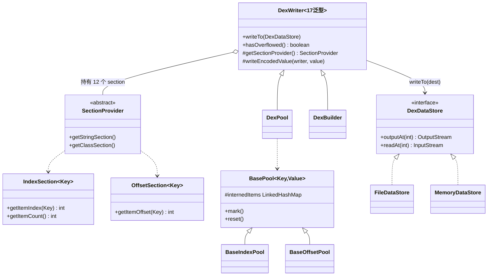
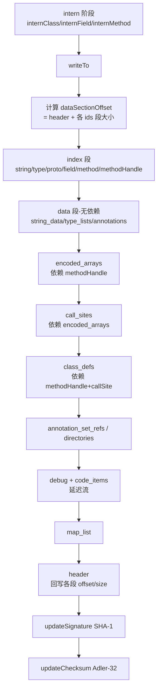

# 📦 writer — 序列化写入层

`org.jf.dexlib2.writer` 负责把 `iface/` 层的只读对象（`ClassDef`、`Method`、`Instruction`、`EncodedValue`…）**编排、去重（intern）、按 dex 二进制布局写回磁盘**，并计算 SHA-1 签名与 Adler-32 校验和。它是 smali 汇编链路的终点：树 walker 产出 builder 对象 → `DexBuilder` 去重 → `DexWriter` 序列化字节。

该包的核心设计是**策略模式 + 模板方法**：`DexWriter` 是抽象泛型骨架，定义写入流程；具体的"如何 intern / 如何取索引"由两套具体子类提供——`pool/`（直接消费 `iface` 对象）与 `builder/`（消费 `builder/` 可变对象，并产回带索引的 `BuilderReference` 供树 walker 回填）。

## 🧩 设计要点

- **抽象泛型骨架**：`DexWriter` 拥有 17 个泛型参数（`DexWriter.java:81-107`），把"dex 各 section 的键类型"全部参数化，使同一套写入逻辑既能跑 `pool` 策略也能跑 `builder` 策略。
- **Section 双抽象**：常量池用 `IndexSection`（按索引引用，如 `string_ids`），数据段用 `OffsetSection`（按偏移引用，如 `code_items`）；`NullableIndexSection`/`NullableOffsetSection` 允许空值。
- **两套具体策略**：`DexPool` 直接 intern `iface.ClassDef`，适合"读一份 dex → 改 → 写另一份"；`DexBuilder` intern 字符串/类型描述符并返回 `BuilderReference`，适合从头汇编（smali 树 walker 的目标）。
- **去重即排序**：所有 section 用 `LinkedHashMap` intern，写入前再按 dex 规范排序（类型按 `typeName`、方法按 `(declaringClass, name, proto)` 等），保证输出确定且可比对。
- **溢出回滚**：`DexPool.mark()`/`reset()` 在多 dex 落盘时回退最后一个导致 65536 溢出的类（`DexPool.java:113-129`、`DexWriter.java:283-306`）。
- **分段随机写**：dex 要求 header/index/data 三段紧凑排列且 data 内部有交叉引用，`DexDataStore` 抽象随机寻址输出（文件或内存），`DexDataWriter` 在其上提供 ULEB128/对齐等写原语。

## 🗂️ 包结构与类清单

### 顶层骨架（`org.jf.dexlib2.writer`）

| 类 | 职责 | 关键方法 |
|---|---|---|
| `DexWriter` | 抽象泛型序列化骨架，编排所有 section 写入 | `writeTo(DexDataStore)`、`hasOverflowed()`、`getDataSectionOffset()` |
| `SectionProvider` | 抽象工厂，按策略产出 12 个 section | `getStringSection()`、`getClassSection()` … |
| `IndexSection` | 索引型 section 契约 | `getItemIndex(Key)`、`getItemCount()` |
| `OffsetSection` | 偏移型 section 契约 | `getItemOffset(Key)` |
| `NullableIndexSection`/`NullableOffsetSection` | 允许空键的变体 | `getItemNullableIndex()` |
| `StringSection` … `ClassSection` | 12 个 section 的窄接口（按 dex 段切分） | 见各接口 |
| `DexDataWriter` | 带 `filePosition` 的缓冲输出流，写 ULEB128/SLEB128/对齐 | `writeUleb128(int)`、`writeHtons(int)`、`align()` |
| `InstructionWriter` | 把 `Instruction` 按格式编码为字节 | `writeInstructions(Iterable)` |
| `EncodedValueWriter` | 把 `EncodedValue` 编码为 dex encoded value | `writeAnnotation()`、`writeArray()`、`writeString()` |
| `DebugWriter` | 编码 `DebugItem`（行号、局部变量） | `writeDebugItems()` |
| `InstructionFactory` | 指令格式分发辅助 | `makeInstructionWriter()` |

### pool 策略（`org.jf.dexlib2.writer.pool`）

| 类 | 职责 |
|---|---|
| `DexPool` | `DexWriter` 的 pool 具体子类，直接 intern `iface.ClassDef` |
| `BasePool` | 所有 pool 的基类，持有 `LinkedHashMap` 与 mark/reset |
| `BaseIndexPool`/`BaseOffsetPool` | 实现 `IndexSection`/`OffsetSection` |
| `StringPool`/`TypePool`/`ProtoPool`/`FieldPool`/`MethodPool`/`ClassPool`/`CallSitePool`/`MethodHandlePool` | 索引型常量池 |
| `TypeListPool`/`AnnotationPool`/`AnnotationSetPool`/`EncodedArrayPool` | 偏移型数据段 |
| `PoolClassDef`/`PoolMethod`/`PoolMethodProto` | 包装 `iface` 对象、缓存排序键 |
| `Markable` | mark/reset 契约接口 |

### builder 策略（`org.jf.dexlib2.writer.builder`）

| 类 | 职责 |
|---|---|
| `DexBuilder` | `DexWriter` 的 builder 具体子类，返回 `BuilderReference` 供回填 |
| `BuilderReference`/`BuilderStringReference`/`BuilderTypeReference`/`BuilderFieldReference`/`BuilderMethodReference`/`BuilderMethodProtoReference`/`BuilderCallSiteReference`/`BuilderMethodHandleReference` | 带索引的引用实现，写入时由 `BuilderXxxPool` 填充 index/offset |
| `BuilderClassDef`/`BuilderField`/`BuilderMethod`/`BuilderMethodParameter`/`BuilderTryBlock`/`BuilderExceptionHandler`/`BuilderAnnotation`/`BuilderAnnotationElement`/`BuilderTypeList` | 可变元素的 builder 实现 |
| `BuilderStringPool` … `BuilderEncodedArrayPool` | builder 版本的 12 个 section pool |
| `BuilderMapEntryCollection`/`BaseBuilderPool` | builder pool 公共基类 |
| `BuilderEncodedValues` | 各 `EncodedValue` 子类的 builder 实现（嵌套类） |

### io 与 util

| 类 | 职责 |
|---|---|
| `io.DexDataStore` | 随机寻址读写抽象（`outputAt(offset)`/`readAt(offset)`） |
| `io.FileDataStore` | 基于 `RandomAccessFile` 的文件实现 |
| `io.MemoryDataStore` | 内存 `byte[]` 实现 |
| `io.DeferredOutputStream`/`io.MemoryDeferredOutputStream`/`io.FileDeferredOutputStream` | 用于 code 段延迟落盘（需先算偏移再回写） |
| `util.TryListBuilder` | 把方法体指令切成无重叠 try 区间 |
| `util.StaticInitializerUtil` | 收集静态字段初始值组装 `EncodedArray` |
| `util.CallSiteUtil` | call site 排序辅助 |

## 📐 类关系图



## 🔄 写入数据流

`DexWriter.writeTo()` 按下表顺序把内存对象编排成字节（`DexWriter.java:308-369`）：



> 顺序很重要：`encoded_arrays` 依赖 `method_handles` 的偏移，`call_sites` 依赖 `encoded_arrays` 的偏移，`class_defs` 又依赖 `call_sites` 与 `method_handles`，因此代码中显式为这两段单独开 writer 并即时关闭（`DexWriter.java:329-348`）。

## ⚙️ 典型用法

### pool 策略：把一份 dex 改写后落盘

`DexPool.writeTo` 提供静态便捷入口，直接消费任意 `iface.DexFile`（`DexPool.java:84-99`）：

```java
// 从已有 DexFile（DexBacked/Immutable 均可）写出
DexPool.writeTo(new FileDataStore(new File("out.dex")), inputDexFile);
// 或直接给路径
DexPool.writeTo("out.dex", inputDexFile);
```

### builder 策略：smali 汇编的终点

`DexBuilder` 在 intern 时返回带索引的 `BuilderReference`，供 tree walker 回填到指令里（`DexBuilder.java:162-219`）：

```java
DexBuilder dexBuilder = new DexBuilder(opcodes);

// intern 字符串/类型/引用，返回值带可被指令引用的 index
BuilderStringReference str = dexBuilder.internStringReference("hello");
BuilderTypeReference type = dexBuilder.internTypeReference("Lcom/ex/Foo;");
BuilderFieldReference field = dexBuilder.internFieldReference(fieldRef);

// 组装类并写入
BuilderClassDef cls = dexBuilder.internClassDef(
        "Lcom/ex/Foo;", accessFlags, superclass, interfaces,
        sourceFile, annotations, fields, methods);
dexBuilder.writeTo(new FileDataStore(new File("out.dex")));
```

### 多 dex 落盘与溢出回滚

当常量池超过 65536 项时，按类逐个 intern 并在越界时回退（`DexPool.java:113-129`）：

```java
DexPool dexPool = new DexPool(opcodes);
for (ClassDef classDef : allClasses) {
    dexPool.mark();
    dexPool.internClass(classDef);
    if (dexPool.hasOverflowed()) {
        dexPool.reset();               // 回退本类
        dexPool.writeTo(curStore);     // 当前 dex 落盘
        dexPool = new DexPool(opcodes); // 开下一个 dex
        dexPool.internClass(classDef);
    }
}
```

## 🔍 与其他包的协作

- **`iface/`**：writer 全程消费其只读接口（`ClassDef`、`Method`、`Instruction`、`EncodedValue`、各类 `Reference`）；`Reference.validateReference()` 在 intern 时被调用。
- **`builder/`**：`DexBuilder` 策略直接依赖 `builder.MutableMethodImplementation`、`BuilderInstruction31c` 等（见 `DexWriter.java:42-43` 的 import），是 smali 汇编链路的写入端。
- **`dexbacked/raw/`**：复用 `HeaderItem`、`StringIdItem`、`TypeIdItem`、`FieldIdItem`、`MethodIdItem`、`ProtoIdItem`、`ClassDefItem`、`CallSiteIdItem`、`MethodHandleItem` 的 `ITEM_SIZE` 常量做段偏移计算（`DexWriter.java:244-254`）。
- **`immutable/`**：`DexPool` 的典型输入就是 `ImmutableDexFile`——读、改、写回路。
- **`rewriter/`**：先经 `Rewriter` 改写引用，再把结果喂给 `DexPool.writeTo`。
- **smali 树 walker**：产出 `BuilderClassDef`/`BuilderMethod` 等交给 `DexBuilder`，是 `smali` 模块与 `dexlib2` 的接线点。

## 延伸阅读

- [iface — 接口层](./iface-reference.md)（writer 消费的只读契约）
- [iface/reference — 引用接口](./iface-reference.md)（被 intern 的对象）
- [builder — 可变构造](./iface-reference.md)（DexBuilder 的输入侧，后续补全）
- [util — 工具类](./util.md)（`InstructionUtil`、`MethodUtil` 等被 writer 引用）
- [formatter — 格式化](./formatter.md)（`DexFormatter` 用于生成方法/字段描述符列表）
- smali 汇编流程总览（smali 模块文档，后续补全）
