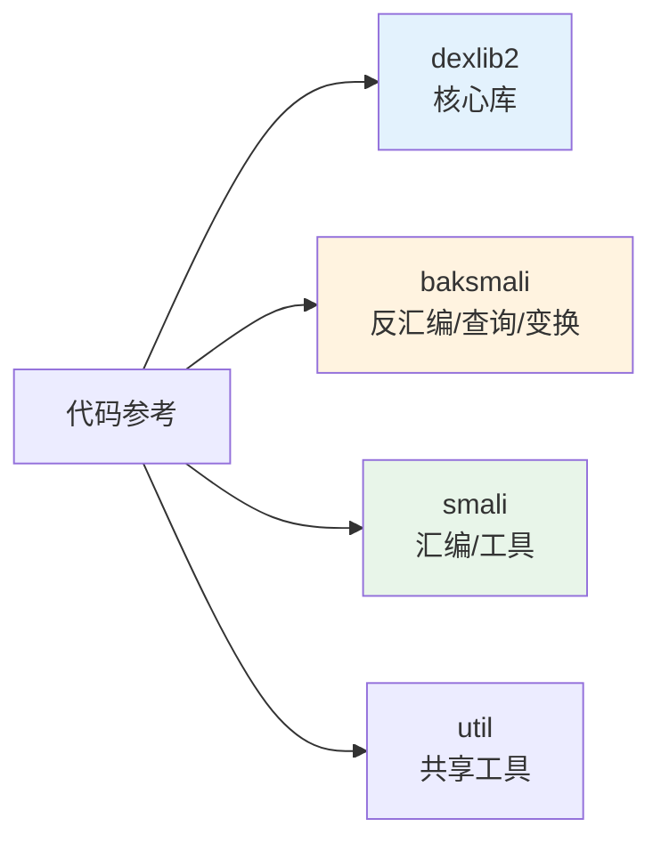

# 📚 代码参考

按模块组织的源码级参考文档。每个包与关键类都有对应文档，含类清单表格、关系图、源码引用。

## 模块导航

| 模块 | 内容 | 文档数 |
|------|------|--------|
| [dexlib2](./dexlib2/) | iface/dexbacked/immutable/builder/writer/rewriter/analysis 各包与核心类 | ~36 |
| [baksmali](./baksmali/) | 各命令类、Adaptors/transform/diff/fingerprint/mcp 等子包 | ~40 |
| [smali](./smali/) | assemble 管线、LSP、format/lint、语法 | ~9 |
| [util](./util.md) | 共享工具类 | 1 |

## dexlib2 子模块

| 包 | 文档 |
|----|------|
| iface | [总览](./dexlib2/iface.md) · [指令](./dexlib2/iface-instruction.md) · [格式](./dexlib2/iface-formats.md) · [引用](./dexlib2/iface-reference.md) · [编码值](./dexlib2/iface-value.md) · [调试](./dexlib2/iface-debug.md) |
| dexbacked | [总览](./dexlib2/dexbacked.md) · [原始结构](./dexlib2/dexbacked-raw.md) |
| immutable | [总览](./dexlib2/immutable.md) |
| builder | [总览](./dexlib2/builder.md) |
| writer | [总览](./dexlib2/writer.md) · [pool](./dexlib2/writer-pool.md) · [builder](./dexlib2/writer-builder.md) |
| rewriter | [总览](./dexlib2/rewriter.md) |
| analysis | [总览](./dexlib2/analysis.md) |
| formatter | [总览](./dexlib2/formatter.md) |
| base | [总览](./dexlib2/base.md) |
| util | [总览](./dexlib2/util.md) |
| 核心类 | [DexFileFactory](./dexlib2/dexfile-factory.md) · [DexBackedDexFile](./dexlib2/dexbacked-dexfile.md) · [DexPool](./dexlib2/dex-pool.md) · [Opcode](./dexlib2/opcode.md) 等 |

## baksmali 命令

[disassemble](./baksmali/commands/disassemble.md) · [list](./baksmali/commands/list.md) · [xref](./baksmali/commands/xref.md) · [search](./baksmali/commands/search.md) · [diff](./baksmali/commands/diff.md) · [fingerprint](./baksmali/commands/fingerprint.md) · [transform](./baksmali/commands/transform.md) · [mcp](./baksmali/commands/mcp.md) · [dump](./baksmali/commands/dump.md) · [deodex](./baksmali/commands/deodex.md) 等

## 延伸阅读

- [三层架构](../guide/architecture.md)
- [内部原理](../internals/)
- [CLI 文档](../cli/)
