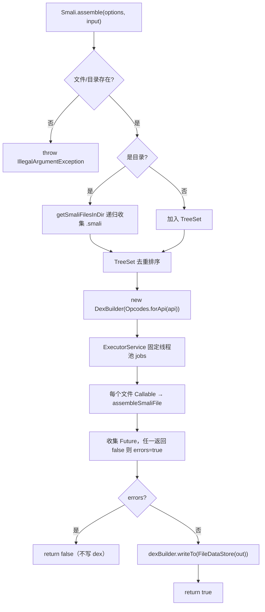

# 🛠️ smali assemble 命令

`smali assemble` 把一个或多个 `.smali` 文本文件汇编成单个 Dalvik 可执行文件（`.dex`）。它是 smali→dex 方向的核心命令，也是"反汇编 → 修改 → 重汇编"工作流的收口环节。命令本体 `AssembleCommand` 极薄，仅做参数解析与分发；真正的汇编逻辑全部位于 `Smali.assemble`。

## 命令定位

- 命令名：`assemble`
- 别名：`ass`、`as`、`a`（`@ExtendedParameters(commandAliases)`）
- 描述（`@Parameters(commandDescription)`）：`Assembles smali files into a dex file.`
- 继承链：`AssembleCommand` → `org.jf.util.jcommander.Command`
- 注册点：`Main.main` 通过 `ExtendedCommands.addExtendedCommand` 注入（`Main.java:83`）

源码：`smali/src/main/java/org/jf/smali/AssembleCommand.java:46-50`

`Main` 在解析参数前注册全部子命令（assemble / printTokens / lsp / smali-format / smali-lint / help），随后 `jc.parse(args)` 选出目标命令并调用其 `run()`（`Main.java:91-103`）。`-v/--version` 与 `-h/--help` 在 `Main` 自身处理（`Main.java:54-60, 93-100`）。

## @Parameter 参数表

| 参数 | 短名/别名 | 说明 | 默认值 | 校验 |
| --- | --- | --- | --- | --- |
| `[<file>\|<dir>]+`（位置参数） | — | 待汇编的 `.smali` 文件或目录；目录递归搜索 `.smali` | —（空则打印 usage） | — |
| `-o`, `--output` | — | 输出 dex 路径 | `out.dex` | — |
| `-a`, `--api` | — | 汇编所用数字 API level，决定可用操作码集 | `15` | — |
| `-j`, `--jobs` | — | 并行编译线程数 | `Runtime.availableProcessors()` | `PositiveInteger`（正整数） |
| `--allow-odex-opcodes` | `--allow-odex`、`--ao` | 允许汇编 dalvik 不拒绝的 odex 优化操作码 | `false` | 布尔 |
| `--verbose` | — | 生成详尽的错误信息 | `false` | 布尔 |
| `-h`, `-?`, `--help` | — | 显示用法 | `false` | 布尔 |

参数声明见 `AssembleCommand.java:52-83`。`getOptions()`（`:102-112`）把这些字段拷进一个 `SmaliOptions` 传给 `Smali.assemble`：

```java
options.jobs = jobs;
options.apiLevel = apiLevel;
options.outputDexFile = output;
options.allowOdexOpcodes = allowOdexOpcodes;
options.verboseErrors = verbose;
```

`SmaliOptions` 字段与命令参数一一对应（`SmaliOptions.java:34-42`），额外有 `printTokens` 仅供 `PrintTokensCommand` 使用，assemble 不触及。

## run() 入口

`AssembleCommand.run()`（`AssembleCommand.java:89-100`）只做两件事——前置校验与转发：

```java
if (help || input == null || input.isEmpty()) {
    usage();
    return;
}
Smali.assemble(getOptions(), input);  // IOException 包装为 RuntimeException
```

无输入或带 `-h` 时直接打印用法并退出（短路），避免空跑线程池。`IOException` 被包装成 `RuntimeException` 抛出——这意味着磁盘写入失败会以非检查异常冒泡。

## assemble 流程



关键节点（`Smali.java`）：

1. **输入收集**（`:77-91`）：`TreeSet<File>` 天然去重并按路径排序；目录走 `getSmaliFilesInDir`（`:177-188`）递归收集 `*.smali`。
2. **DexBuilder 构造**（`:95`）：`new DexBuilder(Opcodes.forApi(options.apiLevel))`——`Opcodes.forApi` 仅记录 api/art 版本，真正的"哪些操作码可用"由 `Opcode` 枚举按版本裁剪（`Opcodes.java:58-60, 85-99`）。
3. **并行汇编**（`:97-106`）：固定大小线程池，每个 `.smali` 一个 `Callable`，共享同一个 `DexBuilder`（线程安全由 dexlib2 builder 内部保证）。
4. **错误聚合**（`:108-123`）：逐个 `task.get()`，任一返回 `false` 或抛 `ExecutionException` 即置 `errors=true`；`InterruptedException` 自旋重试。
5. **写出**（`:131`）：仅当 `errors == false` 时调用 `dexBuilder.writeTo(new FileDataStore(new File(options.outputDexFile)))`——有错则**不落盘**，避免产出半残 dex。

### 单文件流水线

`assembleSmaliFile`（`Smali.java:190-255`）是真正的"词法→解析→树遍历→builder"四段式：

| 阶段 | 类 | 源码 |
| --- | --- | --- |
| 词法（JFlex） | `smaliFlexLexer` | `:197-199` |
| 解析（ANTLR3） | `smaliParser.smali_file()` | `:222-227` |
| AST→builder | `smaliTreeWalker.smali_file()` | `:242-247` |

`smaliTreeWalker` 通过 `dexGen.setDexBuilder(dexBuilder)` 把生成的类/方法塞进共享 `DexBuilder`（`:246`）。词法或解析阶段的语法错误数 > 0 即提前返回 `false`（`:229-231`）。`apiLevel`、`allowOdex`、`verboseErrors` 同时下发到 parser 与 tree walker（`:223-225, 243-245`）。

## 输出 dex

产物路径由 `-o/--output` 决定，默认 `out.dex`（`AssembleCommand.java:67-70`）。`DexBuilder.writeTo` 经 `FileDataStore` 将序列化后的 dex 字节写入该文件。成功时 `assemble` 返回 `true` 且**无任何 stdout 输出**——脚本判定成功需依赖退出码与文件存在性。

## 真实命令示例

```bash
# 1) 基本汇编（目录递归）
java -jar smali.jar assemble -o /tmp/hello.dex examples/HelloWorld/
# （无输出即成功；产物 /tmp/hello.dex）

# 2) 短别名 + 指定 API 级别
java -jar smali.jar a -o out.dex -a 28 smali_src/

# 3) 允许 odex 操作码（处理 deodex 前的中间产物）
java -jar smali.jar ass -o out.dex --allow-odex smali_src/

# 4) 限制单线程便于调试
java -jar smali.jar assemble -j 1 -o out.dex smali_src/

# 5) 详尽错误（开发期定位语法问题）
java -jar smali.jar assemble --verbose -o out.dex smali_src/
```

汇编后用 baksmali 验证产物：

```bash
java -jar baksmali.jar list classes --format text /tmp/hello.dex
# LHelloWorld;
```

源文件 `examples/HelloWorld/HelloWorld.smali` 节选：

```smali
.class public LHelloWorld;
.super Ljava/lang/Object;

.method public static main(Ljava/lang/String;)V
    .registers 2
    sget-object v0, Ljava/lang/System;->out:Ljava/io/PrintStream;
    const-string v1, "Hello World!"
    invoke-virtual {v0, v1}, Ljava/lang/PrintStream;->println(Ljava/lang/String;)V
    return-void
.end method
```

## 常见错误

| 错误 | 原因 | 解决 |
| --- | --- | --- |
| `invalid instruction` | API 级别过低，不支持该指令 | 加 `-a` 提高到对应 API |
| `odex opcode not allowed` | 使用了 odex 优化操作码 | 加 `--allow-odex-opcodes` 或先 deodex |
| `Cannot find file or directory` | 输入路径不存在 | 检查路径，目录递归仅收 `.smali` |
| `RuntimeException: IOException` | 输出路径不可写 / 磁盘满 | 检查 `-o` 目标目录权限 |

## 源码要点

- 命令注册与分发：`Main.java:83, 102-103`
- 参数表全部声明：`AssembleCommand.java:52-83`
- `getOptions()` 字段映射：`:102-112`
- `run()` 前置校验与转发：`:89-100`
- 输入收集与 `TreeSet` 去重：`Smali.java:77-91`
- 线程池与错误聚合：`:97-123`
- 仅无错才落盘：`:127-131`
- 单文件四段流水线：`:190-249`

## 延伸阅读

- CLI: smali assemble — 面向使用者的速查与 API 级别对照表
- [反汇编↔汇编往返 — disassemble → 修改 → assemble 闭环
- [SmaliOptions](./smali-formatter.md) — 选项对象字段全貌（同模块共享）
- [baksmali list classes](../baksmali/commands/list-strings.md) — 汇编产物验证入口
