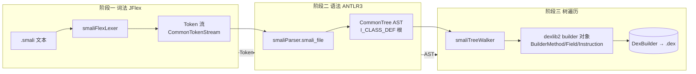

# 🔗 汇编管线 — lexer→parser→tree walker

smali 把 `.smali` 文本变成 `.dex` 二进制走的是经典的 ANTLR3 三阶段管线：**词法分析 → 语法分析 → 树遍历代码生成**。三阶段的输入输出严格分层，前一阶段的产物就是后一阶段的食粮，且全部由 Gradle 的 `generateGrammarSource`/jflex 任务在构建期自动生成 Java 源码。本文拆解每阶段的职责、关键规则与最终生成物。

总装入口在 `Smali.assembleSmaliFile`（`smali/src/main/java/org/jf/smali/Smali.java:190`），它把三个生成器串成一条流水线：

```java
// Smali.java:197-247（节选）
LexerErrorInterface lexer = new smaliFlexLexer(reader, options.apiLevel);
CommonTokenStream tokens = new CommonTokenStream((TokenSource)lexer);
smaliParser parser = new smaliParser(tokens);
parser.setApiLevel(options.apiLevel);
smaliParser.smali_file_return result = parser.smali_file();   // 阶段二：AST
CommonTree t = result.getTree();
CommonTreeNodeStream treeStream = new CommonTreeNodeStream(t);
treeStream.setTokenStream(tokens);
smaliTreeWalker dexGen = new smaliTreeWalker(treeStream);
dexGen.setDexBuilder(dexBuilder);
dexGen.smali_file();                                          // 阶段三：builder
```

## 🧭 三阶段总览



三个生成器各自的输入产物、校验职责与失败语义都不一样，下表概括：

| 阶段 | 生成器输入 | 生成器产物 | 关键类 | 错误统计入口 |
| --- | --- | --- | --- | --- |
| 一 词法 | `smaliLexer.jflex` | `smaliFlexLexer`（`TokenSource`） | `Token` / `InvalidToken` | `getNumberOfSyntaxErrors()` |
| 二 语法 | `smaliParser.g` | `smaliParser`（输出 `AST`） | `CommonTree`、`I_*` 虚拟节点 | `parser.getNumberOfSyntaxErrors()` |
| 三 树遍历 | `smaliTreeWalker.g` | `smaliTreeWalker`（消费 AST） | `DexBuilder`、`BuilderInstruction*` | `dexGen.getNumberOfSyntaxErrors()` |

`Smali.assembleSmaliFile` 在阶段二之后立即短路：只要 lexer 或 parser 报错就返回 `false`，绝不让脏 AST 进入 tree walker（`Smali.java:229-231`）。

## 1️⃣ 阶段一：JFlex 词法分析

输入文件：`smali/src/main/jflex/smaliLexer.jflex`。生成的 `smaliFlexLexer` 实现 `TokenSource`，把字符流切成带类型与位置（行/列/起止字符偏移）的 `CommonToken`。

### 职责

- **指令分类**：为每条 smali 指令按其格式产出专用 token，例如 `"const/4"` → `INSTRUCTION_FORMAT11n`、`"invoke-virtual"` → `INSTRUCTION_FORMAT35c_METHOD`（`smaliLexer.jflex:521-535, 675-677`）。格式后缀直接编码了指令的寄存器/字面量元数，让 parser 几乎不做歧义判定。
- **指令歧义归约**：少数指令既可能是指令也可能是标识符，词法给出"或"型 token，交由 parser 按上下文消解——`"move"` 走 `INSTRUCTION_FORMAT12x_OR_ID`（`:530-535`），`"const"` 走 `INSTRUCTION_FORMAT31i_OR_ID`（`:655-657`），`"rsub-int"` 走 `INSTRUCTION_FORMAT22s_OR_ID`（`:620-622`）。
- **类型与描述符**：用状态机（`CLASS_DESCRIPTOR_BEGINNING`/`_REMAINING`、`PARAM_LIST`、`ARRAY_DESCRIPTOR`）拼接跨多字符的 `Lpkg/Class;` 描述符与参数列表（`smaliLexer.jflex:277-283, 367-401`）。
- **字面量**：整数/长/短/字节、浮点（含 `NaN`/`Infinity`）、字符串（带 `\uXXXX` 转义）、字符、布尔、null（`:329-347, 403-466`）。
- **注册名、访问标志、hidden-api 限制、odex 索引**（`inline@`/`vtable@`/`field@`）等杂项 token（`:469-505`）。
- **非法兜底**：未识别的 `.xxx` 直接产出 `InvalidToken("Invalid directive")`，裸 `.` 与任意字符同理（`:799-803`）。

`InvalidToken` 走 `smaliParser.ERROR_CHANNEL`，不污染主流但计入错误数（`InvalidToken.java:37-45`）。`apiLevel` 通过 `%ctorarg` 注入，控制如"带空格的引用名仅 API≥30/dex 040 允许"这类版本门禁（`smaliLexer.jflex:24-27, 210-216`）。

## 2️⃣ 阶段二：ANTLR3 语法分析

输入文件：`smali/src/main/antlr/smaliParser.g`（`output=AST`）。parser 把 token 流重排成以 `I_CLASS_DEF` 为根的 `CommonTree`，**不做任何 dexlib2 调用**——它的全部产出是一棵纯结构树。

### 职责

- **顶层骨架**：`smali_file` 规则用语义断言强制 `.class`/`.super`（`Object` 例外）必须存在，否则抛 `SemanticException`（`smaliParser.g:429-461`）。重写规则把方法、字段、注解分别装进 `I_METHODS`/`I_FIELDS`/`I_ANNOTATIONS` 三个虚拟子节点（`:462-467`）。
- **指令格式分派**：`instruction` 规则列出 50+ 条 `insn_format*` 分支，每条匹配对应格式的 token 并重写为 `I_STATEMENT_FORMAT*` 节点（`:847-897`）。例如 `insn_format21c_string`（`:974-977`）：

  ```
  insn_format21c_string
    : INSTRUCTION_FORMAT21c_STRING REGISTER COMMA STRING_LITERAL
    -> ^(I_STATEMENT_FORMAT21c_STRING ... INSTRUCTION ... REGISTER STRING_LITERAL);
  ```

- **消解"或"型 token**：`instruction_format12x`/`_22s`/`_31i`/`_35c_method` 把 `_OR_ID` token 改写成确定格式 token，把歧义在 AST 层冻结（`:831-845`）。
- **引用与字面量结构化**：`field_reference`/`method_reference`/`method_prototype`/`array_literal`/`subannotation` 等规则把 `->`、`(V)LType;`、`{...}` 这些 token 组合成 `I_ENCODED_*` 子树（`:700-752`），供 tree walker 直接取用。
- **odex 门禁**：对 `*_ODEX`、`execute-inline`、`invoke-*-quick` 等 odex 指令，parser 在规则动作里调 `throwOdexedInstructionException`，由 `allowOdex` 与 `apiLevel` 决定是否放行（`:910-915, 932-940`）。

注意 `simple_name` 规则（`:558-606`）：smali 的标识符极宽松，几乎任何关键字/字面量 token 都可在成员名位置退化为 `SIMPLE_NAME`——这是 smali 语法最反直觉、也最该被 parser 而非 lexer 处理的部分。

### AST 长什么样

`--print-tokens` 的第二段会打印 `t.toStringTree()`（`Smali.java:238-240`）。AST 全部由 `I_*` 虚拟节点（声明于 `smaliParser.g:165-253`）做骨架，叶子是原始 token。tree walker 完全靠这些 `I_*` 类型号做模式匹配。

## 3️⃣ 阶段三：tree walker 代码生成

输入文件：`smali/src/main/antlr/smaliTreeWalker.g`（`tree grammar`，`tokenVocab=smaliParser`）。它消费 `CommonTreeNodeStream`，把每个 `I_*` 节点翻译成 dexlib2 的 `builder` 包对象，最终通过注入的 `DexBuilder` 落盘。

### 职责

- **类落地**：`smali_file` 规则调 `dexBuilder.internClassDef(...)`，把 header（类名/超类/接口表/源文件）、字段、方法、注解一次性归并（`smaliTreeWalker.g:163-168`）。返回值就是 `ClassDef`。
- **方法体构造**：`method` 规则建 `MethodImplementationBuilder(totalRegisters)`，逐条 `addInstruction`；寄存器数来自 `.registers`/`.locals`，`pN` 参数寄存器在 `parseRegister_*` 里被换成绝对 `vN`（`:100-148, 427-433`）。
- **指令→BuilderInstruction\***：每条 `insn_format*` 规则查 `opcodes.getOpcodeByName(...)` 拿到 `Opcode`，再 `new BuilderInstructionXXx(...)` 并 `addInstruction`。以 `invoke-virtual` 为例（`smaliTreeWalker.g:1187-1201`）：

  ```
  insn_format35c_method
    : ^(I_STATEMENT_FORMAT35c_METHOD INSTRUCTION_FORMAT35c_METHOD register_list method_reference)
    { Opcode opcode = opcodes.getOpcodeByName($INSTRUCTION_FORMAT35c_METHOD.text);
      byte[] registers = $register_list.registers;
      $method::methodBuilder.addInstruction(new BuilderInstruction35c(opcode,
          $register_list.registerCount, registers[0..4],
          dexBuilder.internMethodReference($method_reference.methodReference))); };
  ```

  `register_list` 约定返回定长 `byte[5]`（35c 格式上限 5 寄存器），多余的填 0——这是 tree walker 依赖 parser/lexer 格式契约的典型例子。

- **字面量→ImmutableEncodedValue**：`literal` 规则把每种字面量节点映射到 `ImmutableIntEncodedValue`/`ImmutableStringEncodedValue` 等（`:314-332`），用于静态字段初值与注解元素。
- **引用 intern**：所有 `method_reference`/`field_reference`/类型描述符都经 `dexBuilder.internMethodReference`/`internFieldReference`/`internTypeReference` 进入常量池，保证后续 `DexWriter` 去重排序。

tree walker 不直接写 `.dex` 字节；它的最终产物是填好 builder 对象的 `DexBuilder`，再由 `dexlib2/writer` 串行化。任意阶段抛异常都被 `smali_file` 的 `catch [Exception ex]` 捕获并转成 `SemanticException` 报告（`:169-174`）。

## 🔬 真实命令：观察三个阶段的中间产物

`smali tokens`（隐藏子命令）只跑前两阶段并打印 token 与 AST，是观察管线最直接的工具：

```bash
# 准备最小 smali 文件
cat > Hello.smali <<'EOF'
.class public LHello;
.super Ljava/lang/Object;
.method public static main([Ljava/lang/String;)V
    .registers 2
    const/4 v0, 0x5
    return-void
.end method
.end method
EOF

java -jar smali/build/libs/smali.jar tokens Hello.smali
```

输出（节选，`--api` 默认 15）：

```
CLASS_DIRECTIVE: .class
ACCESS_SPEC: public
CLASS_DESCRIPTOR: LHello;
SUPER_DIRECTIVE: .super
CLASS_DESCRIPTOR: Ljava/lang/Object;
METHOD_DIRECTIVE: .method
ACCESS_SPEC: public
ACCESS_SPEC: static
MEMBER_NAME: main
OPEN_PAREN: (
CLASS_DESCRIPTOR: Ljava/lang/String;
ARRAY_TYPE_PREFIX: [
CLOSE_PAREN: )
VOID_TYPE: V
REGISTERS_DIRECTIVE: .registers
POSITIVE_INTEGER_LITERAL: 2
INSTRUCTION_FORMAT11n: const/4
REGISTER: v0
COMMA: ,
POSITIVE_INTEGER_LITERAL: 5
INSTRUCTION_FORMAT10x: return-void
END_METHOD_DIRECTIVE: .end method
```

注意 `const/4` 被 lexer 直接定为 `INSTRUCTION_FORMAT11n`，而 `return-void` 是 `INSTRUCTION_FORMAT10x`——格式信息在词法层就已锁定，parser 只需匹配固定元数，tree walker 只需 new 对应 `BuilderInstruction11n`/`BuilderInstruction10x`。这条贯穿三阶段的"格式契约"是 smali 管线能做到几乎无回溯的关键。

## 📚 延伸阅读

- [smali 模块总览](./) — 子命令清单与模块定位
- [smali assemble 命令](./assemble-command.md) — 多线程汇编入口与 `DexBuilder` 写出
- [smali 语言服务器](./smali-language-server.md) — 复用 lexer/parser 的 LSP 实现
- [literal-tools](./literal-tools.md) — 字面量解析工具
- [roundtrip 工作流](../../guide/roundtrip.md) — 反汇编→修改→重汇编完整回路
