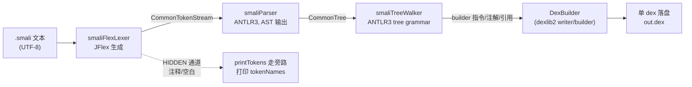

# 🧱 smali 模块总览 — 汇编器与工具

`org.jf.smali` 是 smali/baksmali 项目中的**汇编器模块**：把人类可读的 `.smali` 文本汇编为 Dalvik `.dex` 二进制。它同时把自身的词法/语法分析能力复用为编辑器实时能力（LSP）与源码风格工具（format/lint），构成一个从「写 smali」到「出 dex」的完整工具链。

入口 `org.jf.smali.Main`（jcommander）注册了六个子命令，主类 `org.jf.smali.Smali`（`smali/src/main/java/org/jf/smali/Smali.java:56`）承载核心汇编逻辑。

## 🧩 子命令一览

| 子命令（别名） | 入口类 | 作用 |
|---|---|---|
| `assemble`（`ass`/`as`/`a`） | `AssembleCommand` | 多线程把 `.smali` 文本汇编为单个 `.dex` |
| `lsp` | `LspCommand` | 启动 stdio JSON-RPC 语言服务器，供编辑器集成 |
| `format`（`fmt`） | `SmaliFormatCommand` | 纯文本级规范化（缩进/空白），`--write`/`--check` |
| `lint` | `SmaliLintCommand` | 风格检查（不修改），`--format text\|json` |
| `tokens`（隐藏） | `PrintTokensCommand` | 词法诊断：打印 token 流 |
| `help`（`hlep`） | `HelpCommand` | 帮助 |

注册点见 `Main.main`（`smali/src/main/java/org/jf/smali/Main.java:83-89`）。

## 🔧 assemble：汇编流水线

`Smali.assemble(options, input)`（`Smali.java:76`）把输入路径展开为 `.smali` 文件集（目录递归，`getSmaliFilesInDir`，`:177`），用一个固定大小线程池（`options.jobs`，默认 CPU 核心数）并行汇编每个文件，全部成功后由共享的 `DexBuilder` 落盘（`dexBuilder.writeTo(new FileDataStore(...))`，`:131`）。

```bash
# 基本汇编（别名 a）
java -jar smali.jar a -o out.dex smali_src/
# 指定 API 级别（决定可用操作码，默认 15）
java -jar smali.jar assemble -o hello.dex -a 28 examples/HelloWorld/
```

无输出即成功。产物可被 baksmali 取回验证：

```bash
java -jar baksmali.jar list classes --format text hello.dex
# LHelloWorld;
```

选项来自 `SmaliOptions`（`smali/src/main/java/org/jf/smali/SmaliOptions.java:34`）：`apiLevel`、`outputDexFile`、`jobs`、`allowOdexOpcodes`、`verboseErrors`、`printTokens`。

### 📜 单文件装配四阶段

`assembleSmaliFile`（`Smali.java:190`）按序跑通整条管线：



| 阶段 | 生成器输入 | 产物 | 关键源码 |
|---|---|---|---|
| 词法 | `smali/src/main/jflex/smaliLexer.jflex` | `smaliFlexLexer`（`TokenSource`） | `Smali.java:197` |
| 语法 | `smali/src/main/antlr/smaliParser.g` | `smaliParser`（`output=AST`） | `Smali.java:222` |
| 树遍历 | `smali/src/main/antlr/smaliTreeWalker.g` | `smaliTreeWalker`（`tree grammar`） | `Smali.java:242` |
| 写盘 | dexlib2 `writer/builder` | `DexBuilder` → `out.dex` | `Smali.java:131` |

错误聚合：`parser.getNumberOfSyntaxErrors()` + `lexer.getNumberOfSyntaxErrors()`（`:229`），任一非零即该文件失败、整体不落盘。

## 🧠 lsp：编辑器集成

`LspCommand.run`（`LspCommand.java:63`）直接 `new SmaliLanguageServer(System.in, System.out).run()`。服务器在项目已有的 Gson 之上**手写** `Content-Length` 帧的 JSON-RPC，未引入 LSP4J/网络依赖（`SmaliLanguageServer.java:52-65`）。

| LSP 能力 | 后端 | 来源 |
|---|---|---|
| `publishDiagnostics` | 词法(`InvalidToken`)+语法+语义错误 | `SmaliAnalyzer.diagnostics` |
| `textDocument/documentSymbol` | 类→方法/字段层级大纲 | `SmaliAnalyzer.documentSymbols` |
| `textDocument/hover` | opcode/指令 Markdown 说明 | `OpcodeDocs` |
| `textDocument/formatting` | 复用 `SmaliFormatter` | `SmaliLanguageServer.formatting` |

`SmaliAnalyzer`（`smali/src/main/java/org/jf/smali/lsp/SmaliAnalyzer.java`）是纯分析核心，无 I/O、无状态。位置 0 基（LSP 约定），底层 ANTLR 报 1 基行号，服务器输出时减 1。

```bash
java -jar smali.jar lsp          # 由编辑器拉起，不交互运行
# initializationOptions: {"apiLevel": 34}
```

## 🎨 format / lint：风格工具

`SmaliFormatCommand`（`SmaliFormatCommand.java:59`）与 `SmaliLintCommand`（`SmaliLintCommand.java:64`）共享同一套纯文本风格：`SmaliFormatter.format(String)→String` 与 `SmaliLinter.lint(String)→List<Issue>`，二者**幂等且互为检查端/修复端**。

```bash
# format：打印单文件结果 / --write 就地 / --check CI 模式
java -jar smali.jar format --check src/        # 未格式化则退出 1
java -jar smali.jar format --write out/        # 就地重写

# lint：text（默认）或 json
java -jar smali.jar lint --format json out/
```

文本输出 `path:line:col: [rule] message`，JSON 每条含 `file/line/column/rule/severity/message`（均 1 基）。规则见 `SmaliLinter` javadoc（`smali/src/main/java/org/jf/smali/format/SmaliLinter.java:43-51`）：`trailing-whitespace`、`tab-indentation`、`indentation`、`multiple-blank-lines`、`carriage-return`、`final-newline`。

## 🔬 tokens：词法诊断

隐藏子命令 `tokens`（`PrintTokensCommand.java:50`）调用 `Smali.printTokens`（`Smali.java:143`），跑 lexer 到 `tokens.fill()` 后逐个打印 `tokenName("text")`，跳过 `HIDDEN` 通道。用于排查 lexer/语法解析边界问题。

## 📋 类清单

| 类 / 包 | 行数 | 职责 |
|---|---|---|
| `Main` | 127 | jcommander 入口，注册子命令、`-v` 版本 |
| `Smali` | 292 | 汇编/打印 token 核心，多线程装配 |
| `AssembleCommand` | 113 | `assemble` 子命令，组装 `SmaliOptions` |
| `LspCommand` | 74 | `lsp` 子命令，拉起语言服务器 |
| `SmaliFormatCommand` | 155 | `format` 子命令（`--write`/`--check`/stdout） |
| `SmaliLintCommand` | 154 | `lint` 子命令（`--format text\|json`） |
| `PrintTokensCommand` | 90 | `tokens` 子命令（隐藏） |
| `HelpCommand` | 92 | `help`/`hlep` 子命令 |
| `SmaliOptions` | 42 | 汇编选项 POJO（apiLevel/jobs/output…） |
| `lsp.SmaliLanguageServer` | 424 | JSON-RPC 传输/派发层 |
| `lsp.SmaliAnalyzer` | 312 | 纯分析核心：诊断、文档符号 |
| `lsp.OpcodeDocs` | 189 | opcode/指令 hover 文档 + 族根回退 |
| `lsp.LspModels` | 150 | LSP 数据模型（Symbol/Position/Range…） |
| `format.SmaliFormatter` | 226 | 纯 `format(String)→String`，深度栈缩进 |
| `format.SmaliLinter` | 163 | 纯 `lint(String)→List<Issue>` |
| `format.SmaliFiles` | 80 | 路径展开为 `.smali` 文件集（递归/排序） |
| `LexerErrorInterface` / `InvalidToken` / `SemanticException` / `OdexedInstructionException` / `LiteralTools` / `SmaliMethodParameter` / `WithRegister` / `SmaliTestUtils` | — | 词法错误接口、异常、字面量/参数辅助、测试工具 |

生成产物（构建时由 `generateGrammarSource`/JFlex 自动产出，**勿手改**）：`smali/build/generated-src/jflex/.../smaliFlexLexer.java`、`smali/build/generated-src/antlr/.../smaliParser.java` 与 `smaliTreeWalker.java`。

## 延伸阅读

- [dex-assemble — 汇编 skill](../../skills/dex-assemble.md)
- [smali-lsp — LSP skill](../../skills/smali-lsp.md)
- [smali-format — format/lint skill](../../skills/smali-format.md)
- [smali-formatter — format 包详解](./smali-formatter.md)
- [util — smali 工具类](./util.md)
- baksmali 模块总览
