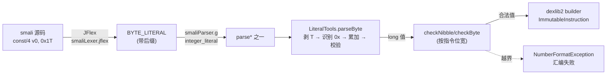

# 🔢 LiteralTools — 字面量解析

`org.jf.smali.LiteralTools` 是 smali 汇编器的「字面量翻译层」。汇编源码里一切带后缀的整型（`100L`、`5S`、`7T`）、十/十六/八进制（`0x1F`、`017`）、以及 IEEE-754 特殊值（`Infinityf`、`NaNd`）都先经过它，再由 ANTLR 树遍历器交给 `dexlib2` 写入指令。它**完全用 `char[]` 手写扫描**，刻意不用 `Long.parseLong`——目的是在溢出前精确报错，并允许 `0x80` 这样的 byte 字面量（其位模式正好是 `-128`）。

源码：`smali/src/main/java/org/jf/smali/LiteralTools.java:34`。全文约 417 行，无依赖（仅 JDK + 正则），是 smali 模块里少有的「纯算法」类。

## 🧩 设计要点

- **类型后缀剥离**：`byte` 剥 `T`/`t`、`short` 剥 `S`/`s`、`long` 剥 `L`/`l`（`LiteralTools.java:46`、`:116`、`:250`）；`int` 不带后缀。`float`/`double` 的 `f`/`d` 后缀则交给 `Float.parseFloat`/`Double.parseDouble` 处理，本类只兜底 `Infinity`/`NaN` 文本（`:310`、`:328`）。
- **基数自识别**：前导 `0x`/`0X` → 16 进制；前导 `0` 且后续为八进制数字 → 8 进制；否则 10 进制（`:60-69`）。这等价于 C 的传统字面量规则，**不是** Java 的（Java 的 `067` 才是八进制，但 `08` 会编译失败——本类则把 `08` 当十进制）。
- **溢出预判**：每次左移（`result * radix`）前先比 `maxValue = TYPE.MAX_VALUE / (radix/2)`，并对「移位后变负 + 末位 digit 越界」单独判定，从而在累加出 `Integer.MIN_VALUE` 之前就能抛出「cannot fit」（`:209`、`:217-222`）。
- **MIN_VALUE 特例**：`-0x80`(byte)、`-0x8000`(short)、`-0x80000000`(int)、`-0x8000000000000000`(long) 这种「最小负数」在 Java 里没有正数对应物，本类用 `result == MIN_VALUE` 的旁路显式放行（`:95`、`:165`、`:229`、`:299`）。
- **IEEE-754 兜底**：smali 允许 `Infinity`/`-Infinity`/`NaN` 加 `f`/`d` 后缀写成字面量，但 JDK 的 `Float.parseFloat` 不认 `Infinityf`，故用正则 `((-)?infinityf)|(nanf)` 先匹配再映射（`:310`、`:328`）。
- **checkXxx 守门**：四个 `check*` 把已解析的 `long` 收敛到目标位宽范围（`checkInt`/`checkShort`/`checkByte`/`checkNibble`，`:394-416`），给树遍历器在 `const/4`、`fill-array-data` 等窄位指令处二次校验。

## 🗂️ 方法清单

| 方法 | 入参 | 返回 | 用途 | 调用点 |
|---|---|---|---|---|
| `parseByte` | `100T`/`0x1FT` | `byte` | byte 字面量 → 值 | 树遍历器 `BYTE_LITERAL`（`smaliTreeWalker.g:1393`） |
| `parseShort` | `5S`/`0x10S` | `short` | short 字面量 → 值 | 树遍历器 `SHORT_LITERAL`（`smaliTreeWalker.g:1390`） |
| `parseInt` | `42`/`0x2A`/`017` | `int` | int 字面量 → 值 | 解析器 + 树遍历器（`smaliParser.g:672`、`smaliTreeWalker.g:1384`） |
| `parseLong` | `100L`/`0x64L` | `long` | long 字面量 → 值 | 树遍历器 `LONG_LITERAL`（`smaliTreeWalker.g:1387`） |
| `parseFloat` | `1.0f`/`Infinityf` | `float` | float 字面量 → 值 | 树遍历器 `FLOAT_LITERAL`（`smaliTreeWalker.g:1396`） |
| `parseDouble` | `1.0d`/`NaNd` | `double` | double 字面量 → 值 | 树遍历器 `DOUBLE_LITERAL`（`smaliTreeWalker.g:1399`） |
| `checkInt`/`checkShort`/`checkByte`/`checkNibble` | `long` | `void`（溢出抛异常） | 窄位指令范围守门 | `smaliTreeWalker.g:875`、`:1038`、`:1360`、`:1365`、`:1375`、`:359` |
| `longToBytes`/`intToBytes`/`shortToBytes`/`floatToBytes`/`doubleToBytes`/`charToBytes`/`boolToBytes` | 数值 | `byte[]` | 小端字节序列化 | **无调用方**（见下） |

## 📐 在汇编流水线中的位置



字面量 token 的后缀定义在 JFlex 规则里（`smali/src/main/jflex/smaliLexer.jflex:332-339`）：

```
-? {Integer} [lL] { return newToken(LONG_LITERAL); }     // long
-? {Integer} [sS] { return newToken(SHORT_LITERAL); }    // short
-? {Integer} [tT] { return newToken(BYTE_LITERAL); }     // byte
{Float}      [fF] { return newToken(FLOAT_LITERAL); }    // float
{Float}      [dD]? { return newToken(DOUBLE_LITERAL); }  // double
```

`Integer` 与 `Float` 宏在同一文件上方定义，允许 `0x` 前缀与 `.`/`e` 指数。

## 🔍 解析算法骨架

四个整型 `parse*` 共用同一套循环（以 `parseInt` 为例）：

```java
// smali/src/main/java/org/jf/smali/LiteralTools.java:194
if (intChars[position] == '0') {            // 基数自识别
    position++;
    if (byteChars[position]=='x' || byteChars[position]=='X') { radix = 16; position++; }
    else if (Character.digit(intChars[position], 8) >= 0) { radix = 8; }
}
int maxValue = Integer.MAX_VALUE / (radix / 2);     // 提前一档的溢出阈值
while (position < intChars.length) {
    digit = Character.digit(intChars[position], radix);
    shiftedResult = result * radix;                 // 左移
    if (result > maxValue) throw ...;               // 移位前预判
    if (shiftedResult < 0 && shiftedResult >= -digit) throw ...; // 移位后回绕
    result = shiftedResult + digit;
}
if (negative) {
    if (result == Integer.MIN_VALUE) return result; // -0x80000000 旁路放行
    else if (result < 0) throw ...;                 // 已回绕到负但非 MIN → 越界
    return result * -1;
}
```

关键不变量：**`result` 在循环体内始终非负**——一旦变负说明已回绕（`int` 容不下），立即抛错。`-0x80000000` 是唯一允许「结果等于 MIN_VALUE」的正数不存在情形，故单独放行。

## 🧪 真实示例：汇编 → 错误

合法字面量，正常汇编：

```bash
$ cat > /tmp/lit.smali <<'EOF'
.class public Lx;
.super Ljava/lang/Object;
.method public static f()V
    .registers 1
    const/4 v0, 0x1T            ; byte 字面量
    const/16 v1, 0x7FFFS        ; short 字面量
    const-wide/16 v2, 0xL       ; long（注：此为最小值）
    return-void
.end method
EOF
$ ./scripts/smali assemble -o /tmp/lit.dex /tmp/lit.smali && echo OK
OK
```

越界字面量，`LiteralTools` 立即报错并中止：

```bash
$ cat > /tmp/bad.smali <<'EOF'
.class public Lx;
.super Ljava/lang/Object;
.method public static f()V
    .registers 1
    const/4 v0, 0xFFFT         ; 0xFFF=4095，超出 nibble 范围 [-8,15]
    return-void
.end method
EOF
$ ./scripts/smali assemble -o /tmp/bad.dex /tmp/bad.smali
# 错误：字面量经 checkNibble 校验失败
# NumberFormatException: 4095 cannot fit into a nibble
```

`checkNibble` 由 `fill-array-data` 的 `PAYLOAD_NIBBLE` 分支调用（`smaliTreeWalker.g:875`），把 payload 元素限定在 4 位有符号范围。

## ⚠️ 注意事项

- **`*ToBytes` 系列是死代码**：`longToBytes`/`intToBytes`/`shortToBytes`/`floatToBytes`/`doubleToBytes`/`charToBytes`/`boolToBytes`（`:346-392`）在全仓库**无任何调用方**（grep 确认）。它们把数值小端序列化为 `byte[]`，疑似早期 `encoded_value` 直写路径的遗留，现已被 `dexlib2` 的 `ImmutableXxxEncodedValue` 取代。新增代码不应复用，删除前需先核对历史版本。
- **`0` 开头歧义**：与 Java 一致，`017` 被当八进制（`=15`），`08` 因 `8` 不是八进制数字而**回退为十进制** `8`。写 smali 时若要表达十进制，避免前导零；要表达字节位模式优先用 `0x`。
- **空串/null 抛错**：`parse*` 对 `null` 或空串抛 `NumberFormatException("string is null"/"string is blank")`（`:39-43`），而非 NPE——这是给 ANTLR 树遍历器的一个温和契约，调用方只需 catch 一种异常。
- **正则大小写不敏感**：`Infinityf`/`infinityF`/`NANd` 均可（`Pattern.CASE_INSENSITIVE`，`:310`）。但十/十六进制前缀 `0x` 的 `x` 必须小写或大写——不能混写 `0X`，正则没限制但 `Character.digit` 走标准路径无影响。
- **不要扩展成万能数值工具**：本类刻意只服务 smali 文法。需要通用数值解析请用 `java.lang.Long` 或 `dexlib2` 的 `EncodedValue` 体系，见 [../dexlib2/iface-value.md](../dexlib2/iface-value.md)。

## 📌 延伸阅读

- [../dexlib2/iface-value](../dexlib2/iface-value.md) — 字段初值/注解元素的 `EncodedValue` 类型分发，与 `*ToBytes` 历史相关
- [../../internals/smali-syntax](../../internals/smali-syntax.md) — smali 字面量在源码层面的语法规则
- [./smali-formatter](./smali-formatter.md) — 反向：把 dex 数值渲染回 smali 字面量文本
- [./util](./util.md) — smali 模块的另一组工具（`BlankReader` 等词法侧设施）
