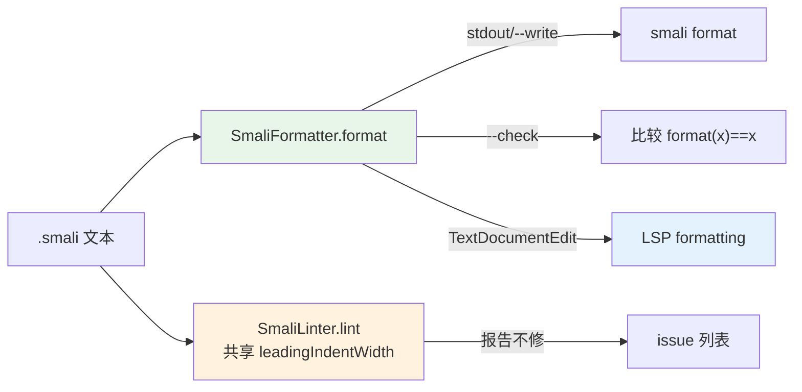

# 🧹 SmaliFormatter — 格式化器

`SmaliFormatter` 是 smali 源码的**规范风格格式化器**。它只看文本、不解析字节码，因此永远不会改变语义，并且**幂等**：`format(format(x)) == format(x)`。它是 `smali format`、`smali lint` 与 LSP `textDocument/formatting` 三条路径的公共底座——一份规则，三个出口。

源码：`smali/src/main/java/org/jf/smali/format/SmaliFormatter.java`。

## 🎯 定位与边界

| 做什么 | 不做什么 |
|--------|----------|
| 按块嵌套深度重新缩进（每级 4 空格） | 不解析指令、不重排指令 |
| 去行尾空白、Tab→空格 | 不改寄存器分配、不合并/拆分指令 |
| 折叠连续空行为单行、补结尾换行 | 不验证语义、不修复语法错误 |
| 折叠 CRLF 为 LF | 不处理注释内容（只整行处理） |

::: tip 为什么「纯文本」足够
smali 的块结构由 `.method`/`.annotation`/`.end ...` 等点号指令显式分隔，缩进层级可以从这些指令的配对关系**机械推导**，无需理解指令含义。这让格式化器极轻、极快、可逆，且能安全地跑在未通过汇编的「半成品」源码上。
:::

## 🔁 三处复用的同一规则



- `smali format`：调用 `format()` 后写回/打印。
- `smali lint`：逐行检查文本级规则，与 formatter 共享 `leadingIndentWidth`（Tab 按 4 展开）。lint 报告的每一条，format 都能修掉。
- LSP `textDocument/formatting`：复用同一个 `SmaliFormatter`，返回覆盖全文的单个 `TextEdit`。

## 📐 缩进模型

格式化器维护一个 `depth` 计数器，按指令类型增减：

| 指令类别 | 成员 | 对 depth 的影响 |
|----------|------|-----------------|
| 无条件块开启 | `.method` `.annotation` `.subannotation` `.array-data` `.packed-switch` `.sparse-switch` | 输出该行后 `depth++` |
| 条件块开启 | `.field` `.param` | 仅当带 body 时 `depth++`（前向 lookahead） |
| 块闭合 | `.end method`/`.end annotation`/… | 输出该行前 `depth--`，使闭合行与开启行对齐 |
| 单语句调试指令 | `.local`/`.end local` | **不**改变层级（非块分隔符） |
| 普通指令/标签/注释 | — | 不改层级，按当前 depth 缩进 |

源码定义见 `SmaliFormatter.java:64-89`（`UNCONDITIONAL_OPENERS`/`CONDITIONAL_OPENERS`/`CLOSERS` 三个集合）。

### 条件开启的 lookahead

`.field`/`.param` 既可能是单行（无 body），也可能带注解子块。`hasBlockBody` 在源码 `SmaliFormatter.java:166-185` 做前向扫描：若在遇到方法边界、同类新开启之前先撞到匹配的 `.end field`/`.end param`，才算块、才 +1 层；中间允许穿插 `.annotation` 子块。

## 📝 规则速查

| 规则 | 处理 |
|------|------|
| 缩进单位 | 4 个空格（`INDENT = "    "`，`SmaliFormatter.java:60`） |
| Tab | 前导 Tab 按 `TAB_WIDTH=4` 展开计算宽度；输出统一用空格 |
| 行尾空白 | 去除（含行尾 `\r`） |
| 连续空行 | 折叠为单个空行；首尾空行裁掉 |
| 结尾换行 | 恰好一个 `\n`；空输入保持空 |
| 指令对齐 | 闭合指令先减层再输出，与开启指令同列 |

## 💻 命令→输出示例

构造一个含三类风格问题的 smali（Tab 缩进 + 行尾空白 + 无结尾换行）：

```bash
printf '.class public LBad;\n.super Ljava/lang/Object;\n.method public static foo()V\n\t.registers 1\nconst/4 v0,0x0   \nreturn-void\n.end method' > bad.smali
```

格式化（打印到 stdout，不改动文件）：

```bash
java -jar smali.jar format bad.smali
```

```smali
.class public LBad;
.super Ljava/lang/Object;
.method public static foo()V
    .registers 1
    const/4 v0,0x0
    return-void
.end method
```

对照可见：第 4 行 Tab→4 空格、第 5 行行尾空白已去、补了结尾换行。

CI 模式只报告不修改，任一未格式化则退出码 1：

```bash
java -jar smali.jar format --check out/
# 2 file(s) not formatted.   (exit 1)
```

## 🔌 LSP 集成

`SmaliLanguageServer` 在 `initialize` 响应中通告 `documentFormattingProvider: true`（`SmaliLanguageServer.java:179`），并在 `textDocument/formatting` 分发里复用 formatter（`SmaliLanguageServer.java:248-278`）：

```java
String formatted = new SmaliFormatter().format(text);
if (formatted.equals(text)) {
    return edits;                       // 已规范 → 空编辑数组
}
// 否则返回一个覆盖全文的 TextEdit
```

返回的 `TextEdit` 范围是 `{start:{0,0}, end:{lineCount,0}}`，`newText` 为整份规范化文本——客户端套用即可。编辑器里「Format Document」即走这条路径。

```
→ textDocument/formatting
← [ { range:{start:{0,0},end:{N,0}}, newText:"…规范化后的整份文本…" } ]
```

## 🗂️ 相关源码

| 文件 | 职责 |
|------|------|
| `smali/src/main/java/org/jf/smali/format/SmaliFormatter.java` | 纯 `format(String)→String`，深度栈 + 开启/闭合集合 + 条件开启 lookahead，无 I/O |
| `smali/src/main/java/org/jf/smali/format/SmaliLinter.java` | 纯 `lint(String)→List<Issue>`，每条规则文本级可判定，与 formatter 共享 `leadingIndentWidth` |
| `smali/src/main/java/org/jf/smali/format/SmaliFiles.java` | 把路径展开成 `.smali` 文件（目录递归、排序，确定性），`format`/`lint` 共用 |
| `smali/src/main/java/org/jf/smali/SmaliFormatCommand.java` | `format` 子命令，`--write`/`--check`/stdout 三态 |
| `smali/src/main/java/org/jf/smali/lsp/SmaliLanguageServer.java` | LSP 传输层，`formatting()` 复用 `SmaliFormatter` |

单元测试见 `smali/src/test/java/org/jf/smali/format/`：覆盖重缩进、嵌套注解/字段块、switch payload、幂等，以及 `formattedOutputIsLintClean` 不变式（格式化输出必通过 lint）。

## 🔗 延伸阅读

- ../cli/format.md — `smali format` / `smali lint` 子命令完整用法
- ../cli/lsp.md — LSP 语言服务器启动与编辑器接入
- ../internals/smali-syntax.md — 手写 smali 语法参考（格式化不改语法，只调风格）
- ../guide/roundtrip.md — 反汇编→编辑→格式化→汇编的往返闭环
