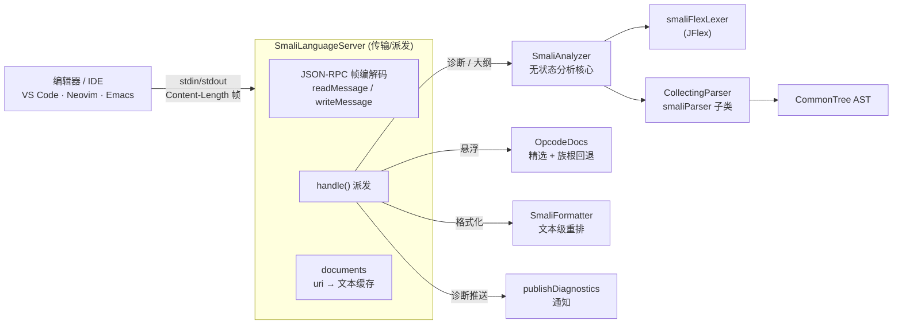

# 🖥️ SmaliLanguageServer — LSP 语言服务器

`SmaliLanguageServer` 是内置于 `smali.jar` 的 **Language Server**，通过 stdio 上的
JSON-RPC（标准 `Content-Length` 帧）与编辑器/IDE 通信。它复用汇编器自身的词法/语法分析
作为实时能力，**在项目已有的 Gson 之上手写协议**，不引入 LSP4J 或网络依赖。

入口位于 `smali/src/main/java/org/jf/smali/lsp/SmaliLanguageServer.java:66`，由
`smali lsp` 子命令（`org.jf.smali.LspCommand`）拉起：

```bash
# 编辑器客户端应以此为 LSP 命令
java -jar smali.jar lsp
# 或用包装脚本（自动定位同目录 smali.jar）
scripts/smali-lsp
```

服务器从 stdin 读、向 stdout 写，由编辑器客户端拉起，不应交互式运行。

## 📡 支持的 LSP 方法

| LSP 方法 | 类型 | 能力 |
|----------|------|------|
| `initialize` | 请求 | 协商能力，接受 `initializationOptions.apiLevel` |
| `initialized` | 通知 | 无操作 |
| `shutdown` / `exit` | 请求/通知 | 优雅终止 |
| `textDocument/didOpen` | 通知 | 缓存文本 + 推送诊断 |
| `textDocument/didChange` | 通知 | 全量同步（取最后一条 change）+ 重算诊断 |
| `textDocument/didClose` | 通知 | 丢弃文档缓存 |
| `textDocument/publishDiagnostics` | 通知 | 词法 + 语法 + 语义错误（含行列） |
| `textDocument/documentSymbol` | 请求 | 类 → 方法/字段层级大纲 |
| `textDocument/hover` | 请求 | 光标下 opcode/指令的 Markdown 说明 |
| `textDocument/formatting` | 请求 | 用 `SmaliFormatter` 重排整份文档 |

`initialize` 返回的 `capabilities`（`SmaliLanguageServer.java:173`）：`textDocumentSync:1`
（全量同步）、`documentSymbolProvider`、`hoverProvider`、`documentFormattingProvider` 均为 `true`。
默认 API level 为 15，客户端可在 `initialize` 中覆盖：

```json
{"initializationOptions": {"apiLevel": 34}}
```

## 🏗️ 架构



关键分工：`SmaliLanguageServer` 只管 **传输 + 派发**，`SmaliAnalyzer` 是 **无 I/O、无状态**
的纯分析核心（`SmaliAnalyzer.java:59`），可独立单测。`OpcodeDocs` 提供悬浮文档，
`SmaliFormatter` 提供格式化。

## 🔍 能力详解

### 诊断（publishDiagnostics）

`SmaliAnalyzer.diagnostics()`（`SmaliAnalyzer.java:80`）收集三类错误：

1. **词法错误** — 扫描填充后的 token 流，挑出 `ERROR_CHANNEL` 上的 `InvalidToken`
   （`SmaliAnalyzer.java:106`）。
2. **语法错误** — 子类化 `smaliParser` 重写 `displayRecognitionError`
   （`SmaliAnalyzer.java:287`），把 `RecognitionException` 转成诊断而非打到 stderr。
3. **语义错误** — `SemanticException` 同样被捕获，如缺失 `.super`。

`RuntimeException` 被防御性兜底成一条 `Internal error` 诊断，**绝不让畸形文档崩溃服务器**。
诊断示例（缺 `.super`）：

```json
{"uri":"file:///F.smali","diagnostics":[
  {"range":{"start":{"line":0,"character":0},"end":{"line":0,"character":0}},
   "severity":1,"source":"smali","message":"The file must contain a .super directive"}]}
```

> 位置为 **0 基**（LSP 约定）：`line:0` 是第一行。底层 ANTLR 报 1 基行号，
> `rangeForNode`/`rangeForToken` 在输出时减 1（`SmaliAnalyzer.java:262`）。

### 文档大纲（documentSymbol）

`SmaliAnalyzer.documentSymbols()`（`SmaliAnalyzer.java:127`）遍历 AST 的
`I_CLASS_DEF`/`I_METHOD`/`I_FIELD` 节点，构造 **层级 `DocumentSymbol`**：类为顶层，
其方法与字段嵌套在 `children`。**语法错误被容忍**——ANTLR 恢复出的部分树仍会走完，故残缺
文档也能产出大纲。方法名带签名（`prototypeText` 重建 `(params)returnType`），字段名为
`name:type`：

```
Lcom/example/E;          (Class, kind=5)
├─ onCreate()V           (Method, kind=6)
├─ toString()Ljava/lang/String;
└─ TAG:Ljava/lang/String; (Field, kind=8)
```

### 悬浮（hover）

`SmaliLanguageServer.hover()`（`SmaliLanguageServer.java:224`）用 `wordAt` 提取光标处的
「opcode/指令风格」token（字母、数字、`- / .`），再查 `OpcodeDocs.lookup()`。
`OpcodeDocs`（`OpcodeDocs.java:48`）有三层回退：

| 层 | 触发 | 说明 |
|----|------|------|
| 精选表 | `invoke-virtual`、`.method` 等 ~70 条 | 一句话人工描述 |
| 族根回退 | `iget-object`、`iget-wide` | 复用 `iget` 的说明 |
| 通用回退 | dexlib2 `Opcode` 枚举校验通过 | "A Dalvik bytecode opcode" + 官方文档链接 |

悬浮返回 Markdown（`MarkupContent`，`kind:"markdown"`），如 `**return-void**` + 返回 void 方法。

### 格式化（formatting）

`SmaliLanguageServer.formatting()`（`SmaliLanguageServer.java:248`）调用
`SmaliFormatter.format()` 文本级重排整份文档，返回**单个覆盖全 buffer 的 `TextEdit`**：
若结果与原文相同则返回空数组（已格式化）。`SmaliFormatter` 只规范化空白与缩进、不解析字节码，
故**永不改变语义**且**幂等**。end 位置取「最后一行下一行的行首」，无论是否有尾随换行都能覆盖整缓冲区。

## 🔁 协议速览

一次最小会话（每条消息都带 `Content-Length` 帧）：

```
→ initialize            ← { capabilities: { documentSymbolProvider, hoverProvider,
                                            documentFormattingProvider, textDocumentSync:1 } }
→ initialized (notif)
→ textDocument/didOpen   ← textDocument/publishDiagnostics（notif，含 diagnostics[]）
→ textDocument/documentSymbol ← [ { name:"Lcom/E;", kind:5, children:[…] } ]
→ textDocument/hover     ← { contents: { kind:"markdown", value:"**return-void** …" } }
→ textDocument/formatting ← [ { range:{…全文档…}, newText:"…" } ]
→ shutdown               ← null
→ exit (notif)
```

未知请求若带 `id`，服务器回一个 `null` 结果（`SmaliLanguageServer.java:148`），避免阻塞客户端。

## 📝 数据模型与测试

`LspModels.java:46` 是与 LSP 线上格式一一对应的纯数据持有者（`Position`/`Range`/`Diagnostic`/
`DocumentSymbol`/`Hover`/`MarkupContent`），字段名必须与 LSP 线名精确匹配——Gson 原样序列化。
`DiagnosticSeverity`（1=Error…4=Hint）与 `SymbolKind`（5=Class/6=Method/8=Field）以常量给出。

端到端测试见 `smali/src/test/java/org/jf/smali/lsp/`：覆盖分析核心、opcode 文档、帧编解码，
以及 stdio 级别的派发往返。

## 🔗 延伸阅读

- [SmaliFormatter — 格式化器](./smali-formatter.md)
- Smali 语法速览
- [baksmali MCP 服务器](../../cli/mcp.md)
- smali-lsp SKILL
