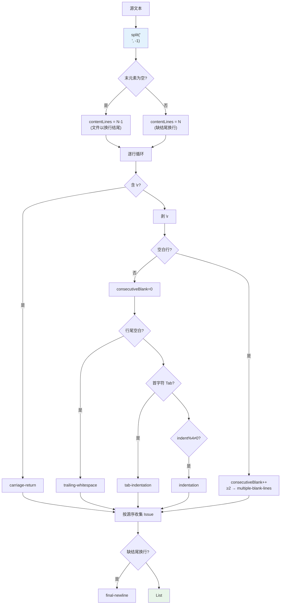
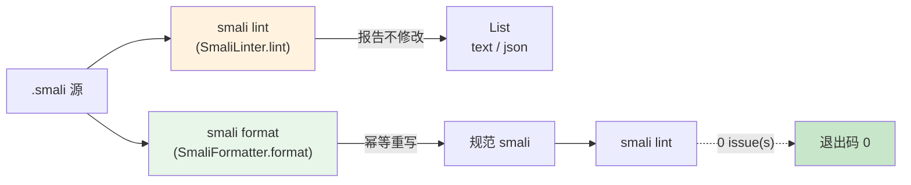

# 🔍 SmaliLinter — lint 风格检查

`SmaliLinter` 是 smali 源码的**风格检查器**。它逐行扫描纯文本（不解析字节码），报告六类风格问题。每条规则都「文本级可判定」，且一一对应 [`SmaliFormatter`](./smali-formatter) 会修复的项——所以 `smali lint` 报告什么，`smali format` 就能清掉什么。两者共享同一套缩进语义（Tab 按 4 展开成空格宽度）。

源码：`smali/src/main/java/org/jf/smali/format/SmaliLinter.java`。

## 🎯 设计定位

| 特性 | 说明 |
| --- | --- |
| 纯文本 | 不 lex、不 parse、不碰 dexlib2；只 `split("\n")` 后逐行走规则 |
| 幂等友伴 | `lint(format(x))` 恒为空——`formattedOutputIsLintClean` 不变式由单测守住 |
| 不改语义 | 只读，永不修改输入；`lint(String) → List<Issue>` 无副作用 |
| 源序输出 | findings 按 (行, 出现顺序) 排列，便于与 diff 对照 |
| 1 基行列 | `line`/`column` 均 1 基，直接喂给编辑器 jump-to-error |

类注释原文（`SmaliLinter.java:38-52`）明确点出："Every rule is reliably detectable from the raw text (no bytecode parse), and each corresponds to something `SmaliFormatter` would fix"。

## 📋 六条规则

| rule | 触发条件 | 严重度 | formatter 修复 |
| --- | --- | --- | --- |
| `trailing-whitespace` | 行尾有空格/Tab | warning | `stripTrailing`（`SmaliFormatter.java:188`） |
| `tab-indentation` | 行首字符是 `\t` | warning | Tab→空格，按深度重缩进 |
| `indentation` | 前导缩进宽度非 4 的倍数 | warning | 重缩进为 `depth*4` 空格 |
| `multiple-blank-lines` | 连续 ≥2 空行 | warning | 折叠为单个空行 |
| `carriage-return` | 行内含 `\r`（CRLF） | warning | 逐行剥掉尾部 `\r` |
| `final-newline` | 文件不以 `\n` 结尾 | warning | 输出末尾恰好一个 `\n` |

::: tip 全是 warning
六条规则统一标 `severity="warning"`（见 `SmaliLinter.java:101-143`）。是否「失败」由调用方按退出码决定——`smali lint` 只要命中任一条即 `exit 1`。
:::

## 🧠 检查算法



关键实现细节：

- **空行判定**先于其他规则：`noCr.trim().isEmpty()` 命中即 `continue`，因此空行只可能触发 `multiple-blank-lines`（`SmaliLinter.java:108-115`）。
- **缩进宽度**复用 `SmaliFormatter.leadingIndentWidth`（`SmaliFormatter.java:212-225`），把 Tab 按 `TAB_WIDTH - (width % TAB_WIDTH)` 展开成对齐到 4 的空格数——formatter 与 linter 用同一个函数，保证「宽度非 4 倍数」判定与「重缩进到 4 倍数」修复口径一致。
- **结尾换行**：`split("\n", -1)` 保留尾元素；尾元素为空 ⇒ 文件以 `\n` 结尾。缺换行时 `column` 取最后一行长度 +1（`SmaliLinter.java:139-144`）。

## 🧩 Issue 数据结构

`SmaliLinter.Issue`（`SmaliLinter.java:56-75`）是不可变记录：

| 字段 | 类型 | 含义 |
| --- | --- | --- |
| `line` | `int` | 1 基行号 |
| `column` | `int` | 1 基列号 |
| `rule` | `String` | 规则名（见上表） |
| `message` | `String` | 人类可读描述 |
| `severity` | `String` | 固定 `"warning"` |

`toString()` 产出 `line:col: [rule] message`，命令端再前置 `file.getPath() + ":"`。

## 📤 报告格式与 lint 命令

`SmaliLintCommand`（`smali/src/main/java/org/jf/smali/SmaliLintCommand.java`）把 `List<Issue>` 渲染成两种格式，并按命中数控制退出码：

```bash
# 文本报告（默认）：path:line:col: [rule] message，命中即退出码 1
java -jar smali.jar lint out/

# JSON 报告（喂给 CI 注解/脚本）
java -jar smali.jar lint --format json out/
```

文本渲染走 `runText`（`SmaliLintCommand.java:116-127`），逐条 `file + ":" + issue`（即 `Issue.toString()`）打到 stdout，末行 stderr 汇总 `N issue(s) across M file(s).`：

```
bad.smali:4:1: [tab-indentation] line is indented with a tab; use spaces
bad.smali:5:15: [trailing-whitespace] line has trailing whitespace
bad.smali:7:12: [final-newline] file does not end with a newline
3 issue(s) across 1 file(s).
```

JSON 渲染走 `runJson`（`SmaliLintCommand.java:129-148`），用 `Gson` pretty-print 一个数组，每元素含 `file/line/column/rule/severity/message`：

```json
[
  {"file":"bad.smali","line":4,"column":1,"rule":"tab-indentation","severity":"warning","message":"line is indented with a tab; use spaces"},
  {"file":"bad.smali","line":5,"column":15,"rule":"trailing-whitespace","severity":"warning","message":"line has trailing whitespace"},
  {"file":"bad.smali","line":7,"column":12,"rule":"final-newline","severity":"warning","message":"file does not end with a newline"}
]
```

::: warning --format 默认是 text
`smali lint` 的 `--format` 默认 **text**，JSON 是 opt-in（`SmaliLintCommand.java:70-73`）。这与 baksmali 查询命令「默认 JSON」相反——lint 属 smali 侧，面向人类与 CI 文本日志。
:::

任一文件命中即 `System.exit(1)`（`SmaliLintCommand.java:107-110`），无命中则退出 0——直接挂进 pre-commit / CI 即可挡下不规范提交。

## 🔗 与 format / lint 命令的关系



三处共用同一套风格定义：

- **检查端**：`SmaliLinter.lint()` 只读，产出 issue 列表。
- **修复端**：`SmaliFormatter.format()` 重写文本。两者通过 `leadingIndentWidth` 共享「缩进宽度 = 4 倍数」这一口径。
- **LSP 端**：`smali lsp` 的 `textDocument/formatting` 复用 `SmaliFormatter`（见 [SmaliLanguageServer](./smali-language-server)），编辑器「Format Document」即走修复端。

不变式 `lint(format(x)) == []` 由单测 `formattedOutputIsLintClean` 守住，保证「修完即干净、干净的不被改」。

## ⚙️ 文件收集

`SmaliLintCommand` 不自己找文件——委托 `SmaliFiles.collect(input)`（`smali/src/main/java/org/jf/smali/format/SmaliFiles.java`）：传目录则递归收 `.smali`，传文件直接收，结果排序保证确定性。空集时 stderr `No .smali files found.` 并退出 1（`SmaliLintCommand.java:99-104`）。

## 📖 延伸阅读

- [SmaliFormatter — 格式化器](./smali-formatter) — 修复端实现，与 linter 共享缩进口径
- [SmaliLanguageServer — LSP](./smali-language-server) — 编辑器侧复用 formatter 的 formatting 请求
- [smali assemble 命令](./assemble-command) — 格式化后的 smali 汇编回 dex
- [format / lint CLI](../../cli/format) — 命令行用法与 CI 模式示例
- [smali-format Skill](../../skills/smali-format) — 含真实 `bad.smali` 构造与端到端示例
