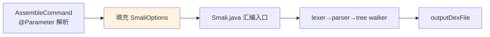

# ⚙️ SmaliOptions — 汇编选项

`SmaliOptions` 持有 smali 汇编的运行时配置。源码：`smali/src/main/java/org/jf/smali/SmaliOptions.java`。与 `AssembleCommand` 的 jcommander `@Parameter` 不同——后者解析命令行后填充这些字段。

## 字段

| 字段 | 类型 | 默认 | 作用 |
|------|------|------|------|
| `apiLevel` | int | 15 | 目标 API 级别，决定 opcode 版本 |
| `outputDexFile` | String | `out.dex` | 输出 dex 路径 |
| `jobs` | int | CPU 核数 | 并行汇编线程数 |
| `allowOdexOpcodes` | boolean | false | 是否允许 odex 操作码 |
| `verboseErrors` | boolean | false | 详细错误信息 |
| `printTokens` | boolean | false | 打印词法 token（调试用） |

## 与命令行的关系



`AssembleCommand` 的 `--api-level`、`-o`、`--jobs` 等 `@Parameter` 解析后写入 `SmaliOptions` 对应字段，`Smali` 主流程据此装配汇编管线。

## 关键选项说明

### apiLevel

决定 `Opcodes` 集合——汇编时只允许该 API 级别支持的 opcode。例如 `invoke-custom` 需 API 28+（dex 038）。默认 15 是兼容最广的版本。

### allowOdexOpcodes

odex 操作码（`invoke-virtual-quick` 等）只应在 deodex 流程出现，普通汇编默认禁止。开启则允许源码直接写这些 opcode（罕用）。

### printTokens

调试选项，打印词法分析器的 token 流，用于排查语法解析问题。对应 `smali print-tokens` 命令。

## 实战

```bash
# 指定 API 级别与输出
java -jar smali.jar assemble input.smali --api-level 28 -o out.dex

# 多线程
java -jar smali.jar assemble input.smali --jobs 4 -o out.dex
```

## 延伸阅读

- [AssembleCommand](./assemble-command.md) — 命令行参数
- [汇编管线](./assembly-pipeline.md) — Smali 主流程
- [版本映射](../../internals/version-map.md) — apiLevel 与 opcode 集合
