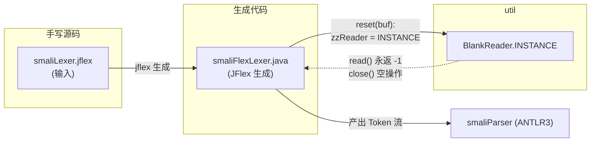

# 🧰 util — smali 工具类

`org.jf.smali.util` 是 smali 汇编器的「工具层」。与 dexlib2 那个庞大的同名包不同，这里**只有一个类** `BlankReader`：一个永远返回 EOF、`close()` 空操作的 `Reader` 单例。

它存在的唯一理由是给 JFlex 生成的词法分析器 `smaliFlexLexer` 当「哑 Reader」——smali 的词法/语法分析并不真的从流式 Reader 读字符，而是直接往 JFlex 内部 `zzBuffer` 灌入预切好的 `char[]`，但 JFlex 的构造与 `reset` 协议仍要求一个非 null 的 `Reader` 字段。`BlankReader.INSTANCE` 就是这个占位对象。

## 📦 包定位

- **依赖方向**：仅依赖 JDK `java.io.Reader`/`IOException` 与 `javax.annotation.Nonnull`，不触碰 dexlib2。
- **被谁用**：`smali/build/generated-src/jflex/org/jf/smali/smaliFlexLexer.java`（由 `smali/src/main/jflex/smaliLexer.jflex` 生成）。
- **不可实例化（外部）**：构造器虽是默认可见性，但约定只通过 `INSTANCE` 静态字段使用，单例、无状态、线程安全。

## 🗂️ 类清单

| 类名 | 职责 | 关键方法 / 字段 |
|---|---|---|
| `BlankReader` | 永空的单例 `Reader`，读即返回 `-1`（EOF） | `INSTANCE`、`read(char[],int,int)`、`close()` |

## 🧩 在词法分析链中的位置



`smaliFlexLexer.reset(charSequence, start, end, initialState)` 把待扫描的 `CharSequence` 拷进 `zzBuffer`，并把游标全部对齐到 `[start, end)`，这一步**完全绕过了 Reader 通路**。但 JFlex 模板里 `zzReader` 是个非 null 字段，故赋一个永远 EOF 的 `BlankReader.INSTANCE` 即可——既不分配新对象，也防止任何意外路径真的去读它。

## 🔍 源码要点

`BlankReader.java` 全文 48 行，去掉版权头后核心只有三行：

```java
// smali/src/main/java/org/jf/smali/util/BlankReader.java:38
public class BlankReader extends Reader {
    public static final BlankReader INSTANCE = new BlankReader();

    @Override public int read(@Nonnull char[] chars, int i, int i2) throws IOException {
        return -1;                       // 永远 EOF
    }

    @Override
    public void close() throws IOException {
    }                                   // 空操作，单例不可被关掉
}
```

要点：

- **单例**：`INSTANCE` 在类加载时创建，全局共享。`close()` 故意留空，避免某次重置「误关」了这个共享对象。
- **EOF 语义**：`read(...)` 恒返回 `-1`，符合 `Reader.read` 的「流已结束」契约。任何依赖它的代码会立刻收到 EOF，从而不会进入正常的字符读取分支。
- **线程安全**：无字段、无状态，多线程共享 `INSTANCE` 无需同步。

## 🔧 在生成代码中的真实调用

`smaliFlexLexer.java`（JFlex 生成，构建时产出）的 `reset` 方法：

```java
// smali/build/generated-src/jflex/org/jf/smali/smaliFlexLexer.java:3342
public void reset(CharSequence charSequence, int start, int end, int initialState) {
    zzReader = BlankReader.INSTANCE;          // 占位 Reader
    zzBuffer = new char[charSequence.length()];
    for (int i=0; i<charSequence.length(); i++) {
        zzBuffer[i] = charSequence.charAt(i); // 真正的数据通路
    }
    yychar = zzCurrentPos = zzMarkedPos = zzStartRead = start;
    zzEndRead = end;
    yybegin(initialState);
}
```

可以看到：字符数据走 `zzBuffer`，`zzReader` 只是为满足 JFlex 运行时对 `Reader` 字段的非 null 约束而存在的「安全哑值」。`./gradlew generateGrammarSource` 会先跑 JFlex 生成 `smaliFlexLexer.java`，此时本类的引用才被织入。

## 📌 注意事项

- 本包**不要**随业务增长随意填充工具方法——smali 模块的横切工具大多落在 `org.jf.util`（仓库的 util 模块）或直接作为顶层类（如 `LiteralTools`、`SmaliTestUtils`）。`org.jf.smali.util` 目前刻意保持极小。
- 若未来改造词法器改用真正的流式输入，`BlankReader` 即可删除；它只是当前「缓冲区直注」策略的副产物。
- 编辑 `smaliLexer.jflex` 后须 `./gradlew :smali:generateGrammarSource` 重生成 `smaliFlexLexer.java`，本类的调用点随之在生成物中刷新。

## 延伸阅读

- [base — 共享基类层](../dexlib2/base.md)
- [util — dexlib2 工具层](../dexlib2/util.md)
- [SmaliFormatter — 格式化器](./smali-formatter.md)
- [smali-language-server — LSP](./smali-language-server.md)
