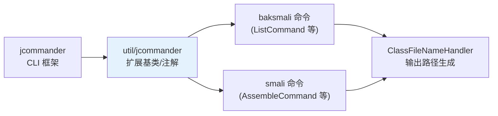

# 🧰 util — 共享工具模块

`util` 模块被 `smali` 与 `baksmali` 共享，提供路径处理、控制台能力与对 jcommander（CLI 框架）的扩展。依赖 `dexlib2`。

## 类清单

### `org.jf.util`

| 类 | 职责 |
|----|------|
| `ClassFileNameHandler` | 把类描述符映射为文件路径（`Lcom/Foo;` → `com/Foo.smali`），处理内部类 `$`、包名长度限制 |
| `ConsoleUtil` | 控制台宽高、彩色输出支持检测 |
| `LinearSearch` | 线性搜索辅助 |
| `PathUtil` | 路径工具方法 |

### `org.jf.util.jcommander`

| 类 | 职责 |
|----|------|
| `Command` | 命令基类，提供 jcommander 子命令骨架 |
| `ExtendedCommands` | 扩展命令注册 |
| `ExtendedParameter` / `ExtendedParameters` | 自定义参数注解（超出 jcommander 原生能力） |
| `ColonParameterSplitter` | 按冒号拆分多值参数（如 `a:b:c`） |
| `HelpFormatter` | 帮助信息格式化 |

## 与 CLI 的关系



baksmali/smali 的所有命令类都继承 `util/jcommander/Command`，参数解析依赖 jcommander + `ExtendedParameter` 扩展。反汇编输出目录结构由 `ClassFileNameHandler` 决定。

## ClassFileNameHandler 示意

```java
// Lcom/example/Foo$Bar;  →  com/example/Foo$Bar.smali
// 处理文件系统路径长度限制、非法字符、内部类
```

它让 `baksmali disassemble -o out/` 产出的目录结构与 Java 包名一致。

## 延伸阅读

- [baksmali Main 入口](../reference/baksmali/main.md)
- [smali 模块总览](../reference/smali/)
- [baksmali disassemble 命令](../reference/baksmali/commands/disassemble.md)
