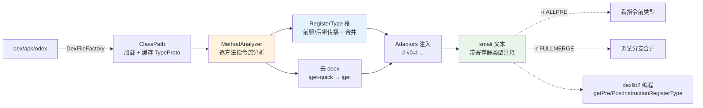

# 🔬 dex-analyze — 寄存器类型推断

dexlib2 的 `analysis` 包会复刻 Dalvik/ART 的类型语义，沿方法指令流做前驱/后继传播，把每个寄存器在每条指令前后的类型算出来。baksmali 通过 `--register-info` 把这些类型以注释形式塞进 smali 输出——这是理解混淆代码、调试 `UnresolvedOdexInstruction`、追踪数据流最直接的入口。

## 前置条件

```bash
curl -fsSL -o baksmali.jar \
  https://github.com/android-security-engineer/smali-skills/releases/latest/download/baksmali.jar
```

寄存器类型推断依赖类路径解析，真实示例需提供 `--boot-class-path`（设备的 `framework.jar` 或 `android.jar`），否则 `ClassPathResolver` 会因找不到 `Ljava/lang/Object;` 失败。

## 能力与工作流



`MethodAnalyzer` 在 `dexlib2/src/main/java/org/jf/dexlib2/analysis/MethodAnalyzer.java:1578` 前后完成三件事：类型推断、去 odex、校验。类型格由 `RegisterType` 表达（`Cat-Unknown`/`Cat-Null`/`Cat-1nr`/`Cat-Integer`/`Cat-Reference` 等），注释里的 `v0=I` 即 `Cat-Integer` 的可读化。

## 命令（CLI 方式）

```bash
# 寄存器类型推断（最常用）
java -jar baksmali.jar d -o out -r ALL app.apk

# 查看指令前寄存器类型
java -jar baksmali.jar d -o out -r ALLPRE app.apk

# 查看指令后寄存器类型
java -jar baksmali.jar d -o out -r ALLPOST app.apk

# 仅参数 + 目标寄存器
java -jar baksmali.jar d -o out -r ARGS,DEST app.apk

# 合并点完整类型集（调试分支合并）
java -jar baksmali.jar d -o out -r MERGE,FULLMERGE app.apk

# 虚方法归一化（把虚调用对齐到声明基类）
java -jar baksmali.jar d -o out --normalize-virtual-methods app.apk
```

## 寄存器信息标志

| 标志 | 含义 | 用途 |
|------|------|------|
| `ALL` | 指令前 + 后所有寄存器类型 | 全面分析 |
| `ALLPRE` | 指令执行前每个寄存器类型 | 理解数据流 |
| `ALLPOST` | 指令执行后每个寄存器类型 | 理解结果 |
| `ARGS` | 方法调用的参数寄存器 | 追踪调用参数 |
| `DEST` | 指令目标寄存器类型 | 快速查看赋值 |
| `MERGE` | 合并点寄存器类型（摘要） | 理解分支汇合 |
| `FULLMERGE` | 合并点完整类型集 | 调试类型冲突 |

可组合：`-r ARGS,DEST,MERGE`。标志解析在 baksmali `disassemble` 子命令的 `RegisterInfoOptions`，详见 [CLI: disassemble](../cli/disassemble)。

## 真实命令 → 输出

```bash
$ java -jar baksmali.jar disassemble \
    -o /tmp/analyzed \
    -r ALL,FULLMERGE --sequential-labels \
    --boot-class-path /path/to/framework.jar \
    baksmali/src/test/resources/LocalTest/classes.dex
```

成功后 `LocalTest.smali` 的 `method1` 在每条指令前后插入寄存器类型注释，以 `return-void` 前状态为例：

```smali
.method public static method1()V
    .registers 10
    .local v0, "blah!...":I, "some sig info:\nblah."
    ...
    # 指令前: v0=I v1=V v2=I v3=V v4=I v5=V v6=I v7=I v8=I v9=I
    return-void
.end method
```

`v0=I` 即该寄存器在此处被推断为 `int`（`Cat-Integer`）。无 framework 时改用纯 dexlib2 编程方式可避开设备依赖。

## 编程方式（dexlib2）

```java
import org.jf.dexlib2.analysis.MethodAnalyzer;
import org.jf.dexlib2.analysis.ClassPath;
import org.jf.dexlib2.analysis.AnalyzedInstruction;

ClassPath classPath = ClassPath.fromClassPath(
    classPathEntries, dexFile, opcodes, false);

MethodAnalyzer analyzer = new MethodAnalyzer(
    classPath, method, methodImpl, false);  // false = 不去 odex

for (AnalyzedInstruction insn : analyzer.getAnalyzedInstructions()) {
    RegisterType[] pre  = insn.getPreInstructionRegisterType();
    RegisterType[] post = insn.getPostInstructionRegisterType();
}
```

`AnalyzedInstruction` 的 `getPreInstructionRegisterType` / `getPostInstructionRegisterType` 直接返回类型数组，无需走 smali 文本。详见 [MethodAnalyzer 参考](../reference/dexlib2/method-analyzer) 与 [analysis 包](../reference/dexlib2/analysis)。

## 分析引擎核心类

| 类 | 作用 | 源码 |
|----|------|------|
| `MethodAnalyzer` | 方法级指令流分析 | `dexlib2/.../analysis/MethodAnalyzer.java:1578` |
| `ClassPath` | 类路径解析与类型层次缓存 | `analysis/ClassPath.java` |
| `RegisterType` | 寄存器类型格（Cat-* 系列） | `analysis/RegisterType.java` |
| `ClassProto` | 引用类型 vtable / 字段布局 / 接口表 | `analysis/ClassProto.java` |
| `InlineMethodResolver` | 解析 `execute-inline` 内联方法 | `analysis/InlineMethodResolver.java` |
| `OdexedFieldInstructionMapper` | odex 字段指令映射 | `analysis/OdexedFieldInstructionMapper.java` |

## 适用场景

| 场景 | 命令组合 |
|------|---------|
| 理解混淆代码类型流 | `d -o out -r ALL,FULLMERGE --sequential-labels obfuscated.apk` |
| 调试去 odex 的 `UnresolvedOdexInstruction` | `d -o out -r ALL,FULLMERGE --normalize-virtual-methods app.odex` |
| 追踪特定方法数据流 | `d -o out --classes Lcom/target/Class -r ALL app.apk` |
| 仅看调用参数与赋值目标 | `d -o out -r ARGS,DEST app.apk` |
| 编程批量提取每寄存器类型 | `MethodAnalyzer` + `AnalyzedInstruction` |

## 与相关 skill 的关系

| Skill | 关系 |
|-------|------|
| [dex-read](./dex-read) | dex-read 给只读高级视图；dex-analyze 在其上叠加类型推断层 |
| [dex-search](./dex-search) | 搜出可疑方法后，用 `-r ALL` 看其寄存器数据流 |
| [dex-list-structure](./dex-list-structure) | 先列结构定位类，再 `--classes` 精准分析 |
| [dex-dump](./dex-dump) | dump 看字节；analyze 看类型语义，二进制与逻辑互补 |

## 延伸阅读

- [CLI: disassemble 子命令](../cli/disassemble) — `-r` / `--normalize-virtual-methods` / `--classes` 完整选项
- [CLI: xref 交叉引用](../cli/xref) — 配合类型推断追踪调用链
- [MethodAnalyzer 参考](../reference/dexlib2/method-analyzer) — 三大职责与源码定位
- [analysis 包参考](../reference/dexlib2/analysis) — 类型格、vtable、字段布局全景
- [SKILL.md 原文](https://github.com/android-security-engineer/smali-skills/blob/master/skills/dex-analyze)
