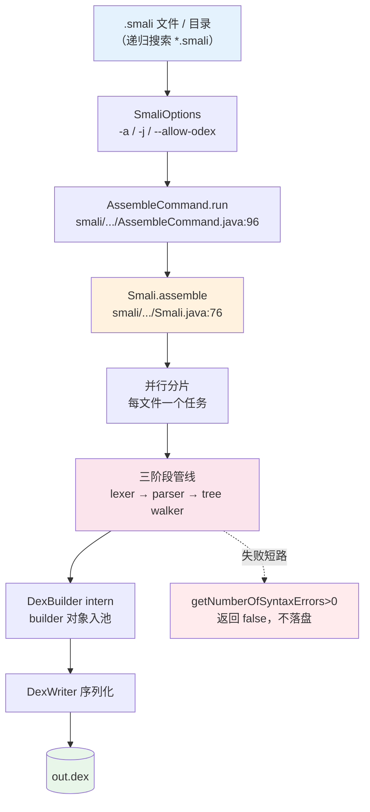

# 🔧 dex-assemble — 将 smali 文本汇编为 dex

把一个或多个 `.smali` 文本文件汇编成单个 Dalvik 可执行文件（`.dex`）。这是「反汇编 → 修改 → 重汇编」工作流的收口环节，也是从零构造可运行 Android 字节码的最短路径——无需手写 Java、无需 `dx`/`d8`，直接以 smali 语法描述类与方法体即可产出可被 ART 加载的二进制。

## 前置条件

```bash
# 方式1: 一键安装（推荐）
curl -fsSL https://github.com/android-security-engineer/smali-skills/releases/latest/download/install.sh | bash

# 方式2: 仅下载 jar
curl -fsSL -o smali.jar https://github.com/android-security-engineer/smali-skills/releases/latest/download/smali.jar

# 方式3: 从源码构建
JAVA_HOME=/usr/lib/jvm/java-11-openjdk-amd64 ./gradlew :smali:build -x test -x javadoc
```

## 能力与工作流



三阶段管线的细节见 [汇编流水线](../reference/smali/assembly-pipeline)：JFlex 词法（`smaliLexer.jflex`）把每条指令切成带格式后缀的 token，ANTLR3 `smaliParser.g` 重排成 `I_*` AST，`smaliTreeWalker.g` 把 AST 翻译成 `dexlib2.builder` 对象并交给 `DexBuilder`。任一阶段报错即短路，绝不让脏 AST 进入 tree walker（`Smali.java:229-231`）。

## 快速参考

```bash
# 基本汇编（别名 a / as / ass 均可）
java -jar smali.jar assemble -o <输出.dex> <输入目录|文件>

# 汇编整个目录（递归搜索 .smali 文件）
java -jar smali.jar a -o out.dex smali_src/

# 指定 API 级别（影响可用操作码）
java -jar smali.jar a -o out.dex -a 28 smali_src/
```

## 完整选项

```bash
java -jar smali.jar assemble \
  -o <输出.dex> \                    # 输出 dex 路径（默认 out.dex）
  -a <api级别> \                     # API 级别（默认 15），决定可用操作码
  -j <线程数> \                      # 并行编译线程数（默认 CPU 核心数）
  --allow-odex-opcodes \            # 允许汇编 odex 优化操作码
  --verbose \                       # 详细错误信息
  <文件或目录>                       # 可指定多个，目录递归搜索 .smali
```

参数声明见 `smali/src/main/java/org/jf/smali/AssembleCommand.java:52-83`，`getOptions()`（`:102-112`）将其拷进 `SmaliOptions` 传给 `Smali.assemble`。

## API 级别与操作码

不同 API 级别支持不同的 Dalvik 指令。`-a` 经 `Opcodes.forApi(n)` 选定 dex 版本与指令集：

| API 级别 | 关键新增 | 说明 |
|----------|----------|------|
| 15（默认） | 基础指令集 | 兼容最广 |
| 26 | invoke-custom, invoke-polymorphic | Lambda/MethodHandle 支持 |
| 28 | const-method-handle, const-method-type | 编译器内联优化 |

若汇编时遇到 `invalid instruction` 错误，尝试提高 API 级别。完整操作码表见 [操作码与版本](../internals/opcodes)。

## 真实示例：汇编 HelloWorld

项目 `examples/` 目录包含完整的 smali 示例。汇编 `examples/HelloWorld/HelloWorld.smali` 为 dex 并用 baksmali 验证：

```bash
# 1) 汇编（无输出即成功）
$ java -jar smali.jar assemble -o /tmp/hello.dex examples/HelloWorld/
$ ls -l /tmp/hello.dex
-rw-r--r-- ... 652 ... /tmp/hello.dex

# 2) 用 baksmali 验证产物 —— 列出其中的类
$ java -jar baksmali.jar list classes --format text /tmp/hello.dex
LHelloWorld;
```

源文件 `examples/HelloWorld/HelloWorld.smali`（节选）：

```smali
.class public LHelloWorld;
.super Ljava/lang/Object;

.method public static main([Ljava/lang/String;)V
    .registers 2

    sget-object v0, Ljava/lang/System;->out:Ljava/io/PrintStream;
    const-string    v1, "Hello World!"
    invoke-virtual {v0, v1}, Ljava/io/PrintStream;->println(Ljava/lang/String;)V
    return-void
.end method
```

## 典型工作流

### 从零创建 dex

```bash
# 1. 编写 smali 文件
mkdir -p src/com/example
cat > src/com/example/HelloWorld.smali << 'EOF'
.class public Lcom/example/HelloWorld;
.super Ljava/lang/Object;

.method public static main([Ljava/lang/String;)V
    .registers 2
    sget-object v0, Ljava/lang/System;->out:Ljava/io/PrintStream;
    const-string v1, "Hello, World!"
    invoke-virtual {v0, v1}, Ljava/io/PrintStream;->println(Ljava/lang/String;)V
    return-void
.end method
.end class
EOF

# 2. 汇编
java -jar smali.jar a -o hello.dex src/

# 3. 验证（反汇编后与源码 diff）
java -jar baksmali.jar d -o verified hello.dex
diff -r src/ verified/
```

### 修改-重汇编 round-trip

```bash
# 1. 反汇编原始 APK
java -jar baksmali.jar d -o smali_out original.apk
# 2. 修改 smali 文件
vim smali_out/com/example/Main.smali
# 3. 重新汇编
java -jar smali.jar a -o modified.dex smali_out/
# 4. 替换回 APK
cp modified.dex extracted/classes.dex
# 重新打包并签名...
```

汇编后用 `baksmali disassemble` 取回的 smali 与源码逻辑等价（寄存器命名等细节可能规范化，见 [反汇编↔汇编往返](../guide/roundtrip)）。

## examples/ 示例目录

| 示例 | 说明 |
|------|------|
| `HelloWorld/` | 最小可运行程序 |
| `AnnotationTypes/` | 类/方法/字段/参数注解 |
| `AnnotationValues/` | 各种注解值类型 |
| `Enums/` | 枚举类定义 |
| `Interface/` | 接口定义与实现 |
| `InvokeCustom/` | invoke-custom（Lambda/MethodHandle） |
| `MethodOverloading/` | 方法重载 |
| `BracketedMemberNames/` | 括号成员名语法 |

## 适用场景

| 场景 | 为什么用 dex-assemble |
|------|----------------------|
| 修改 APK 内字节码后回写 dex | 反汇编→改 `.smali`→重汇编，是最自然的文本级编辑路径 |
| 从零编写可运行的最小 dex | smali 语法比手写 Java+dx 链路更短、可逐指令控制 |
| 验证操作码 / 指令格式假设 | 配合 `-a` 切换 API 级别，快速试错单条指令 |
| 教学 / 复现 Dalvik 字节码 | `.smali` 文本可读、可 diff、可版本化 |

## 与相关 skill 的关系

| Skill | 关系 |
|-------|------|
| [dex-build](./dex-build) | 跳过文本层，直接用 dexlib2 `DexPool`+builder 构造 dex；本 skill 是其文本入口 |
| [dex-roundtrip](./dex-roundtrip) | 反汇编→改→重汇编工作流，重汇编步骤即调用 `assemble` |
| [dex-transform](./dex-transform) | 用 Rewriter 修改已有 dex；本 skill 从文本重建而非变换 |
| [dex-read](./dex-read) | 读取侧；本 skill 是写出侧的「文本→二进制」对应物 |
| [dex-instructions](./dex-instructions) | 指令格式与寄存器元数的权威清单，写 `.smali` 时的查阅表 |

## 常见错误

| 错误 | 原因 | 解决 |
|------|------|------|
| `invalid instruction` | API 级别太低，不支持该指令 | 加 `-a` 提高到对应 API 级别 |
| `odex opcode not allowed` | 使用了 odex 优化操作码 | 加 `--allow-odex-opcodes` |
| `Duplicate class` | 同一个类出现在多个 .smali 文件中 | 检查输入文件去重 |
| `No .source or .class directive` | smali 文件格式错误 | 检查文件头部 |

## 延伸阅读

- [CLI: smali assemble](../cli/assemble) — 文本汇编命令的 CLI 总览
- [参考: assemble 命令详解](../reference/smali/assemble-command) — `AssembleCommand` 参数表与 `SmaliOptions` 映射
- [参考: 汇编流水线](../reference/smali/assembly-pipeline) — lexer→parser→tree walker→DexBuilder
- [指南: 反汇编↔汇编往返](../guide/roundtrip) — 修改-重汇编完整工作流
- [内幕: 操作码与版本](../internals/opcodes) — `Opcodes.forApi` 决定的指令集
- [SKILL.md 原文](https://github.com/android-security-engineer/smali-skills/blob/master/skills/dex-assemble)
