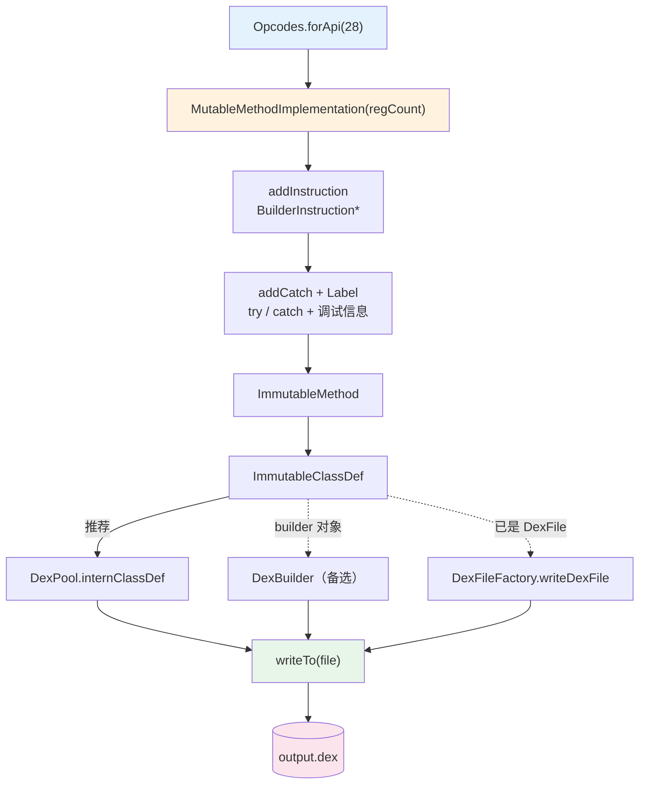

# 🏗️ dex-build — 用 dexlib2 构建并写出 dex

无需任何 `.smali` 文本，直接以 Java API 拼装 `ImmutableClassDef` / `ImmutableMethod` 与 `BuilderInstruction*`，再序列化为 Android 可加载的 `.dex`。适合合成最小 payload、批量生成测试 fixture、或在内存中变换字节码后立即落盘。

## 前置条件

```bash
# 单文件 dexlib2 jar，含 immutable / builder / writer 全部类
curl -fsSL -o dexlib2.jar https://github.com/android-security-engineer/smali-skills/releases/latest/download/dexlib2.jar
```

随后 `javac -cp dexlib2.jar` 编写、`java -cp .:dexlib2.jar`（Windows 用 `;`）运行。

## 能力与工作流



## 两种序列化方式

| 方式 | 类 | 源码 | 适用场景 |
|------|-----|------|---------|
| **DexPool**（推荐） | `writer.pool.DexPool` | `dexlib2/.../writer/pool/DexPool.java:76` | 从零构建，intern 不可变对象 |
| **DexBuilder** | `writer.builder.DexBuilder` | `dexlib2/.../writer/builder/DexBuilder.java:66` | 直接消费 builder 对象 |
| **DexFileFactory** | `DexFileFactory` | `dexlib2/.../DexFileFactory.java:291` | 已有 `DexFile`，一行写出 |

`DexPool` 与 `DexBuilder` 均继承自 `DexWriter`，差异在 interning 策略：前者按常量池去重、后者按 builder 索引。从零构造时 `DexPool` 路径最短。

## 用 DexPool 构建一个类

`Opcodes.forApi(n)` 决定可用操作码与 dex 版本（见 [操作码与版本](../internals/opcodes)）。`ImmutableClassDef` 九参构造接收 type / accessFlags / superclass / interfaces / sourceFile / annotations / fields / virtual methods / direct methods，签名见 `ImmutableClassDef.java:64`。

```java
Opcodes opcodes = Opcodes.forApi(28);
DexPool pool = new DexPool(opcodes);

ImmutableClassDef classDef = new ImmutableClassDef(
    "Lcom/example/Hello;", AccessFlags.PUBLIC.getValue(),
    "Ljava/lang/Object;", null, null, null, null,
    ImmutableSet.of(method),   // virtual methods
    null);                      // direct methods

pool.internClassDef(classDef);
pool.writeTo(new File("output.dex"));
```

## 构建方法体（Builder 指令）

`MutableMethodImplementation(registerCount)` 创建可变方法体，逐条 `addInstruction` 追加 `BuilderInstruction*`。指令格式类与 `Opcode` 一一对应——`21c` = 「2 寄存器位 + 1 引用」，`35c` = 「3 寄存器位 + 5 寄存器列表 + 1 引用」，`10x` = 「单字节空操作」。源码：构造 `(int registerCount)` 在 `MutableMethodImplementation.java:130`，`addInstruction` 在 `:237`。

### try/catch 与调试信息（Label 而非整数索引）

::: warning 注意
SKILL.md 原文用 `impl.addCatch(0, 1, 2)`（整数索引）调用，但 **dexlib2 公共 API 不存在整数重载**——三个 `addCatch` 均要求 `Label`。请先用 `newLabelForIndex` 取标签再传入。
:::

```java
Label start = impl.newLabelForIndex(0);
Label end   = impl.newLabelForIndex(3);
Label hand  = impl.newLabelForIndex(4);

impl.addCatch(start, end, hand);                           // catch-all
impl.addCatch("Ljava/lang/Exception;", start, end, hand);  // typed handler
impl.addPrologue(0);  impl.addEpilogue(5);                 // 入口 / 出口
impl.addLineNumber(1, 0);                                  // 行号 → 指令索引
```

`addCatch` 三签名见 `MutableMethodImplementation.java:189` / `:194` / `:199`，`newLabelForIndex` 见 `:523`。

## 完整示例：合成 Hello World

串起上述步骤产出 `hello.dex`——逻辑与 [smali assemble](../cli/assemble) 的 `HelloWorld.smali` 等价，仅省去文本层，同时演示 `21c` / `35c` / `10x` 三种指令格式：

```java
Opcodes opcodes = Opcodes.forApi(15);
DexPool pool = new DexPool(opcodes);

MutableMethodImplementation impl = new MutableMethodImplementation(2);
impl.addInstruction(new BuilderInstruction21c(Opcode.CONST_STRING, 1,
    new ImmutableStringReference("Hello World!")));
impl.addInstruction(new BuilderInstruction21c(Opcode.SGET_OBJECT, 0,
    new ImmutableFieldReference("Ljava/lang/System;", "out", "Ljava/io/PrintStream;")));
impl.addInstruction(new BuilderInstruction35c(Opcode.INVOKE_VIRTUAL, 2, 0, 1, 0, 0, 0,
    new ImmutableMethodReference("Ljava/io/PrintStream;", "println",
        ImmutableList.of("Ljava/lang/String;"), "V")));
impl.addInstruction(new BuilderInstruction10x(Opcode.RETURN_VOID));

ImmutableMethod method = new ImmutableMethod(
    "LHelloWorld;", "main",
    ImmutableList.of(new ImmutableMethodParameter("[Ljava/lang/String;", null, null)),
    "V", AccessFlags.PUBLIC.getValue() | AccessFlags.STATIC.getValue(),
    null, null, impl);

ImmutableClassDef classDef = new ImmutableClassDef(
    "LHelloWorld;", AccessFlags.PUBLIC.getValue(), "Ljava/lang/Object;",
    null, null, null, null, ImmutableSet.of(method), null);

pool.internClassDef(classDef);
pool.writeTo(new File("hello.dex"));
```

编译后用 baksmali 验证（真实命令→输出）：

```bash
$ javac -cp dexlib2.jar BuildHello.java && java -cp .:dexlib2.jar BuildHello
$ java -jar baksmali.jar list classes --format text hello.dex
LHelloWorld;
$ java -jar baksmali.jar disassemble hello.dex -o out/ && cat out/HelloWorld.smali
.class public LHelloWorld;
.super Ljava/lang/Object;
.method public static main([Ljava/lang/String;)V
    .registers 2
    const-string v1, "Hello World!"
    sget-object v0, Ljava/lang/System;->out:Ljava/io/PrintStream;
    invoke-virtual {v0, v1}, Ljava/io/PrintStream;->println(Ljava/lang/String;)V
    return-void
.end method
```

## 适用场景

| 场景 | 为什么选 dex-build 而非 assemble |
|------|----------------------------------|
| 合成最小 payload / shellcode dex | 无文本往返，精确控制每条指令与寄存器分配 |
| 批量生成测试 fixture | 程序化组合不同 API 级别 / 操作码子集的 dex |
| 内存中变换字节码后立即落盘 | 配合 `dex-transform` 的 Rewriter 修改后用 `DexPool` 回写 |
| 验证 dexlib2 writer 行为 | 直接 intern 不可变对象，观察 interning 与池排序 |

## 与相关 skill 的关系

| Skill | 关系 |
|-------|------|
| [dex-assemble](./dex-assemble) | 从 `.smali` 文本汇编；本 skill 跳过文本层 |
| [dex-transform](./dex-transform) | 用 Rewriter 修改已有 dex；写出阶段共用 `DexPool` / `DexFileFactory` |
| [dex-roundtrip](./dex-roundtrip) | 反汇编→改→重汇编工作流，重汇编即调 `assemble` 或本 skill |
| [dex-read](./dex-read) | 读取侧；本 skill 是写出侧的「从零」对应物 |
| [dex-instructions](./dex-instructions) | 指令格式与 `BuilderInstruction*` 类的权威清单 |

## 常见错误

| 错误 | 原因 | 解决 |
|------|------|------|
| `No such opcode` / `Unsupported opcode` | `Opcodes.forApi(n)` 的 n 太低 | 提到含该指令的 API 级别（见 [操作码与版本](../internals/opcodes)） |
| 寄存器溢出 / `registerCount` 不足 | `MutableMethodImplementation(regCount)` 给小了 | 按 `registers = 参数 + 局部` 重算 |
| `Duplicate class` | 同一类型多次 `internClassDef` | 每个 `Lxxx;` 只 intern 一次 |
| `addCatch` 找不到整数重载 | 误用整数索引调用 | 改用 `newLabelForIndex` 取 `Label` 后传入 |
| 输出 dex 无法被 `dx`/`d8` 校验 | 引用未 intern（如裸 `StringReference`） | 所有引用用 `Immutable*Reference` 包装 |

## 延伸阅读

- [CLI: smali assemble](../cli/assemble) — 文本路径的等价 CLI
- [指南: 反汇编↔汇编往返](../guide/roundtrip) — 修改-重汇编完整工作流
- [内幕: 汇编管线](../reference/smali/assembly-pipeline) — lexer→parser→tree walker→DexPool
- [内幕: 池化写入](../internals/pool-writing) — `DexPool` 的 interning 与排序
- [内幕: 操作码与版本](../internals/opcodes) — `Opcodes.forApi` 决定的指令集
- [参考: DexPool](../reference/dexlib2/dex-pool) · [MutableMethodImplementation](../reference/dexlib2/mutable-method-implementation)
- [SKILL.md 原文](https://github.com/android-security-engineer/smali-skills/blob/master/skills/dex-build)
