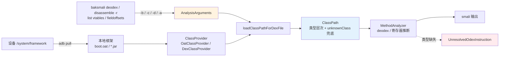

# 🛤️ dex-classpath — 类路径配置与解析

`dex-classpath` 不是某个独立子命令，而是 `deodex`、`disassemble -r`、`list vtables`、`list fieldoffsets` 这类**分析型命令的共同前置条件**：它们都要先把 Android 框架类加载进 `dexlib2` 的 `ClassPath`，构建完整类型层次，才能解析优化指令、推断寄存器类型、计算虚方法表与字段偏移。本文档说明如何为 ART 与 Dalvik 设备正确喂入类路径。

## 🧭 类路径在分析流水线中的位置



## 🎯 何时需要类路径

| 操作 | 需要类路径 | 说明 |
|------|:---------:|------|
| `deodex` | ✅ 必须 | 解析 optimize 指令需要完整类型层次 |
| `disassemble -r` | ✅ 必须 | 寄存器类型推断需要类型信息 |
| `list vtables` | ✅ 必须 | 虚方法表需要类型层次 |
| `list fieldoffsets` | ✅ 必须 | 字段偏移需要类型层次 |
| `disassemble`（无 `-r`） | ❌ 不需要 | 纯反汇编不触及类型 |
| `list strings/methods/fields/types/classes` | ❌ 不需要 | 仅列举元数据 |
| `dump` | ❌ 不需要 | 十六进制转储 |

## ⚙️ 类路径选项

所有需要类路径的命令共享以下 jcommander 选项，定义于 `baksmali/src/main/java/org/jf/baksmali/AnalysisArguments.java:54`：

| 选项 | 短选项 | 别名 | 说明 |
|------|--------|------|------|
| `--bootclasspath` | `-b` | `--bcp` | 引导类路径（冒号分隔，空串 `""` 表示空类路径） |
| `--classpath` | `-c` | `--cp` | 额外类路径，追加在 bootclasspath 之后 |
| `--classpath-dir` | `-d` | `--cpd`/`--dir` | 类路径搜索目录，可多次指定 |
| `--api` | `-a` | — | API 级别，影响默认框架文件列表 |

`-b ""` 是一个特殊语义：明确告诉 baksmali **不加载任何框架类**（`AnalysisArguments.java:136`），用于 odex 自包含或需要隔离分析的场景。

## 🤖 ART 设备（Android L+）

```bash
# 方式1：指定 boot.oat（推荐）
adb pull /system/framework/arm/boot.oat /tmp/boot.oat
java -jar baksmali.jar deodex -b /tmp/boot.oat -o out app.odex

# 方式2：拉取整个框架目录
adb pull /system/framework/arm /tmp/framework
java -jar baksmali.jar deodex -b /tmp/framework/boot.oat -o out app.odex
```

### Android N+ 的拆分

Android N 把 `boot.oat` 拆成 `boot-core-lib.oat`、`boot-framework.oat` 等多个文件。**只需指定 `boot.oat`**，同目录其余文件由 `OatClassProvider` 自动加载——这是 `baksmali/src/main/java/org/jf/baksmali/HelpCommand.java:129` 强调的点。

## 📲 Dalvik 设备（Android L 之前）

```bash
# 方式1：指定框架目录（推荐）
adb pull /system/framework /tmp/framework
java -jar baksmali.jar deodex -d /tmp/framework -o out app.odex

# 方式2：使用 BOOTCLASSPATH 环境变量
export BOOTCLASSPATH=$(adb shell "echo \$BOOTCLASSPATH")
java -jar baksmali.jar deodex -b "$BOOTCLASSPATH" -d /tmp/framework -o out app.odex
```

Dalvik 没有 `boot.oat`，框架以 `framework.jar` 等多个 jar 形式存在；用 `-d` 指定目录后，baksmali 会按 `--bootclasspath` 给出的文件名到目录中查找。

## 📋 类路径条目格式

`-b` / `-c` 接受冒号分隔列表，每条目可以是：

| 格式 | 示例 | 是否需 `-d` |
|------|------|:-----------:|
| 简单文件名 | `framework.jar` | ✅ 配合 `--classpath-dir` |
| 设备绝对路径 | `/system/framework/framework.jar` | ✅ 配合 `--classpath-dir` |
| 本地绝对路径 | `/tmp/framework/framework.jar` | ❌ 不需要 |

## 🩺 常见问题

### UnresolvedOdexInstruction

```
Error: UnresolvedOdexInstruction
```

**原因**：类路径不完整，`MethodAnalyzer` 找不到目标类，无法把 optimize 指令还原成具体 invoke/field-access。触发点在 `baksmali/src/main/java/org/jf/baksmali/Adaptors/MethodDefinition.java:475`，当某条指令的 `format == Format.UnresolvedOdexInstruction` 时抛出。

**解法**：

1. 用 `list dependencies` 查看 odex 声明的依赖；
2. 拉取全部依赖到本地；
3. 以完整 `-b` / `-c` 重新 deodex。

```bash
# 1. 查看需要的依赖
java -jar baksmali.jar l deps app.odex
# → boot.oat
# → conscrypt.odex
# → okhttp.odex
# → ...

# 2. 提供完整类路径
java -jar baksmali.jar deodex \
  -b /tmp/framework/boot.oat \
  -c /tmp/app/libs/support.jar \
  -o out app.odex
```

### 默认值与空类路径

不指定 `-b` 时，baksmali 按 `-a` API 级别选默认框架列表（见 `AnalysisArguments.java:106` 的 `VersionMap.mapApiToArtVersion`）。默认不准就手动指定。需要**空类路径**（不加载任何框架类）时显式传空串：

```bash
java -jar baksmali.jar deodex -b "" -o out app.odex
```

## 🧪 完整示例

### 从设备拉框架并 deodex

```bash
# 1. 拉取框架
adb pull /system/framework /tmp/framework
adb pull /system/framework/arm/boot.oat /tmp/boot.oat

# 2. deodex（ART）
java -jar baksmali.jar deodex \
  -b /tmp/boot.oat \
  -d /tmp/framework \
  -o smali_out \
  app.odex

# 3. 验证：用 smali 重新装配
java -jar smali.jar a -o rebuilt.dex smali_out/
```

### 带类路径的寄存器类型分析

```bash
adb pull /system/framework /tmp/framework

java -jar baksmali.jar d \
  -o out \
  -r ALL \
  -b /tmp/framework/boot.oat \
  app.apk
```

`-r ALL` 会在每条指令前注入寄存器类型注释（`.registers` 后跟 `# v0:Ljava/lang/String;`），其类型来自 `ClassPath` 解析的 `TypeProto` 层次——见 `dexlib2/src/main/java/org/jf/dexlib2/analysis/ClassPath.java:90` 的构造器，它会把 `unknownClass` 作为兜底注入，保证缺类时分析不直接崩而产出 `UnknownClassProto`。

## 🎯 适用场景

| 场景 | 价值 |
|------|------|
| ROM / 系统应用 deodex | 从 `boot.oat` 还原 optimize 指令为可读 smali |
| 寄存器类型审计 | `-r ALL` 输出每条指令的寄存器类型，辅助漏洞分析 |
| vtable 与字段偏移取证 | 列举虚方法表/字段布局，比对 hook 框架行为 |
| 跨版本兼容分析 | `-a` 切换 API 级别，对比不同 Android 框架差异 |
| 隔离/空类路径分析 | `-b ""` 强制不加载框架，确认 odex 自包含性 |

## 🔗 与相关 skill 的关系

| Skill | 关系 |
|-------|------|
| [`dex-read`](./dex-read) | 类路径由 `ClassPath` + `ClassProvider` 加载，底层仍是 `DexFileFactory` 解析 |
| [`dex-list-structure`](./dex-list-structure) | `vtables` / `fieldoffsets` 子命令直接消费本 skill 配置的类路径 |
| [`dex-assemble`](./dex-assemble) | deodex 产出的 smali 经 `smali a` 装配回 dex 做闭环验证 |
| [`dex-dump`](./dex-dump) | 纯转储不需类路径，是本 skill 的「不依赖」对照 |

## 📚 延伸阅读

- [CLI: disassemble](../cli/disassemble.md) — `-r` 寄存器类型注释选项
- [CLI: xref](../cli/xref.md) — 交叉引用 CLI（同样依赖类路径做类型解析）
- [Reference: ClassPath](../reference/dexlib2/classpath.md) — 类型层次与 `ClassProvider` 源码剖析
- [Reference: analysis](../reference/dexlib2/analysis.md) — `MethodAnalyzer` / deodex / 寄存器推断总览
- [Reference: method-analyzer](../reference/dexlib2/method-analyzer.md) — optimize 指令还原与 `UnresolvedOdexInstruction` 触发链
- [Reference: oat-file](../reference/dexlib2/oat-file.md) — `boot.oat` 解析与 N+ 多文件自动加载
- [SKILL.md 原文](https://github.com/android-security-engineer/smali-skills/blob/master/skills/dex-classpath)
