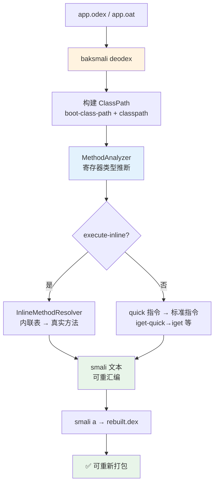

# 🔓 dex-deodex — odex 去优化，还原为可重汇编的 smali

`dex-deodex` 解决一个硬伤：直接 `disassemble` odex/oat 会**原样保留优化指令**（`execute-inline`、`iget-quick`、`invoke-virtual-quick` 等），smali 汇编器不认识它们，且这些指令丢失了原始方法/字段引用。`deodex` 子命令通过 `dexlib2/analysis` 的类路径与寄存器类型推断，把这些"快"指令解析回标准的 `invoke-virtual`、`iget`、`invoke-direct`，使输出可以经 `smali a` 重新汇编成可用 dex。

## 🧭 能力与工作流



## 📦 前置条件

```bash
# 方式1: 一键安装（推荐）
curl -fsSL https://github.com/android-security-engineer/smali-skills/releases/latest/download/install.sh | bash

# 方式2: 仅下载 jar
curl -fsSL -o baksmali.jar https://github.com/android-security-engineer/smali-skills/releases/latest/download/baksmali.jar

# 方式3: 从源码构建
JAVA_HOME=/usr/lib/jvm/java-11-openjdk-amd64 ./gradlew :baksmali:build -x test -x javadoc
```

## 🚀 快速开始

```bash
# 基本：去 odex
java -jar baksmali.jar deodex -o out app.odex

# 指定引导类路径（解析 framework 引用所必需）
java -jar baksmali.jar deodex -o out \
  --boot-class-path /system/framework/framework.jar \
  app.odex

# 使用自定义内联方法表（厂商非标准 Dalvik）
java -jar baksmali.jar deodex -o out \
  --inline-table inline_methods.txt \
  app.odex
```

输出到 `out/` 的 smali 可直接 `smali a -o rebuilt.dex out/` 重汇编。

## 🛠️ 完整选项

```bash
java -jar baksmali.jar deodex \
  -o <输出目录> \                    # 输出目录（默认 out）
  -a <api级别> \                     # API 级别
  -j <线程数> \                      # 并行线程数
  --boot-class-path <jar列表> \     # 引导类路径（逗号分隔）
  --classpath <jar/dex列表> \       # 额外类路径
  --inline-table <文件> \           # 自定义内联方法表文件
  --check-package-private-access \  # 检查包私有访问
  --api-level <级别> \              # 指定 API 级别（影响类路径解析）
  <odex/oat文件>
```

> `deodex` 继承 `disassemble` 的所有选项（`--debug-info`、`--sequential-labels`、`--register-info` 等）。

## 📊 disassemble vs deodex

| | `disassemble` | `deodex` |
|---|---|---|
| 速度 | 快 | 较慢（需类路径分析） |
| odex 指令 | 保留原始优化指令 | 解析为标准指令 |
| 可重汇编 | ❌ 不能 | ✅ 可以 |
| 需要类路径 | 仅 `register-info` 需要 | ✅ 必须 |
| 适用场景 | 快速查看 | 修改重打包 |

## 🔬 类路径解析

`deodex` 必须有完整类路径才能把 quick 指令的目标解析出来。默认在输入文件所在目录搜索。

```bash
# 常见 Android 引导类路径
--boot-class-path /system/framework/framework.jar

# 多个类路径（逗号分隔）
--boot-class-path /system/framework/framework.jar,/system/framework/ext.jar

# 应用自身依赖
--classpath /path/to/libs/support.jar
```

类路径类型解析的核心在 `dexlib2/src/main/java/org/jf/dexlib2/analysis/ClassPath.java:52`，由 `MethodAnalyzer`（`analysis/MethodAnalyzer.java:72`）驱动寄存器类型推断并在多趟迭代中还原 odex 指令（`:180` 起的 `undeodexedInstructions` BitSet）。

## 🧩 自定义内联方法表

某些设备的 Dalvik 使用**非标准内联方法表**（厂商魔改），默认 `InlineMethodResolver`（`analysis/InlineMethodResolver.java`）解析不出 `execute-inline`。用 `deodexerant` 从设备导出真实表：

```bash
# 在 Android 设备上运行 deodexerant
adb push deodexerant/deodexerant /data/local/
adb shell chmod +x /data/local/deodexerant
adb shell /data/local/deodexerant > inline_methods.txt

# 使用导出的内联表（自动走 CustomInlineMethodResolver）
java -jar baksmali.jar deodex -o out \
  --inline-table inline_methods.txt app.odex
```

`--inline-table` 选项见 `baksmali/src/main/java/org/jf/baksmali/DeodexCommand.java:59`，读入后构造 `CustomInlineMethodResolver`（`:86`）替换默认解析器。

## 🔄 典型工作流：去优化 → 重汇编 → 校验

```bash
# 1. 去 odex
java -jar baksmali.jar deodex -o smali_out \
  --boot-class-path /system/framework/framework.jar \
  app.odex

# 2. 验证输出可重汇编
java -jar smali.jar a -o rebuilt.dex smali_out/

# 3. 对比原始与重建
java -jar baksmali.jar d -o verified rebuilt.dex
```

## 🎯 适用场景

| 场景 | 价值 |
|------|------|
| odex/oat 重打包 | 还原为标准指令后才能改写并重汇编 |
| 厂商 ROM 逆向 | 解析 ART/OAT 优化指令，拿到真实调用目标 |
| 漏洞复现补丁 | 在 smali 层 patch 后重新打包到设备 |
| 静态分析预处理 | 把 quick 指令展开为带引用的标准指令，便于 xref |
| 指令级取证 | 还原 `execute-inline` 到具体 framework 方法 |

## 🔗 与相关 skill 的关系

| Skill | 关系 |
|-------|------|
| [`dex-disassemble`](./dex-disassemble) | 仅反汇编、不去优化；odex 输入需改用本 skill |
| [`dex-assemble`](./dex-assemble) | deodex 产物的下游：smali → dex |
| [`dex-roundtrip`](./dex-roundtrip) | deodex 是 odex 输入进入 round-trip 的前置 |
| [`dex-classpath`](./dex-classpath) | 类路径构建机制的编程侧剖析 |
| [`dex-analyze`](./dex-analyze) | 共享 `analysis/` 类型推断，但 deodex 面向重汇编 |
| [`dex-instructions`](./dex-instructions) | quick/inline 指令族与 Opcode 版本对照 |

## ⚠️ 注意事项

- **类路径必须完整**：缺失依赖会抛 `UnresolvedOdexInstruction`（`dexlib2/src/main/java/org/jf/dexlib2/analysis/UnresolvedOdexInstruction.java:42`），输出里会保留未解析的占位指令。
- **OAT + vdex**：OAT 文件的 vdex 会在同目录自动查找（`<basename>.vdex`）。
- **不支持的 OAT 版本**：抛 `UnsupportedOatVersionException`（`dexlib2/src/main/java/org/jf/dexlib2/DexFileFactory.java:307`），需升级 baksmali。
- **未去优化的 odex 不可重汇编**：`DisassembleCommand` 在 odex 输入时会显式告警（`baksmali/src/main/java/org/jf/baksmali/DisassembleCommand.java:166`）。

## 📚 延伸阅读

- [CLI: disassemble](../cli/disassemble.md) — `deodex` 的父命令与共享选项
- [CLI: assemble](../cli/assemble.md) — deodex 产物的重汇编
- [Reference: analysis](../reference/dexlib2/analysis.md) — `ClassPath`/`MethodAnalyzer`/类型推断源码剖析
- [Reference: dexfile-factory](../reference/dexlib2/dexfile-factory.md) — odex/oat 解析与 `UnsupportedOatVersionException`
- [Reference: iface-instruction](../reference/dexlib2/iface-instruction.md) — quick/inline 指令类型族
- [SKILL.md 原文](https://github.com/android-security-engineer/smali-skills/blob/master/skills/dex-deodex)
