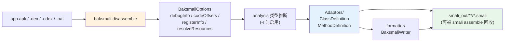

# 🔧 dex-disassemble — 反汇编 dex/apk 为 smali 文本

`dex-disassemble` 是 smali-skills **写侧最常用入口**：把 dex/apk/odex/oat 二进制反汇编成可读 smali 文本目录。它直接驱动 `baksmali disassemble` 子命令，经 `Adaptors/` 层把 `dexlib2` 只读对象模型渲染成 `.smali` 文件——拿到可 `grep`/`diff` 的文本，才能 `dex-rewrite` 再 `dex-assemble` 回去。输入自动嗅探魔数（zip → dex → odex → oat），多 dex APK 默认只处理 `classes.dex`，其余见 [dex-multidex](./dex-multidex)。

## 🧭 能力与工作流



## 📦 前置条件

```bash
curl -fsSL -o baksmali.jar https://github.com/android-security-engineer/smali-skills/releases/latest/download/baksmali.jar
```

## 🚀 快速参考

```bash
# 基本反汇编（d 是 disassemble 的短别名）
java -jar baksmali.jar disassemble -o <输出目录> <输入文件>
# 反汇编 APK（自动识别 zip 中的 classes.dex）
java -jar baksmali.jar d -o out app.apk
# 只反汇编特定类（逗号分隔，类名用 L...; 形式）
java -jar baksmali.jar d -o out --classes Lcom/example/Main app.apk
```

入口 `org.jf.baksmali.Main` 把子命令分发到 `baksmali/src/main/java/org/jf/baksmali/DisassembleCommand.java`，选项字段定义在 `:71`（`debugInfo`）至 `:143`（`classes`），最终经 `Baksmali.disassembleDexFile` 多线程落盘（`:183`）。

## 📥 支持的输入格式

| 格式 | 扩展名 | 说明 |
|------|--------|------|
| dex | `.dex` | 标准 Dalvik 可执行文件 |
| odex | `.odex` | 优化过的 dex（未 deodex 含 odex 指令，无法重汇编） |
| oat | `.oat` | ART 运行时格式（含 vdex） |
| apk/zip | `.apk`, `.zip` | 自动提取 classes.dex |

## ⚙️ 完整选项

```bash
java -jar baksmali.jar disassemble \
  -o <输出目录> \                    # 输出目录（默认 out）
  -a <api级别> \                     # API 级别（默认 15）
  -j <线程数> \                      # 并行线程数
  --debug-info=false \              # 省略调试信息（.local/.param/.line）
  --code-offsets \                  # 每条指令前注释代码偏移
  --use-locals \                    # 用 .locals 代替 .registers
  --parameter-registers=false \     # 禁用 pNN 参数寄存器语法
  --sequential-labels \             # 标签用顺序编号而非字节码地址
  --implicit-references \           # 当前类方法/字段省略类名
  --accessor-comments=false \       # 禁用合成访问器辅助注释
  --normalize-virtual-methods \     # 虚方法引用归一化到声明基类
  --allow-odex-opcodes \            # 允许 odex 操作码（结果无法重汇编）
  --classes <类列表> \              # 只反汇编指定类（逗号分隔）
  --resolve-resources <前缀> <public.xml> \  # 解析资源 ID 引用
  -r <寄存器信息> \                 # 注释寄存器类型（ALL/ALLPRE/ALLPOST/ARGS/DEST/MERGE/FULLMERGE）
  <输入文件>
```

各开关映射到 `BaksmaliOptions` 字段（见 `DisassembleCommand.java:249`–`:296` 的 `getOptions()`）。`-r` 在 `:119` 解析，按位 OR 进 `options.registerInfo`（`:258`–`:282`）。

## 🧬 寄存器类型信息（-r 选项）

逆向分析时理解寄存器在每条指令前后的类型；底层走 `dexlib2/analysis/` 的类型格运算，输出由 `Adaptors/MethodDefinition.java:216` 构造的 `RegisterFormatter` 渲染：

| 值 | 含义 |
|---|------|
| `ALL` | 指令前+后的完整寄存器类型 |
| `ALLPRE` / `ALLPOST` | 仅指令前 / 仅指令后 |
| `ARGS` / `DEST` | 方法参数寄存器 / 目标寄存器类型 |
| `MERGE` / `FULLMERGE` | 合并点寄存器类型摘要 / 完整类型集（会自动覆盖 `MERGE`，见 `:281`） |

## 🏷️ 资源 ID 解析

把字节码里的 `0x7f010001` 等资源 ID 解析成可读名称；`--resolve-resources` 可多次指定以覆盖多个资源包，需提供对应 Android 框架的 `public.xml`：

```bash
java -jar baksmali.jar d -o out \
  --resolve-resources android.R framework/res/values/public.xml \
  app.apk
```

## 📝 真实示例

用 `LocalTest/classes.dex` fixture（含 `LLocalTest;` 一个类、两个静态方法）：

```bash
java -jar baksmali.jar disassemble -o /tmp/local_smali \
  baksmali/src/test/resources/LocalTest/classes.dex
```

生成的文件树：

```
/tmp/local_smali/
└── LocalTest.smali
```

`LocalTest.smali` 内容（节选）：

```smali
.class public LLocalTest;
.super Ljava/lang/Object;


# direct methods
.method public static method1()V
    .registers 10

    .local v0, "blah! This local name has some spaces, a colon, even a \nnewline!":I, "some sig info:\nblah."
    .local v1, "blah! This local name has some spaces, a colon, even a \nnewline!":V, "some sig info:\nblah."
    ...
    .local v8
    .local v9
    return-void
.end method

.method public static method2(IJLjava/lang/String;)V
    .registers 10
    .param p0, "blah! This local name has some spaces, a colon, even a \nnewline!"    # I
    .param p1    # J
        .annotation runtime LAnnotationWithValues;
        .end annotation
    .end param

    return-void
```

`.class`/`.super` 声明类型层次，`.method`/`.registers`/`.local`/`.param` 描述方法签名与调试信息，`.annotation` 还原运行时注解。这些文本可用 `smali assemble` **无损**重新汇编回等价 dex（见 [dex-roundtrip](./dex-roundtrip)）。

## 🎯 适用场景

| 场景 | 价值 |
|------|------|
| APK 静态审计 | 拿到可 `grep` 的 smali 文本目录，定位加固/混淆点 |
| 指令级逆向 | `-r ALL` 注入寄存器类型，理解每条指令的寄存器流转 |
| 差分比对 | 配合 `dex-diff` 比较两个版本 APK 的 smali 输出 |
| 改写前导出 / 资源还原 | `dex-rewrite` 前 dump 基线 / `--resolve-resources` 把硬编码 ID 转可读符号 |
| 去调试信息清理 | `--debug-info=false` 输出更干净，便于审阅逻辑 |

## 🔗 与相关 skill 的关系

| Skill | 关系 |
|-------|------|
| [dex-roundtrip](./dex-roundtrip) | 本 skill 的反汇编是往返第一步；第二步 `smali assemble` 把文本回收成 dex |
| [dex-deodex](./dex-deodex) | odex/oat 需先 deodex 才能产出可重汇编的 smali |
| [dex-list-structure](./dex-list-structure) / [dex-multidex](./dex-multidex) | 多 dex APK 下先查条目名；默认只处理 classes.dex，其余需协调 |
| [dex-search](./dex-search) | 在反汇编产出的文本上做内容检索；[dex-dump](./dex-dump) 则不走文本层 |

## ⚠️ 注意事项

- odex/oat 未 deodex、或启用 `--allow-odex-opcodes` 时，输出含优化指令，**无法重新汇编**——前者改用 [dex-deodex](./dex-deodex)，后者仅供审阅。
- 多 dex APK 默认只处理 `classes.dex`，`--resolve-resources` 需对应框架 `public.xml` 才能解析 ID；多 dex 处理见 [dex-multidex](./dex-multidex)。

## 📚 延伸阅读

- [CLI: disassemble](../cli/disassemble) — `baksmali disassemble` 参数总览与短别名 `d`
- [CLI: assemble](../cli/assemble) — 反汇编产物的回收路径（`smali assemble`）
- [Reference: baksmali Adaptors](../reference/baksmali/adaptors.md) — `ClassDefinition`/`MethodDefinition` 渲染层源码剖析
- [Reference: baksmali formatter](../reference/baksmali/formatter.md) — `BaksmaliWriter`/`RegisterFormatter` 文本输出
- [SKILL.md 原文](https://github.com/android-security-engineer/smali-skills/blob/master/skills/dex-disassemble)
