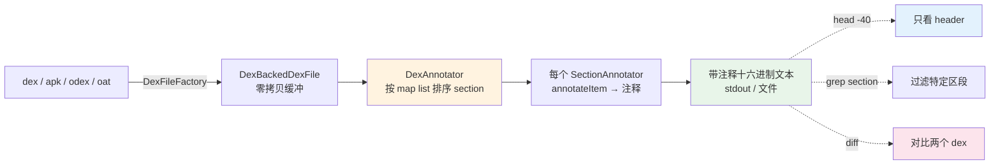

# 🔍 dex-dump — 带注释的十六进制转储

把一个 `.dex` 的原始字节按 section 顺序铺开，左侧是偏移与十六进制字节、右侧是字段语义注释——魔数、校验和、各 section 偏移与大小都就地标注。理解 dex 二进制布局、调试自生成 dex、定位损坏文件二进制层面问题的最直接工具。

## 前置条件

```bash
curl -fsSL -o baksmali.jar \
  https://github.com/android-security-engineer/smali-skills/releases/latest/download/baksmali.jar
```

## 能力与工作流



注释由 `DexAnnotator` 驱动：先读 map list，按 `sectionAnnotationOrder` 重排各 `MapItem`，再逐个调用注册的 `SectionAnnotator.annotateSection` 产出注释，最后统一写出。源码：`DexAnnotator.writeAnnotations` 在 `dexlib2/.../dexbacked/raw/util/DexAnnotator.java:167`，section 排序在 `:169`。

## 命令

```bash
# 基本转储（输出到 stdout）
java -jar baksmali.jar dump <dex文件>

# 转储到文件，便于后续 grep / diff
java -jar baksmali.jar dump app.dex > dump.txt

# 指定 API 级别（默认 -1 = 由 dex 头自动检测）
java -jar baksmali.jar dump -a 28 app.dex

# 转储 APK 中的特定 dex
java -jar baksmali.jar dump "app.apk/classes2.dex"
```

CLI 入口为 `baksmali` 的 `dump` 子命令（别名 `du`），实现在 `baksmali/src/main/java/org/jf/baksmali/DumpCommand.java:50`；`run()` 在 `:60` 解析输入、`:76` 调用静态 `dump()`；静态方法 `:92` 创建 `DexAnnotator` 并 `writeAnnotations`。完整选项：

```bash
java -jar baksmali.jar dump \
  -a <api级别> \   # API 级别（默认 -1 = 自动检测）
  <dex/apk/odex/oat文件>
```

## 真实命令 → 输出

用 `LocalTest/classes.dex` fixture 实跑，前 45 行即 `header_item` 与 `string_id_item` 开头：

```bash
$ java -jar baksmali.jar dump baksmali/src/test/resources/LocalTest/classes.dex | head -45
```

```
                           |-----------------------------
                           |header_item section
                           |-----------------------------
                           |
                           |[0] header_item
000000: 6465 780a 3033 3500|  magic: dex\n035
000008: 186a b5cf          |  checksum
00000c: 24e9 48b0 c690 0fec|  signature
000014: 372e 2457 9934 9c70|
00001c: 93c4 0f30          |
000020: 3c03 0000          |  file_size: 828
000024: 7000 0000          |  header_size: 112
000028: 7856 3412          |  endian_tag: 0x12345678 (Little Endian)
000034: 7802 0000          |  map_off: 0x278
000038: 0c00 0000          |  string_ids_size: 12
00003c: 7000 0000          |  string_ids_off: 0x70
000040: 0700 0000          |  type_ids_size: 7
000060: 0100 0000          |  class_defs_size: 1
                           |-----------------------------
                           |string_id_item section
                           |-----------------------------
                           |[0] string_id_item
000070: 0401 0000          |  string_data_item[0x104]: "I"
                           |[1] string_id_item
000074: 0701 0000          |  string_data_item[0x107]: "J"
```

读法：左列是字节偏移，中间是按 2 字节分组的原始十六进制，右列是语义注释。`magic: dex\n035` 即 `dex\n035\0`——`035` 是 dex 版本 35（Android API 23+）；`string_ids_size: 12` 说明字符串池有 12 项，可与 [`list strings`](../cli/list) 的输出交叉印证。这些注释字符串的源头在 `dexlib2/.../dexbacked/raw/HeaderItem.java:178`（`checksum`）一路到 `:213`（`data_off`）。

## Section 注释对照

| Section | 内容 | dump 中的注释 | 注释器源码 |
|---------|------|--------------|-----------|
| **Header** | 文件头 | 魔数、版本、校验和、签名、各 section 偏移/大小 | `raw/HeaderItem.java` |
| **String IDs** | 字符串偏移表 | 每条目指向 Data 区的 `string_data_item` | `raw/StringIdItem.java` |
| **Type IDs** | 类型索引 | 每条目是 String IDs 的索引 | `raw/TypeIdItem.java` |
| **Proto IDs** | 方法原型 | 返回类型 + 参数类型列表 | `raw/ProtoIdItem.java` |
| **Field IDs** | 字段引用 | 类名 + 类型 + 名称索引 | `raw/FieldIdItem.java` |
| **Method IDs** | 方法引用 | 类名 + 原型 + 名称索引 | `raw/MethodIdItem.java` |
| **Class Defs** | 类定义 | 类信息、父类、接口、字段/方法偏移 | `raw/ClassDefItem.java` |
| **Data** | 实际数据 | 字符串内容、指令字节码、注解 | `raw/CodeItem.java` 等 |
| **Map List** | section 映射 | 类型 → 偏移 → 大小 | `raw/MapItem.java` |

section 遍历顺序由 `DexAnnotator.java:54` 的 `sectionAnnotationOrder` 表决定（`MAP_LIST` 先、`HEADER_ITEM` 次、再按池化顺序），`SectionAnnotator.annotateSection` 在 `raw/SectionAnnotator.java:75` 逐条调 `annotateItem`（`:68` 抽象方法）。

## 实用技巧

```bash
# 只看 header（前 0x70 字节对应的注释区域）
java -jar baksmali.jar dump classes.dex | head -40

# 检查各 section 偏移是否符合规范
java -jar baksmali.jar dump classes.dex | grep "offset\|size"

# 搜索字符串数据区
java -jar baksmali.jar dump classes.dex | grep -A2 "string_data"

# 搜索类定义区
java -jar baksmali.jar dump classes.dex | grep -A5 "class_def"

# 检查 header 中的 checksum 与 signature
java -jar baksmali.jar dump classes.dex | head -8

# 分析损坏的 dex（定位二进制层面问题）
java -jar baksmali.jar dump corrupted.dex 2>&1 | head -50
# 搜索特定偏移位置的内容
java -jar baksmali.jar dump classes.dex | grep "0x0008"

# 对比自生成 dex 与参考 dex 的差异
diff <(java -jar baksmali.jar dump original.dex) \
     <(java -jar baksmali.jar dump rebuilt.dex)

# 大文件先落盘再统计行数
java -jar baksmali.jar dump large.dex > large.dump.txt
wc -l large.dump.txt
```

## 适用场景

| 场景 | 为什么用 dump 而非 disassemble |
|------|--------------------------------|
| 理解 dex 二进制格式 | 直接看字节与字段偏移，比反汇编文本更贴近格式规范 |
| 调试自生成 dex | `dex-build`/`assemble` 产物出错时，逐字节核对 header 与 section 偏移 |
| 验证 section 对齐 / 校验和 | 一眼看到 `checksum`、`signature`、`map_off` 是否合理 |
| 定位损坏 dex 的二进制问题 | 即便解析半途失败，已注释部分仍可定位越界偏移 |
| 逆向反混淆 / 对抗加固 | 配合 `grep` 快速跳到可疑 section，看原始字节而非反汇编后的语义 |

## 与相关 skill 的关系

| Skill | 关系 |
|-------|------|
| [dex-disassemble](./dex-disassemble) | 反汇编为 smali 文本看语义；dump 看二进制布局，两者互补 |
| [dex-build](./dex-build) | 自生成 dex 后用 dump 逐字节验证产物正确性 |
| [dex-read](./dex-read) | 编程读取的高级视图；dump 是「不编程、直接看字节」的对应物 |
| [dex-list-strings](./dex-list-strings) | dump 中 `string_data_item` 注释可与其交叉印证字符串池 |
| [dex-instructions](./dex-instructions) | dump 里 `CodeItem` 的字节码对应其指令格式表 |

## 延伸阅读

- [CLI: baksmali dump 入口](../reference/baksmali/main) — 命令调度与 `dump` 子命令注册
- [CLI: list 子命令](../cli/list) — 正向列举各 section，与 dump 注释交叉印证
- [内幕: DEX 文件格式](../internals/dex-format) — section 布局与池化条目详解
- [内幕: 零拷贝解析](../internals/zero-copy) — `DexBackedDexFile` 缓冲机制
- [SKILL.md 原文](https://github.com/android-security-engineer/smali-skills/blob/master/skills/dex-dump)
