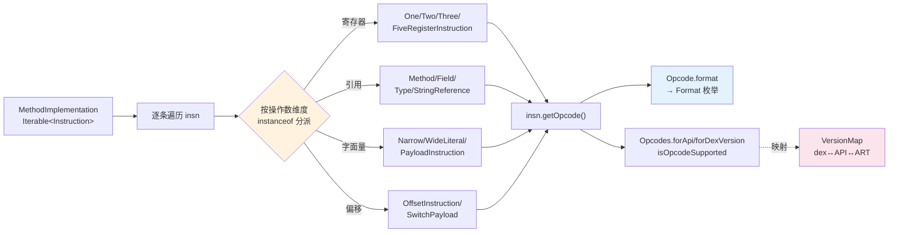

# 🧩 dex-instructions — 指令类型与 Opcode 版本

dexlib2 把每条 Dalvik 指令建模成 `Instruction` 接口，再按操作数维度拆出一组正交的子接口——`OneRegisterInstruction`、`ReferenceInstruction`、`OffsetInstruction`……一条 `invoke-virtual` 同时是「多寄存器」「方法引用」「带偏移」三接口的实现，按需 instanceof 即可取出对应字段。与之配套的 `Opcode` / `Opcodes` / `VersionMap` 三元组，回答「这个操作码在哪个版本可用」「dex 040 对应哪个 API」。这是写任何指令级分析器（统计、改写、校验）的公共地基。

## 前置条件

```bash
curl -fsSL -o dexlib2.jar \
  https://github.com/android-security-engineer/smali-skills/releases/latest/download/dexlib2.jar
```

## 能力与工作流



整条链路的源头是 `MethodImplementation.getInstructions()`（接口定义在 `dexlib2/src/main/java/org/jf/dexlib2/iface/Method.java`），每条 `Instruction` 自带 `getOpcode()`；`Opcode.format`（`dexlib2/src/main/java/org/jf/dexlib2/Opcode.java:357`）把它钉到具体 `Format` 枚举值；版本判定则交给 `Opcodes`（`dexlib2/src/main/java/org/jf/dexlib2/Opcodes.java:58` 起）与 `VersionMap`（`dexlib2/src/main/java/org/jf/dexlib2/VersionMap.java:37`）。

## 指令类型速查

### 按寄存器数量

```java
if (insn instanceof OneRegisterInstruction)       // vAA
    int reg = ((OneRegisterInstruction) insn).getRegister();

if (insn instanceof TwoRegisterInstruction)       // vA, vB
    int regA = ((TwoRegisterInstruction) insn).getRegisterA();
    int regB = ((TwoRegisterInstruction) insn).getRegisterB();

if (insn instanceof ThreeRegisterInstruction)     // vA, vB, vC
    int regA = ((ThreeRegisterInstruction) insn).getRegisterA();

if (insn instanceof FiveRegisterInstruction)      // vA..vE (invoke-* 非范围)
    // 4 个参数寄存器 + 1 个寄存器计数
```

### 按引用类型

```java
if (insn instanceof ReferenceInstruction) {
    Reference ref = ((ReferenceInstruction) insn).getReference();
    // 具体类型: MethodReference, FieldReference, TypeReference, StringReference
}

if (insn instanceof MethodReferenceInstruction) {
    MethodReference ref = ((MethodReferenceInstruction) insn).getMethodReference();
}

if (insn instanceof FieldReferenceInstruction) {
    FieldReference ref = ((FieldReferenceInstruction) insn).getFieldReference();
}
```

### 按字面量类型

```java
if (insn instanceof NarrowLiteralInstruction)     // const/4, const/16, const
    int value = ((NarrowLiteralInstruction) insn).getNarrowLiteral();

if (insn instanceof WideLiteralInstruction)       // const-wide
    long value = ((WideLiteralInstruction) insn).getWideLiteral();

if (insn instanceof PayloadInstruction)           // fill-array-data, sparse/packed-switch
    // 获取 payload 数据
```

### 按偏移类型

```java
if (insn instanceof OffsetInstruction)            // goto, if-*, invoke-*
    int offset = ((OffsetInstruction) insn).getCodeOffset();

if (insn instanceof SwitchPayload)                // sparse-switch, packed-switch
    // switch 表数据
```

所有这些子接口都在 `dexlib2/src/main/java/org/jf/dexlib2/iface/instruction/` 包下，互不耦合，可任意组合 instanceof。

## 常见指令格式

| 格式 | 语法 | 示例指令 |
|------|------|---------|
| `10x` | 无操作数 | `return-void` |
| `11x` | vAA | `move-result v0` |
| `12x` | vA, vB | `move v0, v1` |
| `21c` | vAA, ref@BBBB | `const-string v0, "hello"` |
| `22b` | vAA, vBB, #CC | `add-int/lit8 v0, v1, 1` |
| `22c` | vA, vB, ref@CCCC | `iget v0, v1, Lcom/Foo;->bar:I` |
| `35c` | {vC..vG}, ref@BBBB | `invoke-virtual {v0, v1}, Lcom/Foo;->bar(I)V` |
| `3rc` | {vCCCC..vNNNN}, ref@BBBB | `invoke-virtual/range {v0..v2}, ...` |

格式枚举本体在 `dexlib2/src/main/java/org/jf/dexlib2/Format.java`，从 `Format10x` 到 `Format51l` 一应俱全；`Opcode` 构造时把每个操作码钉死到某个 `Format`（`Opcode.java:392` 的 `this.format = format`）。

## Opcode 与版本支持

### 获取特定版本的 Opcode 集

```java
import org.jf.dexlib2.Opcodes;
import org.jf.dexlib2.Opcode;
import org.jf.dexlib2.VersionMap;

// 按 API 级别
Opcodes opcodes = Opcodes.forApi(28);

// 按 dex 版本
Opcodes opcodes = Opcodes.forDexVersion(39);
```

### 检查 Opcode 可用性

```java
// 检查特定操作码是否在版本中可用
Opcode opcode = Opcode.INVOKE_CUSTOM;
boolean available = opcodes.isOpcodeSupported(opcode);
```

`Opcodes.forApi` 在 `Opcodes.java:58`，`forDexVersion` 在 `:68`——后者内部把 dex 版本经 `VersionMap` 折算成 API 再构造；`isOpcodeSupported` 查的就是该 API 下生效的 `VersionConstraint` 列表（`Opcode.java:311` 的 `INVOKE_CUSTOM` 用 `firstArtVersion(0xfc, 111)` 即 ART 111 / API 27 起才出现）。

### 版本映射

```java
// dex 版本 → API 级别
int api = VersionMap.mapDexVersionToApi(35);   // → 23
int api = VersionMap.mapDexVersionToApi(38);   // → 27
int api = VersionMap.mapDexVersionToApi(39);   // → 28
int api = VersionMap.mapDexVersionToApi(40);   // → 30 （本仓库扩展）

// API 级别 → dex 版本
int ver = VersionMap.mapApiToDexVersion(28);   // → 39
int ver = VersionMap.mapApiToDexVersion(30);   // → 40
int ver = VersionMap.mapApiToDexVersion(34);   // → 40
```

两个映射方法成对存在：`VersionMap.mapDexVersionToApi` 在 `VersionMap.java:37`，`mapApiToDexVersion` 在 `:56`，另有 ART 版本双向映射 `mapArtVersionToApi` (`:73`) / `mapApiToArtVersion` (`:109`)。

### 关键版本对应

| dex 版本 | API 级别 | 关键新增 |
|----------|---------|---------|
| 035 | 23 | 基础指令集 |
| 037 | 25 | ART 相关 |
| 038 | 27 | invoke-custom, invoke-polymorphic |
| 039 | 28 | const-method-handle, const-method-type |
| 040 | 30 | hiddenapi 限制标志（本仓库扩展支持） |

## 指令格式枚举

```java
import org.jf.dexlib2.Format;

// 获取指令格式
InstructionFormat format = insn.getOpcode().format;
// 值: Format10x, Format11x, Format12x, ..., Format3rc, Format51l
```

## 工具方法

```java
// 获取指令的代码单元大小
int codeUnits = insn.getCodeUnits();

// 获取指令的代码偏移（在遍历时需要自己跟踪）
// Instruction 本身不存储偏移，需在遍历时累加 codeUnits

// 判断指令类型
insn.getOpcode().format == Format.Format35c;  // invoke 系列
insn.getOpcode().format == Format.Format3rc;  // invoke/range 系列
```

`Instruction` 不持久化自身偏移——遍历时要靠 `getCodeUnits()` 累加得到当前指令的 `codeOffset`，这也是 `dex-xref` / `dex-diff` 计算跳转目标的基础。

## 适用场景

| 场景 | 为什么用本 skill |
|------|------------------|
| 写指令级分析器（计数/分类） | 按格式或引用类型 instanceof 一次分桶，省去手写 opcode 大表 |
| 校验跨版本字节码合法性 | `Opcodes.isOpcodeSupported` 判断某操作码在目标 API 是否存在 |
| 重写 invoke 目标 / 字段引用 | 拿 `MethodReferenceInstruction` 直接改 `MethodReference` |
| 计算 switch / goto 跳转目标 | `OffsetInstruction.getCodeOffset()` + `getCodeUnits()` 累加 |
| 对齐 smali 语法与二进制格式 | `Format` 枚举是 smali 语法树与 dex 字节码的共同锚点 |

## 与相关 skill 的关系

| Skill | 关系 |
|-------|------|
| [dex-read](./dex-read) | 上层编程入口；本 skill 是其指令维度的「字段访问字典」 |
| [dex-disassemble](./dex-disassemble) | 反汇编输出 smali 时，`Adaptors` 内部正是按这些接口取操作数 |
| [dex-dump](./dex-dump) | dump 里 `CodeItem` 字节码对应本 skill 的格式表，可交叉印证 |
| [dex-xref](./dex-xref) | 交叉引用靠 `ReferenceInstruction` 抽取方法/字段/字符串引用 |
| [dex-rewrite-references](./dex-rewrite-references) | 改写引用的落点就是 `ReferenceInstruction.getReference()` 返回的对象 |
| [dex-deodex](./dex-deodex) | deodex 后要把 odex 指令解析回具体 invoke，依赖 `MethodAnalyzer` + 指令接口 |

## 延伸阅读

- [CLI: baksmali list/disassemble](../cli/list) — 列举与反汇编时按本 skill 的接口取操作数
- [CLI: xref](../cli/xref) — 交叉引用抽取，直接消费 `ReferenceInstruction`
- [内幕: Opcode 与版本支持](../internals/opcodes) — `Opcode`/`Opcodes`/`VersionConstraint` 详解
- [内幕: 版本映射](../internals/version-map) — `VersionMap` 的 dex↔API↔ART 三向换算
- [内幕: 零拷贝解析](../internals/zero-copy) — `DexBackedDexFile` 如何惰性产出 `Instruction`
- [SKILL.md 原文](https://github.com/android-security-engineer/smali-skills/blob/master/skills/dex-instructions)
