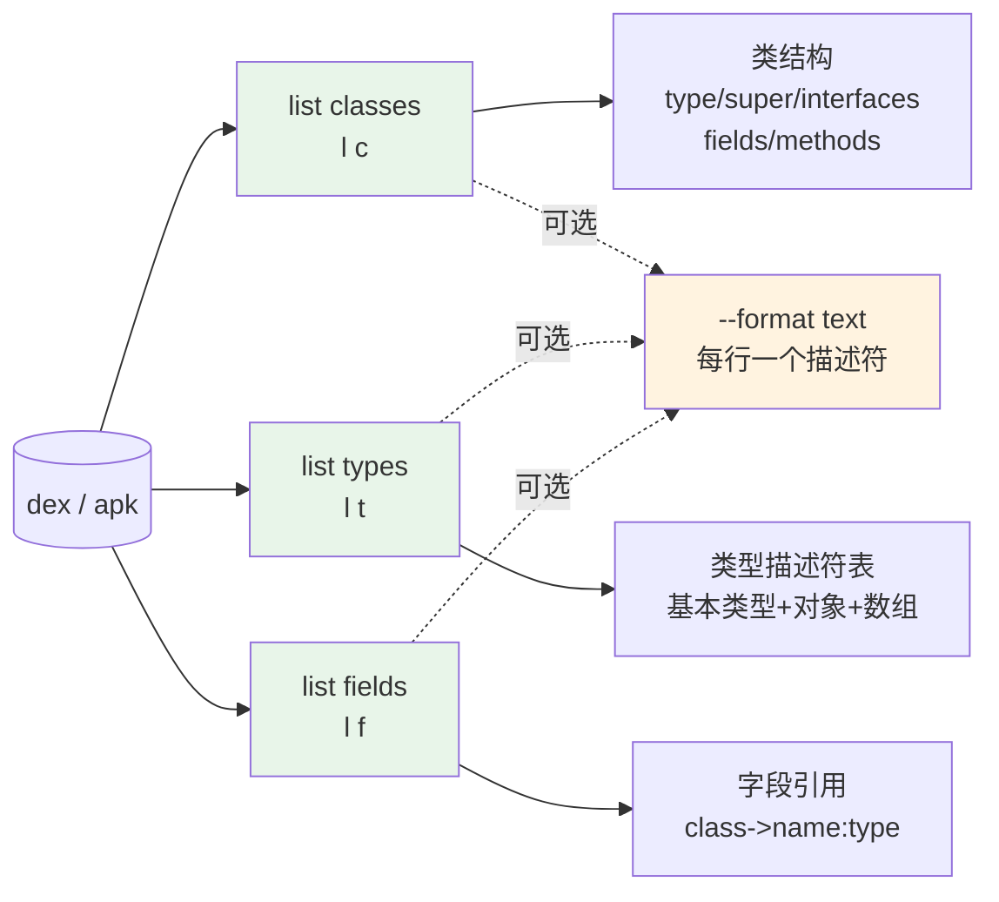
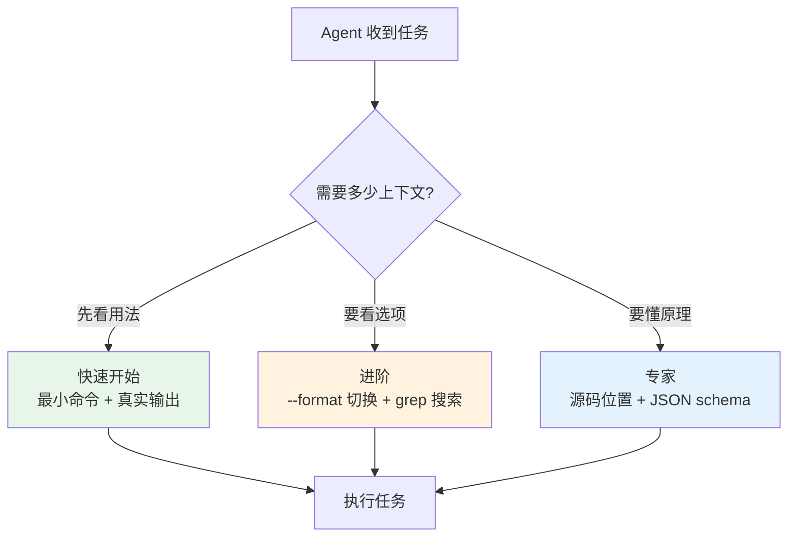

# 🧩 dex-list-classes

快速浏览 dex / apk 文件中的**类定义**、**类型描述符**与**字段引用**。三个子命令均默认输出 JSON，一条记录即完整结构化数据——Agent 无需再二次解析 smali 文本。

## 🗺️ 能力与命令关系



三个子命令同属内容级列举（绿色），与结构级 `list vtables` / `fieldoffsets` 不同：无需类路径即可运行，输出直接可用 `jq` / `grep` 过滤。

## 📦 前置条件

```bash
curl -fsSL -o baksmali.jar \
  https://github.com/android-security-engineer/smali-skills/releases/latest/download/baksmali.jar
```

## 📋 list classes — 类结构

```bash
java -jar baksmali.jar list classes app.apk          # 默认 JSON：含超类/接口/字段/方法
java -jar baksmali.jar l c app.apk                   # 短别名
java -jar baksmali.jar l c app.apk --format text    # 仅类描述符，每行一个
```

真实示例（`LocalTest/classes.dex`，含两个方法的简单类）：

```bash
java -jar baksmali.jar list classes baksmali/src/test/resources/LocalTest/classes.dex
```

实际输出（默认 JSON）：

```json
[{"type":"LLocalTest;","superclass":"Ljava/lang/Object;","accessFlags":1,"interfaces":[],"fields":[],"methods":[{"name":"method1","parameters":[],"returnType":"V","accessFlags":9},{"name":"method2","parameters":["I","J","Ljava/lang/String;"],"returnType":"V","accessFlags":9}]}]
```

人读文本对照（`--format text`）：

```
LLocalTest;
```

JSON 一条记录即完整描述类的超类、访问标志、接口、字段与方法签名——Agent 无需再二次解析 smali 文本。

### 搜索类

```bash
java -jar baksmali.jar l c app.apk | grep "com/example"                       # 按包名
java -jar baksmali.jar l c app.apk | grep "Activity"                          # 找 Activity
java -jar baksmali.jar l c app.apk | grep '\$'                                # 找内部类
java -jar baksmali.jar l c app.apk | grep -v "^Landroid/\|^Landroidx/\|^Lkotlin/"  # 排除框架类
```

## 🔡 list types — 类型描述符

```bash
java -jar baksmali.jar list types app.apk          # 默认 JSON
java -jar baksmali.jar l t app.apk --format text  # 人读文本
```

文本模式列出所有类型描述符（含基本类型与数组）：

```
I                        # int
Z                        # boolean
Ljava/lang/String;       # String
Lcom/example/Main;       # 自定义类
[B                       # byte[]
[[I                      # int[][]
```

### 类型描述符速查

| 描述符 | Java 类型 | 描述符 | Java 类型 |
|--------|----------|--------|----------|
| `V` | void | `J` | long |
| `Z` | boolean | `F` | float |
| `B` | byte | `D` | double |
| `C` | char | `L...;` | 对象类型 |
| `S` | short | `[` | 数组（前置） |
| `I` | int | | |

### 真实示例

```bash
java -jar baksmali.jar list types baksmali/src/test/resources/LocalTest/classes.dex
```

```json
[{"type":"I"},{"type":"J"},{"type":"LAnnotationWithValues;"},{"type":"LLocalTest;"},{"type":"Ljava/lang/Object;"},{"type":"Ljava/lang/String;"},{"type":"V"}]
```

## 🧬 list fields — 字段引用

```bash
java -jar baksmali.jar list fields app.apk          # 默认 JSON: {class,name,type}
java -jar baksmali.jar l f app.apk --format text   # 格式: 类名->字段名:类型
```

真实示例（`accessorTest.dex`，含内部类对外部类的引用字段 `this$0` 与各种基本类型字段）：

```bash
java -jar baksmali.jar list fields dexlib2/src/test/resources/accessorTest.dex
```

实际输出（默认 JSON，节选）：

```json
[
  {"class":"Lorg/jf/dexlib2/AccessorTypes$Accessors;","name":"this$0","type":"Lorg/jf/dexlib2/AccessorTypes;"},
  {"class":"Lorg/jf/dexlib2/AccessorTypes;","name":"boolean_val","type":"Z"},
  {"class":"Lorg/jf/dexlib2/AccessorTypes;","name":"byte_val","type":"B"},
  {"class":"Lorg/jf/dexlib2/AccessorTypes;","name":"char_val","type":"C"}
]
```

人读文本对照：

```
Lorg/jf/dexlib2/AccessorTypes$Accessors;->this$0:Lorg/jf/dexlib2/AccessorTypes;
Lorg/jf/dexlib2/AccessorTypes;->boolean_val:Z
Lorg/jf/dexlib2/AccessorTypes;->byte_val:B
Lorg/jf/dexlib2/AccessorTypes;->char_val:C
```

`this$0` 是非静态内部类持有的外部类实例引用——识别 Java 内部类的典型特征字段。

### 搜索字段

```bash
java -jar baksmali.jar l f app.apk | grep "API_KEY\|SECRET\|TOKEN"             # 敏感字段名
java -jar baksmali.jar l f app.apk | grep ":Landroid/widget/EditText;"        # 按类型
java -jar baksmali.jar l f app.apk | grep "com/example.*->.*:Ljava/lang/String;"  # 静态字符串字段
```

## 🗂️ 多 dex APK

```bash
java -jar baksmali.jar l c "app.apk/classes2.dex"   # 列举特定 dex 的类
java -jar baksmali.jar l f "app.apk/classes2.dex"   # 列举特定 dex 的字段
```

## 🎯 适用场景

| 场景 | 命令 |
|------|------|
| 查看应用包结构 | `l c app.apk \| grep "^Lcom/myapp"` |
| 查找敏感字段 | `l f app.apk \| grep -iE "key\|secret\|token\|password"` |
| 统计类数量 | `l c app.apk \| wc -l` |
| 查找自定义 View | `l c app.apk \| grep "View\|Layout"` |
| 查找接口实现 | `l c app.apk \| grep "Impl\|Listener"` |
| 识别内部类 | `l c app.apk \| grep '\$'` 或 `l f app.apk \| grep 'this\$'` |

## 🔗 与相关 skill 关系

| Skill | 关系 |
|-------|------|
| `dex-list-methods` | 同族内容级列举，互补：本 skill 看类/字段，它看方法签名 |
| `dex-list-strings` | 同族，列举字符串池；常与字段搜索配合找敏感常量 |
| `dex-list-structure` | 结构级（vtables/fieldoffsets/odex 依赖），需类路径，纯文本输出 |
| `dex-search` | 在列举结果上做模式匹配与过滤，本 skill 是其数据来源 |
| `dex-xref` | 反向交叉引用；本 skill 列「有什么」，xref 答「谁在用」 |
| `dex-multidex` | 多 dex 容器处理，`list dex` 是其前置侦察步骤 |
| `dex-read` | 用 dexlib2 编程读取，覆盖本 skill 之外的灵活查询 |

## 🧭 渐进式披露



源码位置（三个子命令各一个 `*Command.java`）：

- `baksmali/src/main/java/org/jf/baksmali/ListClassesCommand.java:51` — `commandName = "classes"`
- `baksmali/src/main/java/org/jf/baksmali/ListTypesCommand.java:44` — `commandName = "types"`
- `baksmali/src/main/java/org/jf/baksmali/ListFieldsCommand.java:44` — `commandName = "fields"`

三者共享 `list` 父命令的 `--format json|text` 开关与输出适配逻辑，JSON 序列化走 dexlib2 的 `iface/` 类型（`ClassDef` / `Field` / 类型描述符字符串），零拷贝读取自 `DexBackedDexFile`。

## 📚 延伸阅读

- [CLI: baksmali list](../cli/list.md) — list 全部子命令总览
- [CLI: baksmali xref](../cli/xref.md) — 反向交叉引用
- [Skill: dex-list-methods](./dex-list-methods.md) — 方法签名列举（同族）
- [Skill: dex-list-strings](./dex-list-strings.md) — 字符串池列举（同族）
- [Skill: dex-list-structure](./dex-list-structure.md) — 结构级列举（vtables/fieldoffsets）
- [Reference: baksmali](../reference/baksmali/) — 命令实现源码
- [Skills 索引](./index.md#读取-结构) — 读取/结构类 skill 全集
