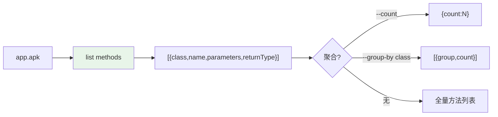

# 📋 dex-list-methods — 列举方法

快速提取 dex/apk 中的所有方法引用，无需完整反汇编。对应 CLI：`baksmali list methods`（别名 `l m`）。

## 适用场景

| 场景 | 用法 |
|------|------|
| 枚举方法表 | `list methods` |
| 找某方法签名 | JSON + `jq` 过滤 |
| 统计方法总数 | `--count` |
| 按类分组计数 | `--group-by class` |
| 定位热点类 | group-by 找方法数最多的类 |

## 工作流



## 快速参考

```bash
# 列举所有方法（默认 JSON）
java -jar baksmali.jar list methods app.apk
java -jar baksmali.jar l m app.apk                 # 短别名

# 人读文本：每行 类名->方法名(参数)返回类型
java -jar baksmali.jar list methods --format text app.apk

# 仅总数
java -jar baksmali.jar list methods --count app.apk        # {"count":N}

# 按类分组计数（找热点类）
java -jar baksmali.jar list methods --group-by class app.apk
```

## 输出格式

默认 JSON：

```json
[
  {"class":"LLocalTest;","name":"method1","parameters":[],"returnType":"V"},
  {"class":"LLocalTest;","name":"method2","parameters":["I","J","Ljava/lang/String;"],"returnType":"V"}
]
```

文本模式：

```
Lcom/example/Main;->onCreate(Landroid/os/Bundle;)V
Ljava/lang/Object;-><init>()V
```

## 聚合示例

`accessorTest.dex` 实跑：

```json
{"count":432}
[
  {"group":"Ljava/lang/Object;","count":1},
  {"group":"Lorg/jf/dexlib2/AccessorTypes$Accessors;","count":232},
  {"group":"Lorg/jf/dexlib2/AccessorTypes;","count":199}
]
```

`AccessorTypes$Accessors` 是合成访问器内部类——方法数最多是识别合成访问器的信号。

## 搜索方法名

```bash
# JSON + jq 按名过滤
java -jar baksmali.jar list methods app.apk | \
  jq '.[] | select(.name|test("login|auth";"i"))'
```

## 相关 skill

| Skill | 关系 |
|-------|------|
| [dex-list-classes](./dex-list-classes.md) | 列举类（方法的容器） |
| [dex-xref](./dex-xref.md) | 反向查谁调用了某方法 |
| [dex-search](./dex-search.md) | 按指令模式定位方法体 |

## 延伸阅读

- [list methods 命令详解](../reference/baksmali/commands/list-methods.md)
- [CLI list 文档](../cli/list.md)
- [查询与交叉引用](../guide/query.md)
