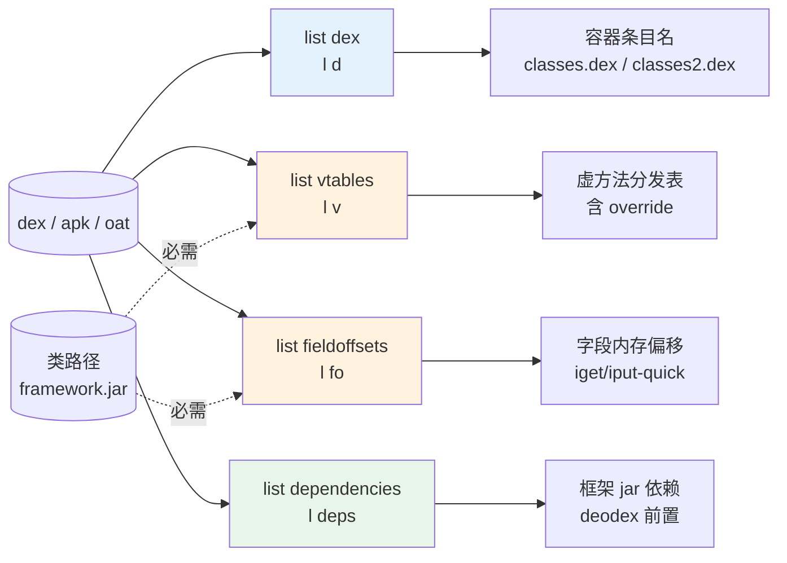
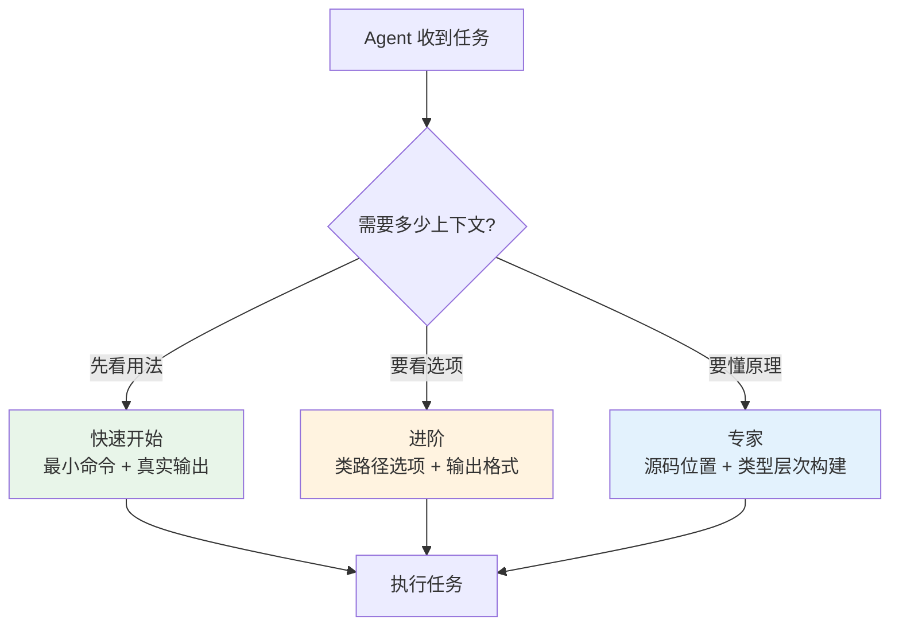

# 🧱 dex-list-structure

列举 dex / apk / oat 文件的**结构级**信息，无需完整反汇编。覆盖四类只读查询：

- 多 dex 条目（APK / OAT 容器内含哪些 dex）
- 虚方法表 vtables（含继承链）
- 实例字段偏移 fieldoffsets（对象内存布局）
- odex / oat 依赖 dependencies（编译期记录）

## 🗺️ 能力与命令关系



橙色子命令（`vtables` / `fieldoffsets`）需类路径构建类型层次；`dex` 与 `dependencies` 无此要求。四个子命令均为**纯文本输出**，无 `--format json` 选项（区别于 `list classes/methods/strings`）。

## 📦 前置条件

```bash
curl -fsSL -o baksmali.jar \
  https://github.com/android-security-engineer/smali-skills/releases/latest/download/baksmali.jar
```

## 📋 list dex — 多 dex 条目

```bash
java -jar baksmali.jar list dex app.apk      # 列举 APK/OAT 内含的 dex 文件
java -jar baksmali.jar l d app.apk          # 短别名
```

真实示例（两个 fixture dex 打成多 dex APK）：

```bash
cp dexlib2/src/test/resources/accessorTest.dex       /tmp/classes.dex
cp baksmali/src/test/resources/LocalTest/classes.dex /tmp/classes2.dex
( cd /tmp && jar cf multidex.apk classes.dex classes2.dex )

java -jar baksmali.jar l d /tmp/multidex.apk
```

实际输出：

```
classes.dex
classes2.dex
```

确认多 dex 后，指定具体 dex 条目进入后续操作：

```bash
java -jar baksmali.jar d -o out "app.apk/classes2.dex"   # 反汇编指定 dex
java -jar baksmali.jar l s "app.apk/classes2.dex"        # 列字符串池
```

## 🧬 list vtables — 虚方法表

```bash
java -jar baksmali.jar l v app.apk                                # 基本用法
java -jar baksmali.jar l v \
  --boot-class-path /system/framework/framework.jar app.apk       # 通常需类路径
java -jar baksmali.jar l v --classes Lcom/example/Main app.apk    # 只看特定类
java -jar baksmali.jar l v --override-oat-version 56 app.apk      # 覆盖 OAT 版本
```

输出每个类的虚方法分发表，含继承方法：

```
Lcom/example/Main; -> vtable
  0: Ljava/lang/Object;-><init>()V
  1: Landroid/app/Activity;->onCreate(Landroid/os/Bundle;)V
  2: Lcom/example/Main;->onCreate(Landroid/os/Bundle;)V  # override
  ...
```

### 类路径选项

| 选项 | 说明 |
|------|------|
| `-b,--bootclasspath` | 引导类路径（冒号分隔） |
| `-c,--classpath` | 额外类路径 |
| `-d,--classpath-dir` | 类路径搜索目录 |
| `--check-package-private-access` | 检查包私有访问（4.2.0 odex 需要） |
| `--override-oat-version` | 覆盖 OAT 版本 |

## 📐 list fieldoffsets — 实例字段偏移

```bash
java -jar baksmali.jar list fieldoffsets app.apk
java -jar baksmali.jar l fo \
  --boot-class-path /system/framework/framework.jar app.apk
```

输出每个类实例字段在对象内存中的偏移量：

```
Lcom/example/Main;:
  0: Lcom/example/Main;->mContext:Landroid/content/Context;
  4: Lcom/example/Main;->mTitle:Ljava/lang/String;
  8: Lcom/example/Main;->mCount:I
```

偏移从 0 开始，引用类型占 4 字节（32 位），基本类型按大小对齐。用途：

- 理解对象内存布局
- 分析 ART 字段访问模式
- 调试 `iget-quick` / `iput-quick` 等 odex 指令

## 🔗 list dependencies — odex/oat 依赖

仅适用于 odex / oat 文件：

```bash
java -jar baksmali.jar list dependencies app.odex
java -jar baksmali.jar l deps app.oat
```

输出编译期记录的依赖信息：依赖的框架 jar、编译时类路径、OAT 间依赖关系。用途：确定 deodex 需要哪些框架文件、排查 deodex 失败原因。

## 🎯 适用场景

| 场景 | 命令 |
|------|------|
| 确认 APK 是否多 dex | `l d app.apk` |
| 查看类继承结构 | `l v -b framework.jar app.apk` |
| 分析对象内存布局 | `l fo -b framework.jar app.apk` |
| 排查 deodex 依赖 | `l deps app.odex` |
| 查看特定类的 vtable | `l v --classes Lcom/example/Main app.apk` |

## 🔗 与相关 skill 关系

| Skill | 关系 |
|-------|------|
| `dex-list-classes` / `dex-list-methods` / `dex-list-strings` | 内容级列举，默认 JSON；本 skill 是结构级，纯文本 |
| `dex-multidex` | 多 dex 容器处理，`list dex` 是其前置侦察步骤 |
| `dex-classpath` | 提供 `--boot-class-path` / `--classpath` 的解析机制 |
| `dex-deodex` | `list dependencies` 是 deodex 失败排查的第一步 |
| `dex-read` | 用 dexlib2 编程读取，覆盖本 skill 之外的灵活查询 |

## 🧭 渐进式披露



源码位置（四个子命令各一个 `*Command.java`）：

- `baksmali/src/main/java/org/jf/baksmali/ListDexCommand.java:53` — `commandName = "dex"`
- `baksmali/src/main/java/org/jf/baksmali/ListVtablesCommand.java:52` — `commandName = "vtables"`
- `baksmali/src/main/java/org/jf/baksmali/ListFieldOffsetsCommand.java:51` — `commandName = "fieldoffsets"`
- `baksmali/src/main/java/org/jf/baksmali/ListDependenciesCommand.java:52` — `commandName = "dependencies"`

`vtables` / `fieldoffsets` 的类型层次构建依赖 `dexlib2` 的 `analysis/` 包（`ClassPath`、`MethodAnalyzer`），与 `dex-deodex` 共用同一套类路径解析逻辑。

## 📚 延伸阅读

- [CLI: baksmali list](../cli/list.md) — list 全部子命令总览
- [CLI: baksmali xref](../cli/xref.md) — 反向交叉引用
- [Reference: baksmali](../reference/baksmali/) — 命令实现源码
- [Skills 索引](./index.md#读取-结构) — 读取/结构类 skill 全集
