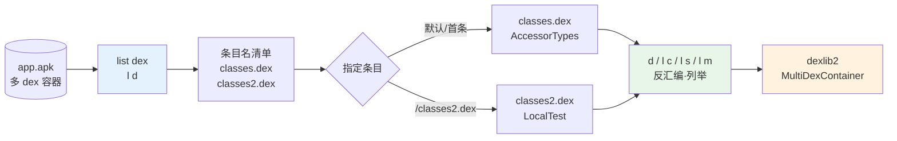
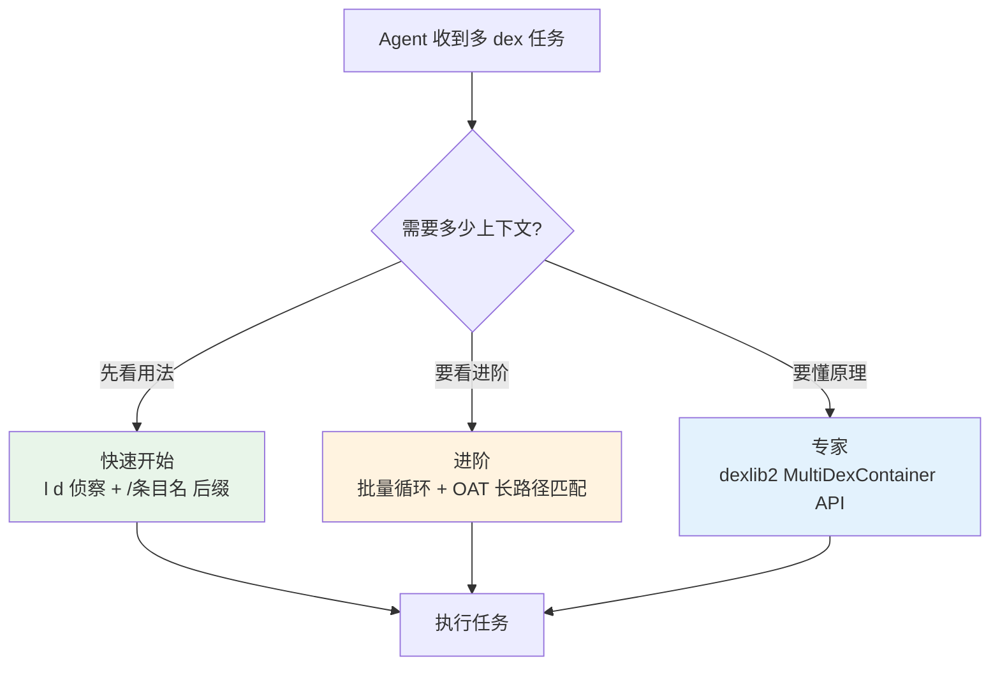

# 🗂️ dex-multidex

处理包含多个 dex 文件的 APK / OAT 容器：用 `容器/条目名` 路径后缀**精准定位**单个 dex 条目，一条命令贯穿列举、反汇编与编程遍历。同一容器、不同条目，类集合完全不同——这是 Android 65535 方法数溢出后的标准打包形态。

## 🗺️ 能力与命令关系



`list dex`（蓝）是**前置侦察**——先看清容器里有哪些条目，再用 `/条目名` 后缀把任意 baksmali 命令钉死在指定 dex 上（绿）；dexlib2 编程（橙）把整条流水线搬进 Java。

## 📦 前置条件

```bash
curl -fsSL -o baksmali.jar https://github.com/android-security-engineer/smali-skills/releases/latest/download/baksmali.jar
curl -fsSL -o dexlib2.jar https://github.com/android-security-engineer/smali-skills/releases/latest/download/dexlib2.jar
```

## 🔎 list dex — 列举容器条目

```bash
# 先看清 APK/OAT 包含哪些 dex
java -jar baksmali.jar list dex app.apk      # 每行一个条目名
java -jar baksmali.jar l d app.apk          # 短别名
```

真实示例（把两个 fixture dex 打成最小多 dex APK）：

```bash
cp dexlib2/src/test/resources/accessorTest.dex /tmp/classes.dex
cp baksmali/src/test/resources/LocalTest/classes.dex /tmp/classes2.dex
( cd /tmp && jar cf multidex.apk classes.dex classes2.dex )

java -jar baksmali.jar l d /tmp/multidex.apk
# classes.dex
# classes2.dex
```

## 🎯 /条目名 后缀 — 精准定位

所有 baksmali 命令都支持 `容器/条目名` 路径后缀：

```bash
java -jar baksmali.jar d -o out2 "app.apk/classes2.dex"      # 反汇编第二个 dex
java -jar baksmali.jar l s "app.apk/classes2.dex"            # 第二个 dex 的字符串
java -jar baksmali.jar l m "app.apk/classes2.dex"            # 第二个 dex 的方法
java -jar baksmali.jar l c "app.apk/classes2.dex"            # 第二个 dex 的类
```

### 默认行为

不指定条目时默认处理**第一个 dex**（通常 `classes.dex`），`app.apk` 与 `"app.apk/classes.dex"` 等价。

### 同容器、不同条目，类集合完全不同

```bash
# 默认 classes.dex = accessorTest
java -jar baksmali.jar l c /tmp/multidex.apk --format text
# Lorg/jf/dexlib2/AccessorTypes$Accessors;
# Lorg/jf/dexlib2/AccessorTypes;

# 指定 classes2.dex = LocalTest
java -jar baksmali.jar l c "/tmp/multidex.apk/classes2.dex" --format text
# LLocalTest;
```

## 🔁 批量操作与 OAT 长路径

```bash
# 反汇编所有 dex：循环 l d + d -o
for dex in $(java -jar baksmali.jar l d app.apk); do
    name=$(echo "$dex" | sed 's/\.dex$//')
    java -jar baksmali.jar d -o "out_$name" "app.apk/$dex"
done
```

OAT 条目名带长路径前缀（如 `/system/framework/framework.jar:classes2.dex`），路径匹配支持**部分匹配**，歧义时用双引号指定精确路径：

```bash
java -jar baksmali.jar l c "framework.oat/classes2.dex"                      # 后缀匹配
java -jar baksmali.jar l c "framework.oat/framework.jar:classes2.dex"        # 更长后缀
java -jar baksmali.jar l c "framework.oat/\"/system/framework/blah.dex\""   # 精确路径
```

## 🧩 用 dexlib2 编程处理多 dex

```java
import org.jf.dexlib2.DexFileFactory;
import org.jf.dexlib2.iface.MultiDexContainer;
import org.jf.dexlib2.dexbacked.DexBackedDexFile;

// 加载为容器，列举所有条目名
MultiDexContainer<? extends DexBackedDexFile> container =
    DexFileFactory.loadDexContainer(new File("app.apk"), null);
List<String> entries = container.getDexEntryNames();   // → ["classes.dex", "classes2.dex", ...]

// 遍历所有 dex
for (String name : container.getDexEntryNames()) {
    DexBackedDexFile dex = container.getEntry(name).getDexFile();
    System.out.println(name + ": " + dex.getClasses().size() + " classes");
}

// 精确加载特定条目（false = 后缀匹配，对应 CLI 部分匹配语义）
MultiDexContainer.DexEntry<? extends DexBackedDexFile> entry =
    DexFileFactory.loadDexEntry(new File("app.oat"), "classes2.dex", false, null);
DexBackedDexFile dex2 = entry.getDexFile();
```

## 🎯 适用场景

| 场景 | 命令 |
|------|------|
| 确认 APK 是否多 dex | `java -jar baksmali.jar l d app.apk` |
| 反汇编第二个 dex | `java -jar baksmali.jar d -o out "app.apk/classes2.dex"` |
| 搜索所有 dex 的字符串 | `for dex in ...; do java -jar baksmali.jar l s "app.apk/$dex"; done` |
| 批量反汇编所有 dex | 循环 `l d` + `d -o` |
| 定位 OAT 中特定 dex | `l c "framework.oat/classes2.dex"` |
| 编程统计各 dex 类数 | `getDexEntryNames()` + `getEntry().getDexFile()` |

## 🔗 与相关 skill 关系

| Skill | 关系 |
|-------|------|
| `dex-list-classes` | 列举类结构；多 dex 场景下本 skill 提供 `/条目名` 后缀定位前置 |
| `dex-list-strings` | 列举字符串池；同样支持 `"app.apk/classes2.dex"` 后缀 |
| `dex-list-methods` | 列举方法签名；多 dex 时需先 `l d` 侦察再指定条目 |
| `dex-deodex` | OAT/odex 去优化；OAT 本身是多 dex 容器，本 skill 是其条目定位基础 |
| `dex-read` | dexlib2 编程读取；本 skill 演示的 `MultiDexContainer` 是其容器层 API |
| `dex-xref` | 反向交叉引用；多 dex 逆向需逐条目建索引后聚合 |

## 🧭 渐进式披露



源码位置（容器加载与条目列举入口）：

- `baksmali/src/main/java/org/jf/baksmali/ListDexCommand.java:53` — `commandName = "dex"`，调用 `container.getDexEntryNames()`（:93）
- `dexlib2/src/main/java/org/jf/dexlib2/DexFileFactory.java:234` — `loadDexContainer(File, Opcodes)` 加载多 dex 容器
- `dexlib2/src/main/java/org/jf/dexlib2/DexFileFactory.java:177` — `loadDexEntry(File, entryName, exactMatch, Opcodes)` 精确/后缀匹配单条目

`loadDexEntry` 的 `exactMatch` 布尔参数对应 CLI 的部分匹配语义——`false` 即后缀匹配，OAT 长路径名靠它定位；`MultiDexContainer` 接口统一了 `ZipDexContainer`（APK）与 `OatFile`（OAT）两种容器的条目访问。

## 📚 延伸阅读

- [CLI: baksmali list](../cli/list.md) — list 全部子命令总览（含 `list dex`）
- [Skill: dex-list-classes](./dex-list-classes.md) — 类结构列举，支持多 dex 后缀
- [Skill: dex-list-strings](./dex-list-strings.md) — 字符串池列举（同族）
- [Skill: dex-read](./dex-read.md) — dexlib2 编程读取的容器层 API
- [Reference: dexlib2](../reference/dexlib2/) — `DexFileFactory` / `MultiDexContainer` 实现
- [Guide: architecture](../guide/architecture.md) — 多 dex 容器在整体架构中的位置
