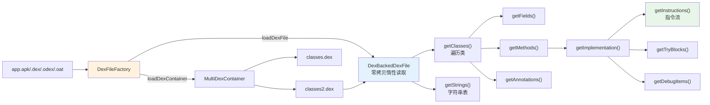

# 📖 dex-read — 用 dexlib2 读取 dex 文件

`dex-read` 是 smali-skills 的**读侧基石**：不靠 CLI 子命令，而是直接用 `dexlib2` Java API 把 dex/apk/odex/oat 加载进内存，按 `DexFile → ClassDef → Method/Field → MethodImplementation → Instruction` 这条访问链逐层遍历。它是后续 `dex-xref`、`dex-transform`、`dex-dump` 的公共依赖——会读了，其他 skill 才有数据可操作。

## 🧭 能力与工作流



## 📦 前置条件

```bash
curl -fsSL -o dexlib2.jar https://github.com/android-security-engineer/smali-skills/releases/latest/download/dexlib2.jar
```

## 🚀 加载 dex 文件

```java
import org.jf.dexlib2.DexFileFactory;
import org.jf.dexlib2.dexbacked.DexBackedDexFile;

// 自动检测: dex → odex → oat → zip/apk
DexBackedDexFile dexFile = DexFileFactory.loadDexFile("app.apk", null);
```

`loadDexFile` 见 `dexlib2/src/main/java/org/jf/dexlib2/DexFileFactory.java:60`，按 zip → dex → odex → oat 嗅探魔数并回退。多 dex 容器用 `loadDexContainer`（`:234`）拿到 `MultiDexContainer`，单 dex 文件也会被包成 `SingletonMultiDexContainer`，调用方代码无需分支：

```java
import org.jf.dexlib2.iface.MultiDexContainer;
import java.io.File;

MultiDexContainer<? extends DexBackedDexFile> container =
    DexFileFactory.loadDexContainer(new File("app.apk"), null);
container.getDexEntryNames();   // → ["classes.dex", "classes2.dex", ...]
container.getEntry("classes2.dex").getDexFile();
```

OAT 长路径名用 `loadDexEntry`（`:177`）做路径后缀匹配定位内嵌 dex。支持的格式：`.dex`→`DexBackedDexFile`、`.odex`→`DexBackedOdexFile`、`.oat`→`OatFile`（含 vdex）、`.apk`/`.zip`→`ZipDexContainer`、`.cdex`→`CDexBackedDexFile`，均自动检测。

## 🗂️ 遍历类与成员

```java
for (ClassDef classDef : dexFile.getClasses()) {
    String className   = classDef.getType();        // "Lcom/example/Main;"
    String superClass  = classDef.getSuperclass();  // "Ljava/lang/Object;"
    int accessFlags    = classDef.getAccessFlags(); // 0x01 = public
    String sourceFile  = classDef.getSourceFile();  // "Main.java"

    for (Field field : classDef.getFields()) { /* name/type/flags */ }
    for (Method method : classDef.getMethods()) {
        MethodImplementation impl = method.getImplementation(); // abstract/native 为 null
        if (impl != null) { /* 见下方"遍历方法体" */ }
    }
}
```

访问链契约定义在 `dexlib2/src/main/java/org/jf/dexlib2/iface/ClassDef.java:55`（`getType`）至 `:165`（`getMethods`）。

## 🔬 遍历方法体

```java
MethodImplementation impl = method.getImplementation();
int registerCount = impl.getRegisterCount();

for (Instruction insn : impl.getInstructions()) {
    if (insn instanceof OneRegisterInstruction) {
        int reg = ((OneRegisterInstruction) insn).getRegister();
    }
    if (insn instanceof ReferenceInstruction) {
        Reference ref = ((ReferenceInstruction) insn).getReference();
    }
    if (insn instanceof NarrowLiteralInstruction) {
        int value = ((NarrowLiteralInstruction) insn).getNarrowLiteral();
    }
}
```

指令按 `instanceof` 分派到类型化接口读取细节，比手算 opcode 格式安全得多。`getInstructions`/`getTryBlocks`/`getDebugItems` 契约见 `dexlib2/src/main/java/org/jf/dexlib2/iface/MethodImplementation.java:49`–`:85`。try 块的 `getExceptionType()` 返回 `null` 即 catch-all；`getDebugItems()` 含 `LineNumber`/`StartLocal`/`EndLocal` 等行号与局部变量信息。

## 🏷️ 注解与字符串表

```java
for (ClassDef classDef : dexFile.getClasses()) {
    for (Annotation a : classDef.getAnnotations()) {
        int visibility = a.getVisibility(); // 0=BUILD, 1=RUNTIME, 2=SYSTEM
        String type = a.getType();          // "Landroid/annotation/SuppressLint;"
        for (AnnotationElement el : a.getElements()) { /* name / EncodedValue */ }
    }
}
// 字段/方法/参数注解需经 AnnotationDirectory 访问
int stringCount = dexFile.getStringCount(); // 仅 DexBackedDexFile，惰性读取
for (String str : dexFile.getStrings()) { /* 字符串池 */ }
```

## 🛠️ 工具类速查

| 工具 | 用途 | 示例输出 |
|------|------|---------|
| `ReferenceUtil.getMethodDescriptor` | 方法引用描述 | `Lcom/Example;->foo(I)V` |
| `ReferenceUtil.getFieldDescriptor` | 字段引用描述 | `Lcom/Example;->bar:I` |
| `TypeUtils.isWideType` | 是否宽类型 | `isWideType("D") → true` |
| `TypeUtils.isPrimitiveType` | 是否基本类型 | `isPrimitiveType("I") → true` |

## 🎯 适用场景

| 场景 | 价值 |
|------|------|
| 静态分析脚本 | 零拷贝扫描数十 MB dex 而常驻内存极低 |
| 多 dex APK 资产盘点 | `MultiDexContainer` 统一处理 classes*.dex |
| 指令级审计 | 按 `instanceof` 分派读取字段/引用/字面量 |
| 注解提取 | 解析 `@SuppressLint` 等运行时/构建期注解 |
| 字符串池取证 | 遍历 `getStrings()` 抽取 URL、密钥、类名 |
| OAT/vdex 还原 | 经 `loadDexEntry` 后缀匹配定位内嵌 dex |

## 🔗 与相关 skill 的关系

| Skill | 关系 |
|-------|------|
| [`dex-list-structure`](./dex-list-structure) | 在本 skill 之上叠加多 dex / vtable / 字段偏移 / odex 依赖 |
| [`dex-search`](./dex-search) | 把本 skill 的遍历封装成 CLI 内容检索 |
| [`dex-dump`](./dex-dump) | 读侧遍历 → 结构化转储 |
| [`dex-build`](./dex-build) / [`dex-assemble`](./dex-assemble) | 读侧 → `builder/` 可变表示 → 写回 |
| [`dex-read`](./dex-read) | 本 skill，纯读侧 Java API |

## 📚 延伸阅读

- [CLI: list](../cli/list.md) — `baksmali list` 子命令（classes/methods/strings/fields）
- [CLI: xref](../cli/xref.md) — 反向交叉引用 CLI
- [Reference: DexFileFactory](../reference/dexlib2/dexfile-factory.md) — 解析总入口源码剖析
- [Reference: dexbacked](../reference/dexlib2/dexbacked.md) — 零拷贝惰性解析层
- [Reference: iface](../reference/dexlib2/iface.md) — 只读对象模型契约（`ClassDef`/`Method`/`Instruction`）
- [Reference: iface-instruction](../reference/dexlib2/iface-instruction.md) — 指令类型族
- [SKILL.md 原文](https://github.com/android-security-engineer/smali-skills/blob/master/skills/dex-read)
