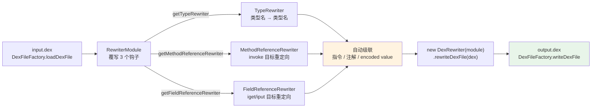

# 🔁 dex-rewrite-references — 重命名与重映射 dex 引用

用 dexlib2 的 `rewriter` 框架对 dex 文件中的**类型名**、**方法引用**、**字段引用**进行系统化变换。核心特性是 **自动级联**：改了类型名，所有引用该类型的指令、注解、编码值都会自动更新——无需手动遍历每条 `invoke` / `iget`。

与 [`dex-transform`](./dex-transform) 的成品 CLI 命令（`unlock`/`replace`/`patch`）不同，本 skill 是**库级编程**：需要写 Java，但能表达任意引用重映射规则（映射表、正则、API hook）。

## 📐 工作流与 Rewriter 关系



## 🚀 前置条件

```bash
curl -fsSL -o dexlib2.jar https://github.com/android-security-engineer/smali-skills/releases/latest/download/dexlib2.jar
# 需要 Java 8+，编译/运行时把 dexlib2.jar 放到 classpath
javac -cp dexlib2.jar Rewrite.java && java -cp .:dexlib2.jar Rewrite
```

## 🏷️ 重命名类型（TypeRewriter）

最常见场景：类名混淆/反混淆、包名迁移。覆写 `RewriterModule.getTypeRewriter` 返回一个 `String → String` 映射。

```java
import org.jf.dexlib2.DexFileFactory;
import org.jf.dexlib2.iface.DexFile;
import org.jf.dexlib2.rewriter.*;

DexFile dexFile = DexFileFactory.loadDexFile("input.dex", null);

RewriterModule module = new RewriterModule() {
    @Override
    public Rewriter<String> getTypeRewriter(Rewriters rewriters) {
        return type -> {
            if (type.equals("Lcom/original/ClassName;")) {
                return "Lcom/rewritten/NewName;";
            }
            return type;
        };
    }
};

DexFile rewritten = new DexRewriter(module).rewriteDexFile(dexFile);
DexFileFactory.writeDexFile("output.dex", rewritten);
```

### 从映射表批量重命名

混淆/反混淆通常有一份 `mapping.txt`（`Lcom/foo/Bar; -> Lcom/obfuscated/a;`），加载成 `Map` 后用 `getOrDefault` 一行搞定：

```java
Map<String, String> mapping = new HashMap<>();
mapping.put("Lcom/foo/Bar;",  "Lcom/obfuscated/a;");
mapping.put("Lcom/foo/Baz;",  "Lcom/obfuscated/b;");

RewriterModule module = new RewriterModule() {
    @Override
    public Rewriter<String> getTypeRewriter(Rewriters rewriters) {
        return type -> mapping.getOrDefault(type, type);
    }
};
```

## 📞 重映射方法引用（MethodReferenceRewriter）

把对 `OldClass.oldMethod` 的调用整体重定向到 `NewClass.newMethod`。返回 `RewrittenMethodReference` 子类，仅覆写需要改的字段，其余字段（参数/返回类型/原型）透传原引用。

```java
RewriterModule module = new RewriterModule() {
    @Override
    public Rewriter<MethodReference> getMethodReferenceRewriter(Rewriters rewriters) {
        return ref -> {
            if (ref.getDefiningClass().equals("LOldClass;") &&
                ref.getName().equals("oldMethod")) {
                return new RewrittenMethodReference(ref) {
                    @Override public String getDefiningClass() { return "LNewClass;"; }
                    @Override public String getName() { return "newMethod"; }
                };
            }
            return ref;
        };
    }
};
```

### API 重定向（Hook 模式）

把所有 `Log.d(...)` 调用重定向到自定义 `MyLog.d(...)`——典型的静态 hook，无需改方法体：

```java
// 命中 Landroid/util/Log;->d，仅改 definingClass
if (ref.getDefiningClass().equals("Landroid/util/Log;") &&
    ref.getName().equals("d")) {
    return new RewrittenMethodReference(ref) {
        @Override public String getDefiningClass() { return "Lcom/myapp/MyLog;"; }
    };
}
```

## 📦 重映射字段引用（FieldReferenceRewriter）

把字段访问重定向到另一个类的同名字段（如把配置常量迁到新 Config 类）：

```java
RewriterModule module = new RewriterModule() {
    @Override
    public Rewriter<FieldReference> getFieldReferenceRewriter(Rewriters rewriters) {
        return ref -> {
            if (ref.getDefiningClass().equals("LOldConfig;") &&
                ref.getName().equals("SERVER_URL")) {
                return new RewrittenFieldReference(ref) {
                    @Override public String getDefiningClass() { return "LNewConfig;"; }
                };
            }
            return ref;
        };
    }
};
```

## 🧩 组合多种变换

`RewriterModule` 是一个抽象模块，同时覆写多个钩子即可在一次 `rewriteDexFile` 中组合应用——类型/方法/字段重映射**互不干扰且共享级联**：

```java
RewriterModule module = new RewriterModule() {
    @Override public Rewriter<String> getTypeRewriter(Rewriters r)             { /* ... */ }
    @Override public Rewriter<MethodReference> getMethodReferenceRewriter(Rewriters r) { /* ... */ }
    @Override public Rewriter<FieldReference> getFieldReferenceRewriter(Rewriters r)  { /* ... */ }
};
DexFile rewritten = new DexRewriter(module).rewriteDexFile(dexFile);
```

## 📊 适用场景

| 场景 | 覆写的 Rewriter | 关键能力 |
|------|----------------|---------|
| 类名混淆 / 反混淆 | `TypeRewriter` | 映射表批量替换，级联更新 |
| API 重定向（静态 hook） | `MethodReferenceRewriter` | 改 `definingClass` / `name` |
| 字段重命名 / 迁移 | `FieldReferenceRewriter` | 改 `definingClass` / `name` |
| 包名迁移 | 三者组合 | 类型改名 + 引用同步 |
| 去混淆后调用关系重建 | `MethodReferenceRewriter` | 还原真实调用目标 |

## 🔗 与相关 skill 的关系

| Skill | 关系 | 边界 |
|-------|------|------|
| [`dex-transform`](./dex-transform) | 上层封装 | `unlock`/`replace`/`patch` 是 rewriter 的成品 CLI，无需写 Java |
| [`dex-xref`](./dex-xref) | 前置侦查 | 重映射前先查谁引用了目标类型/方法/字段 |
| [`dex-disassemble`](./dex-disassemble) | 验证手段 | 写出后反汇编确认引用已改 |

::: tip 与 dex-transform 的边界
需要 **成品单行命令**（改访问标志、替字符串、强制返回）用 [`dex-transform`](./dex-transform)；需要 **任意引用重映射规则**（映射表、正则、API hook）用本 skill 直接编程。
:::

## ⚙️ 底层机制与源码引用

`RewriterModule` 是抽象模块，定义所有 rewriter 钩子；`DexRewriter` 是其默认实现，遍历 dex 各元素逐项重写。关键源码位置：

| 概念 | 源码 path:line |
|------|---------------|
| 模块钩子入口 | `dexlib2/src/main/java/org/jf/dexlib2/rewriter/RewriterModule.java:43` |
| `getTypeRewriter` 钩子 | `RewriterModule.java:84` |
| `getFieldReferenceRewriter` 钩子 | `RewriterModule.java:88` |
| `getMethodReferenceRewriter` 钩子 | `RewriterModule.java:92` |
| `DexRewriter` 实现 | `dexlib2/src/main/java/org/jf/dexlib2/rewriter/DexRewriter.java:68` |
| `RewrittenMethodReference` | `MethodReferenceRewriter.java:53` |
| `RewrittenFieldReference` | `FieldReferenceRewriter.java:50` |
| dex 加载入口 | `dexlib2/src/main/java/org/jf/dexlib2/DexFileFactory.java:60` |
| dex 写出入口 | `DexFileFactory.java:291` |

### 注意事项

- Rewriter 产生**新的不可变对象**，原始 `DexFile`（及底层字节缓冲）不受影响。
- 类型重命名是**级联**的：改了类型名，所有引用该类型的指令、注解、encoded value都会自动更新，无需手动处理 `invoke` / `iget`。
- 写出统一走 `DexFileFactory.writeDexFile()` 或 `DexPool.writeTo()`。

## 📚 延伸阅读

- [Skill: dex-transform](./dex-transform) — rewriter 框架的成品 CLI 封装
- [Skill: dex-xref](./dex-xref) — 重映射前查引用关系
- [CLI: baksmali transform](/cli/transform) — `unlock`/`replace`/`patch` 命令手册
- [CLI: baksmali xref](/cli/xref) — 调用交叉引用只读查询
- [Reference: dexlib2 rewriter 包](/reference/dexlib2/rewriter) — `RewriterModule` / `DexRewriter` API 全量
