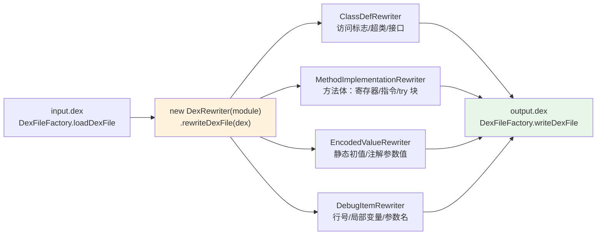

# 🏗️ dex-rewrite-structure — 修改 dex 结构元素

用 dexlib2 的 `rewriter` 框架对 dex 文件中的**结构性元素**——类定义、方法体、指令、注解、调试信息、try/catch 块、编码值——进行变换。与 [`dex-rewrite-references`](./dex-rewrite-references) 改“引用指向谁”不同，本 skill 改“元素本身长什么样”：方法体里的指令、注解的存留、静态字段的初值、调试信息的清空。

核心抽象是 `RewriterModule`：覆写其中的某个 `getXxxRewriter` 钩子，返回一个 `T -> T` 的 lambda，`DexRewriter` 会自动遍历整个 dex 把它套用到每一处对应元素。`RewrittenXxx` 基类已实现委托，**只需 override 要改的字段**。

## 📐 Rewriter 钩子与遍历关系



> `InstructionRewriter` / `TryBlockRewriter` / `ExceptionHandlerRewriter` / `AnnotationRewriter` 等钩子同样从 `DexRewriter` 分发，见下表。

## 🚀 前置条件

```bash
curl -fsSL -o dexlib2.jar https://github.com/android-security-engineer/smali-skills/releases/latest/download/dexlib2.jar
javac -cp dexlib2.jar Rewrite.java && java -cp .:dexlib2.jar Rewrite   # Java 8+，classpath 加 dexlib2.jar
```

## 🏷️ 可重写的结构元素

| Rewriter 钩子 | 作用 | Rewriter 钩子 | 作用 |
|---------------|------|---------------|------|
| `getClassDefRewriter` | 改类访问标志/超类/接口 | `getInstructionRewriter` | 替换特定指令 |
| `getMethodRewriter` / `getFieldRewriter` | 改方法/字段签名与访问标志 | `getTryBlockRewriter` / `getExceptionHandlerRewriter` | 改 try 范围 / catch 类型 |
| `getMethodImplementationRewriter` | 替换方法体、注入代码 | `getDebugItemRewriter` | 清空行号/局部变量 |
| `getAnnotationRewriter` / `getAnnotationElementRewriter` | 注解增删 / 改参数值 | `getEncodedValueRewriter` / `getMethodParameterRewriter` | 改静态初值 / 改参数名 |

## 🩹 修改方法实现

覆写 `getMethodImplementationRewriter`，返回 `RewrittenMethodImplementation` 子类——它把寄存器数、指令列表、try 块、调试项都委托到原对象，只 override 要改的部分：

```java
import org.jf.dexlib2.DexFileFactory;
import org.jf.dexlib2.iface.DexFile;
import org.jf.dexlib2.rewriter.*;   // 含 RewriterModule / DexRewriter / RewrittenMethodImplementation
DexFile dexFile = DexFileFactory.loadDexFile("input.dex", null);
RewriterModule module = new RewriterModule() {
    @Override
    public Rewriter<MethodImplementation> getMethodImplementationRewriter(Rewriters rewriters) {
        return impl -> new RewrittenMethodImplementation(rewriters, impl) {
            // 按需 override：getRegisterCount / getInstructions / getTryBlocks / getDebugItems
        };
    }
};
DexFile rewritten = new DexRewriter(module).rewriteDexFile(dexFile);
DexFileFactory.writeDexFile("output.dex", rewritten);
```

## ✏️ 修改指令与注解

`getInstructionRewriter` 对每条指令做 `T -> T` 变换，适合改指令引用（如把 `invoke-virtual` 改指向另一方法）。要**增删或替换指令**则需配合 `MethodImplementationRewriter` 用 `MutableMethodImplementation` 重建指令列表——指令隶属于方法体，`InstructionRewriter` 里无法凭空造指令。

`getAnnotationRewriter` 返回 `RewrittenAnnotation` 子类按需 override。**删除注解**时返回 `null` 并不总是安全（某些集合不允许 null 元素），在 `ClassDef.getAnnotations()` 层面过滤集合更稳妥。

## 🔢 修改编码值（静态字段初值）

`EncodedValueRewriter` 套用到所有 encoded value——静态字段初值、注解参数值、数组元素。命中字符串常量后返回新的不可变值：

```java
RewriterModule module = new RewriterModule() {
    @Override
    public Rewriter<EncodedValue> getEncodedValueRewriter(Rewriters rewriters) {
        return value -> {
            if (value instanceof StringEncodedValue) {
                StringEncodedValue sv = (StringEncodedValue) value;
                if (sv.getValue().equals("old_url")) {
                    return new ImmutableStringEncodedValue("new_url");
                }
            }
            return value;
        };
    }
};
```

## 🧹 清除调试信息

`getDebugItemRewriter` 返回 `null` 即删除该 debug item——行号 `.line`、局部变量 `.local`、参数名一并清空，**可执行字节码不变**：

```java
RewriterModule module = new RewriterModule() {
    @Override
    public Rewriter<DebugItem> getDebugItemRewriter(Rewriters rewriters) {
        return item -> null;  // 删除所有调试项
    }
};
```

## 🔓 修改类定义（去 final）

`RewrittenClassDef` 委托全部字段，仅 override 要改的：

```java
import org.jf.dexlib2.AccessFlags;   // RewrittenClassDef 来自 org.jf.dexlib2.rewriter.*

RewriterModule module = new RewriterModule() {
    @Override
    public Rewriter<ClassDef> getClassDefRewriter(Rewriters rewriters) {
        return classDef -> new RewrittenClassDef(rewriters, classDef) {
            @Override
            public int getAccessFlags() {
                return classDef.getAccessFlags() & ~AccessFlags.FINAL.getValue();
            }
        };
    }
};
```

## 🧩 组合引用重写 + 结构重写

`RewriterModule` 是抽象模块，一次 `rewriteDexFile` 中可同时覆写多个钩子——引用重映射（`getTypeRewriter`）与结构变换（`getEncodedValueRewriter` / `getDebugItemRewriter` 等）互不干扰、共享同一次遍历，最后统一 `DexFileFactory.writeDexFile("output.dex", rewritten)` 写出。

## 📊 适用场景

| 场景 | 覆写的 Rewriter | 关键能力 |
|------|----------------|---------|
| 去掉类的 `final` 以便继承 | `ClassDefRewriter` | override `getAccessFlags` |
| 改静态字段初始值（URL/密钥） | `EncodedValueRewriter` | 命中 `StringEncodedValue` 返回新值 |
| 清空调试信息（瘦身/抗逆向） | `DebugItemRewriter` | 返回 `null` 删除全部 debug item |
| 改注解参数值 | `AnnotationElementRewriter` + `EncodedValueRewriter` | 改 `name=value` 的 value |
| 调整 try/catch 范围或 catch 类型 | `TryBlockRewriter` / `ExceptionHandlerRewriter` | override 起止寄存器 / handler 类型 |
| 改方法参数名 / 参数注解 | `MethodParameterRewriter` | override `getName` / `getAnnotations` |

## 🔗 与相关 skill 的关系

| Skill | 关系 | 边界 |
|-------|------|------|
| [`dex-rewrite-references`](./dex-rewrite-references) | 姊妹 skill | 改“引用指向谁”（类型/方法/字段引用），本 skill 改“元素本身长什么样” |
| [`dex-transform`](./dex-transform) | 上层封装 | `unlock`/`replace`/`strip-debug`/`patch` 是结构 rewriter 的成品 CLI，无需写 Java |
| [`dex-disassemble`](./dex-disassemble) | 验证手段 | 写出后反汇编确认结构已改 |
| [`dex-build`](./dex-build) | 方法体重建 | 注入任意指令用 `MutableMethodImplementation`，属 build 范畴 |

::: tip 与 dex-transform 的边界
需要**成品单行命令**（去 final、替字符串、清调试、强制返回）用 [`dex-transform`](./dex-transform)；需要**任意结构变换规则**（按注解类型过滤、按字段名改初值、组合多钩子）用本 skill 直接编程。
:::

## ⚙️ 底层机制与源码引用

`RewriterModule` 定义全部结构 rewriter 钩子，`DexRewriter` 是其默认实现，遍历 dex 各元素逐项重写。`RewrittenXxx` 基类已实现委托，只需 override 需要改的字段。

| 概念 | 源码 path:line |
|------|---------------|
| 模块钩子总入口 | `dexlib2/src/main/java/org/jf/dexlib2/rewriter/RewriterModule.java:48` |
| 各结构钩子（按行排） | `RewriterModule.java`: `getClassDefRewriter:48` / `getFieldRewriter:52` / `getMethodRewriter:56` / `getMethodParameterRewriter:60` / `getMethodImplementationRewriter:64` / `getInstructionRewriter:68` / `getTryBlockRewriter:72` / `getExceptionHandlerRewriter:76` / `getDebugItemRewriter:80` / `getAnnotationRewriter:96` / `getAnnotationElementRewriter:100` / `getEncodedValueRewriter:104` |
| `DexRewriter` 实现 | `dexlib2/.../rewriter/DexRewriter.java:68` |
| `RewrittenClassDef` / `RewrittenMethodImplementation` | `ClassDefRewriter.java:58` / `MethodImplementationRewriter.java:54` |
| `RewrittenAnnotation` / `RewrittenAnnotationElement` | `AnnotationRewriter.java:52` / `AnnotationElementRewriter.java:51` |
| `RewrittenTryBlock` / `RewrittenExceptionHandler` | `TryBlockRewriter.java:53` / `ExceptionHandlerRewriter.java:51` |
| `RewrittenMethodParameter` / `RewrittenMethod` / `RewrittenField` | `MethodParameterRewriter.java:53` / `MethodRewriter.java:57` / `FieldRewriter.java:55` |
| dex 加载 / 写出入口 | `dexlib2/.../DexFileFactory.java:60` / `:291` |

**注意事项：** `RewrittenXxx` 基类**自动委托**到原始对象，只需 override 要改的方法；Rewriter 产生**新的不可变对象**，原始 `DexFile` 及底层字节缓冲不受影响。返回 `null` **并不总是安全**——某些集合不允许 null 元素，删除元素建议通过过滤集合实现（注解删除在 `ClassDef.getAnnotations()` 层面过滤更稳妥）。修改方法体（指令/寄存器）通常通过 `MutableMethodImplementation` 构建新方法体，而非在 `InstructionRewriter` 里凭空造指令。

## 📚 延伸阅读

- [Skill: dex-rewrite-references](./dex-rewrite-references) — 改类型/方法/字段引用指向的姊妹 skill
- [Skill: dex-transform](./dex-transform) — 结构 rewriter 的成品 CLI 封装
- [Skill: dex-build](./dex-build) — `MutableMethodImplementation` 方法体重建
- [CLI: baksmali transform](/cli/transform) — `unlock`/`replace`/`strip-debug`/`patch` 命令手册
- [Reference: dexlib2 rewriter 包](/reference/dexlib2/rewriter) — `RewriterModule` / `DexRewriter` API 全量
