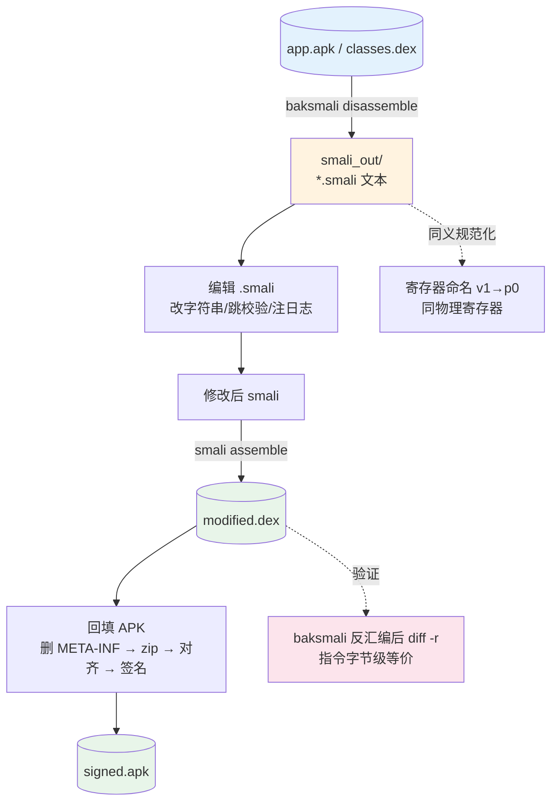

# 🔁 dex-roundtrip — 反汇编→修改→重汇编

把 dex/APK 反汇编为 smali 文本，修改后重新汇编为 dex，再回填进 APK 重新打包签名——这是 smali/baksmali 最经典、最完整的工作流。dex 与 smali 文本之间是**无损双向**转换：同一段字节码，反汇编再汇编回来，指令序列字节级等价。

## 前置条件

```bash
curl -fsSL -o smali.jar https://github.com/android-security-engineer/smali-skills/releases/latest/download/smali.jar
curl -fsSL -o baksmali.jar https://github.com/android-security-engineer/smali-skills/releases/latest/download/baksmali.jar
```

## 工作流总览



基本流程一行概括：`dex/apk → baksmali disassemble → smali 文本 → 编辑 → smali assemble → 新 dex`。

## 步骤 1：反汇编

```bash
java -jar baksmali.jar d -o smali_out app.apk                       # APK（自动识别 classes.dex）
java -jar baksmali.jar d -o smali_out classes.dex                  # 裸 dex
java -jar baksmali.jar d -o smali_out --classes Lcom/example/Main app.apk   # 只反汇编特定类
java -jar baksmali.jar d -o smali_out --debug-info=false app.apk  # 省略调试信息，方便编辑
java -jar baksmali.jar d -o smali_out --sequential-labels app.apk # 顺序标签，:label_0xa 稳定编号
```

反汇编由 `Adaptors/` 逐元素输出 smali 文本，见 [反汇编适配器](../reference/baksmali/adaptors)。

## 步骤 2：编辑 smali

```bash
find smali_out -name "Main.smali"
vim smali_out/com/example/Main.smali
```

### 常见修改模式

```smali
# 改字符串常量
const-string v1, "old_url"   # → "new_url"
# 跳过校验调用，直接返回 true
invoke-virtual {v0, v1}, Lcom/example/Check;->verify()Z   # → const/4 v0, 0x1
# 方法入口注入日志
const-string v0, "TAG"
const-string v1, "method entered"
invoke-static {v0, v1}, Landroid/util/Log;->d(Ljava/lang/String;Ljava/lang/String;)I
# 改写返回值：isPremium() 恒真
.method public isPremium()Z
    .registers 1
    const/4 v0, 0x1
    return v0
.end method
```

## 步骤 3：重新汇编

```bash
java -jar smali.jar a -o modified.dex smali_out/      # 别名 a / as / ass 均可
java -jar smali.jar a -o modified.dex -a 28 smali_out/  # 指定 API 级别（高版本指令）
```

汇编管线为 lexer → parser → tree walker → DexBuilder，见 [汇编流水线](../reference/smali/assembly-pipeline)。

## 步骤 4：回填 APK 并签名

```bash
mkdir apk_contents && unzip app.apk -d apk_contents
cp modified.dex apk_contents/classes.dex
rm -rf apk_contents/META-INF          # 删除旧签名
( cd apk_contents && zip -r ../modified.apk . )
zipalign -f 4 modified.apk aligned.apk
apksigner sign --ks my-key.jks --out signed.apk aligned.apk
```

## 处理多 dex APK

```bash
java -jar baksmali.jar l d app.apk                          # 1. 列出 APK 内的 dex
java -jar baksmali.jar d -o smali_out2 "app.apk/classes2.dex"  # 2. 反汇编指定 dex（zip 成员路径）
java -jar smali.jar a -o classes2.dex smali_out2/           # 3. 编辑后重汇编并回填
cp classes2.dex apk_contents/classes2.dex
```

`l d` 即 `list dex`，子命令文档见 [CLI: list](../cli/list)。

## 验证 round-trip 完整性

```bash
# 方法1：重新反汇编并递归对比
java -jar baksmali.jar d -o verified modified.dex && diff -r smali_out/ verified/

# 方法2：assemble ⇄ disassemble 闭环
java -jar smali.jar a -o rebuilt.dex smali_out/
java -jar baksmali.jar d -o roundtrip rebuilt.dex && diff -r smali_out/ roundtrip/
```

### 真实往返示例（HelloWorld）

用 `examples/HelloWorld/` 实跑完整闭环：

```bash
$ java -jar smali.jar assemble -o /tmp/hello.dex examples/HelloWorld/        # 1) smali → dex
$ java -jar baksmali.jar disassemble -o /tmp/hello_rt /tmp/hello.dex         # 2) dex → smali（往返）
```

源 `examples/HelloWorld/HelloWorld.smali` 用 `v1` 持有字符串；往返后产物把同一寄存器规范化命名为 `p0`（参数寄存器约定）：

```smali
const-string p0, "Hello World!"   # 源里写的是 v1
invoke-virtual {v0, p0}, Ljava/lang/PrintStream;->println(Ljava/lang/String;)V
```

`v1`↔`p0` 是**同义**写法——对应同一物理寄存器，字节码层面完全等价。指令序列与源**完全一致**，用 `baksmali dump` 比对两次产物的指令字节即可确认零差异。

## 处理 odex 文件

odex 需先 deodex 才能重汇编（`baksmali/src/main/java/org/jf/baksmali/DeodexCommand.java`）：

```bash
java -jar baksmali.jar deodex -o smali_out \
  --boot-class-path /system/framework/framework.jar app.odex   # 去 odex（需引导类路径）
vim smali_out/...                                              # 编辑
java -jar smali.jar a -o modified.dex smali_out/               # deodex 后的 smali 可正常汇编
```

deodex 背后的类型推断与 `ClassPath` 解析见 [内幕: deodex 与类型推断](../internals/deodex)。

## 适用场景

| 场景 | 为什么用 dex-roundtrip |
|------|----------------------|
| 逆向修改 APK 字节码 | 文本级编辑可 diff、可版本化，比直接改二进制直观 |
| 绕过校验/去广告/改常量 | 改 `const-string`、跳 `invoke`、改返回值即可 |
| 复现 Dalvik 字节码行为 | assemble ⇄ disassemble 闭环可验证指令假设 |
| odex 逆向 | 先 deodex 回到标准 dex，再走正常往返 |
| 安全研究/漏洞分析 | 在 smali 层插桩日志或探针，重汇编后动态运行 |

## 与相关 skill 的关系

| Skill | 关系 |
|-------|------|
| [dex-assemble](./dex-assemble) | 本 skill 的重汇编步骤即调用 `smali assemble`；纯写出侧 |
| [dex-read](./dex-read) | 读取侧；先看清结构再决定改哪里 |
| [dex-build](./dex-build) | 跳过文本层，直接用 dexlib2 builder 构造 dex |
| [dex-transform](./dex-transform) | 用 Rewriter 程序化变换 dex，适合批量规则改写 |
| [dex-dump](./dex-dump) | 比对往返产物的指令字节，验证零差异 |

## 常见问题

| 问题 | 原因 | 解决 |
|------|------|------|
| 汇编报 `invalid instruction` | API 级别太低 | 加 `-a` 提高到对应级别 |
| 汇编报 `odex opcode not allowed` | 使用了 odex 指令 | 先 deodex 或加 `--allow-odex-opcodes` |
| 汇编报 `Duplicate class` | 同一个类在多个 .smali 中 | 检查输入文件去重 |
| 重打包后闪退 | 签名问题 | 确保删除旧 META-INF 并重新签名 |
| 多 dex 类找不到 | 修改的类在另一个 dex 中 | 用 `l d` 确认并指定正确的 dex |
| `diff -r` 报寄存器名不同 | `v1`↔`p0` 同义规范化 | 字节码等价，用 dump 比指令字节确认 |

## 延伸阅读

- [指南: 反汇编↔汇编往返](../guide/roundtrip) — 往返模型与完整性证明
- [CLI: disassemble](../cli/disassemble) — `baksmali disassemble` 参数总览
- [CLI: assemble](../cli/assemble) — `smali assemble` 参数总览
- [CLI: list](../cli/list) — `list dex` 定位多 dex 中的类
- [CLI: xref](../cli/xref) — 改动前用交叉引用确认调用点影响面
- [参考: 反汇编适配器](../reference/baksmali/adaptors) — `Adaptors/` 如何逐元素产出 smali 文本
- [参考: 汇编流水线](../reference/smali/assembly-pipeline) — lexer→parser→tree walker→DexBuilder
- [内幕: deodex 与类型推断](../internals/deodex) — odex 还原的 `MethodAnalyzer`/`ClassPath`
- [SKILL.md 原文](https://github.com/android-security-engineer/smali-skills/blob/master/skills/dex-roundtrip)
