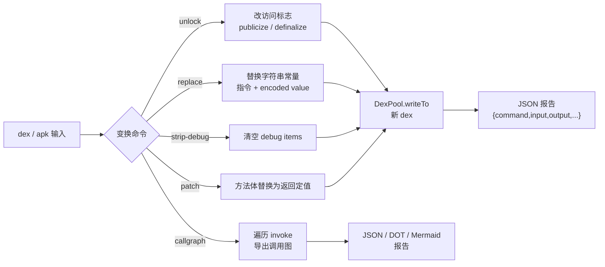

# 🔄 dex-transform — dex 写回变换命令

这是一组 **修改并写出新 dex** 的 `baksmali` 子命令，与只读的 `list`/`xref`/`search`/`disassemble` 相对。它把 dexlib2 的 `rewriter` 框架封装成单行 CLI，**无需写一行 Java 代码**。

所有命令遵循同一契约：读入 dex/apk → 应用变换 → 用 `-o/--output`（默认 `out.dex`）写出新 dex。**原文件不被修改**。成功时默认输出一行机器可读的 **JSON 报告**，加 `--format text` 转人读文本。

## 📐 工作流与命令关系



## 🚀 前置条件

```bash
curl -fsSL -o baksmali.jar https://github.com/android-security-engineer/smali-skills/releases/latest/download/baksmali.jar
alias baksmali='java -jar baksmali.jar'
```

## 📋 命令速查

| 命令 | 作用 | 典型场景 | 必选参数 |
|------|------|---------|---------|
| `unlock` | 批量改访问标志：publicize / definalize | 打开隐藏 API、让类可被继承 | 无（默认两者都做）|
| `replace` | 批量替换字符串常量 | 改 URL/日志 tag、脱敏 key | `--from`/`--to` 或 `--regex` |
| `strip-debug` | 清除全部调试信息 | 瘦身、增加逆向难度 | 无 |
| `patch` | 强制目标方法立即返回定值 | 绕过 root/授权/SSL 校验 | `--class` 或 `--method` + `--return` |
| `callgraph` | 导出方法级调用图 | 静态分析、可视化 | 无 |

## 🔓 unlock — 批量修改访问标志

把每个类/方法/字段变为 `public` 并/或去掉 `final`。不带任何标志时默认同时 publicize + definalize（“全部解锁”）。

```bash
baksmali unlock app.apk -o unlocked.dex            # 两者都做（默认）
baksmali unlock app.apk --public   -o public.dex   # 仅 publicize（清 private/protected）
baksmali unlock app.apk --no-final -o open.dex     # 仅 definalize（去 final）
```

## ✏️ replace — 批量替换字符串常量

同时替换 `const-string`/`const-string/jumbo` 指令与字符串型 encoded value（如 `static final String` 初值）。规则按命令行顺序依次作用于每个字符串，后一条看到前一条的输出。

```bash
# 字面替换（--from 与 --to 按出现顺序配对）
baksmali replace app.apk --from http://old.example --to http://new.example -o patched.dex

# 多条规则，按顺序依次施加
baksmali replace app.apk --from DEBUG --to RELEASE --from v1 --to v2 -o patched.dex

# 正则替换，--to 可用 $1 引用捕获组
baksmali replace app.apk --regex "key_[0-9]+" --to REDACTED -o patched.dex
```

## 🧹 strip-debug — 清除调试信息

移除每个方法的全部 debug item（行号 `.line`、局部变量 `.local`、参数名），**保留可执行字节码不变**。

```bash
baksmali strip-debug app.apk -o stripped.dex
```

## 🩹 patch — 强制方法返回定值

把匹配 `--class`/`--method`（正则）的方法体整体替换为“立即返回”。返回值必须与方法返回类型兼容：

| `--return` 取值 | 适用返回类型 |
|----------------|-------------|
| `void` | `V` 返回 |
| `true` / `false` | 布尔 |
| `0` / `1` | 数值 |
| `null` | 对象 / 数组 |

```bash
# 让授权检查恒为 true
baksmali patch app.apk --method 'isPremium' --return true -o patched.dex

# 让某包下所有 check() 变成空操作
baksmali patch app.apk --class 'Lcom/drm/.*' --method 'check' --return void -o patched.dex
```

::: warning 必选约束
必须至少给出 `--class` 或 `--method` 之一，避免误伤全部方法。类型不兼容（如对 `I` 返回请求 `null`）会报错并中止。
:::

## 🕸️ callgraph — 导出调用图

遍历每个方法体，把每次 invoke 记为一条 `调用者 -> 被调用者` 有向边。节点用规范 smali 描述符 `Lpkg/Cls;->name(参数)返回类型`。

```bash
baksmali callgraph app.apk                              # JSON（默认）
baksmali callgraph app.apk --graph-format dot > cg.dot  # Graphviz
baksmali callgraph app.apk --graph-format mermaid       # Mermaid 流程图
baksmali callgraph app.apk --class 'Lcom/example/.*'    # 只看某子系统
```

JSON 结构为 `{"nodes":[...],"edges":[{"from":"...","to":"..."}]}`。

## 📊 真实示例（JSON 报告）

用 `accessorTest.dex` fixture 实跑，每个变换命令默认在 stdout 打印一行 JSON 报告。

**unlock** —— 默认 publicize + definalize：

```bash
java -jar baksmali.jar unlock dexlib2/src/test/resources/accessorTest.dex -o /tmp/unlocked.dex
```

```json
{"command":"unlock","input":"dexlib2/src/test/resources/accessorTest.dex","output":"/tmp/unlocked.dex","publicized":true,"definalized":true}
```

**patch** —— 强制 `boolean_and` 方法立即返回（匹配 1 个方法）：

```bash
java -jar baksmali.jar patch dexlib2/src/test/resources/accessorTest.dex \
  --class 'Lorg/jf/.*' --method 'boolean_and' --return void -o /tmp/patched.dex
```

```json
{"command":"patch","input":"dexlib2/src/test/resources/accessorTest.dex","output":"/tmp/patched.dex","matched":1,"return":"void","classFilter":"Lorg/jf/.*","methodFilter":"boolean_and"}
```

`matched` 表示被改写的方法数；`classFilter`/`methodFilter` 仅在显式给出时才出现。要人读文本加 `--format text`（如 `Wrote /tmp/patched.dex (1 method(s) forced to return void).`）。

## 🔗 组合工作流

去混淆式“解锁 + 脱敏 + 瘦身”流水线：

```bash
baksmali unlock      app.apk        -o step1.dex
baksmali replace     step1.dex --from https://telemetry.example --to https://127.0.0.1 -o step2.dex
baksmali strip-debug step2.dex      -o final.dex
```

绕过校验后验证：

```bash
baksmali patch app.apk --class 'Lcom/app/License;' --method verify --return true -o patched.dex
baksmali disassemble patched.dex -o out/   # 查看反汇编确认已改为 return
```

## 🧩 适用场景与 skill 关系

| 场景 | 推荐命令 | 配合 skill |
|------|---------|-----------|
| 改 telemetry 域名做流量重定向 | `replace` | [dex-xref](./dex-xref) 找字符串引用 |
| 去调试信息对抗 Frida hook 行号 | `strip-debug` | [dex-search](./dex-search) 先确认 |
| 绕过 root/授权/SSL pinning | `patch --return` | [dex-disassemble](./dex-disassemble) 验证 |
| 反混淆后重构调用关系 | `callgraph` | [dex-xref](./dex-xref) 互补 |

::: tip 与相关 skill 的边界
:::

## ⚙️ 底层机制

这些命令是 dexlib2 `rewriter` 框架的成品封装：

| 命令 | 覆写的 rewriter 钩子 |
|------|---------------------|
| `unlock` | `ClassDef/Field/Method` 的 `getAccessFlags()` |
| `replace` | 自定义 `InstructionRewriter` + `EncodedValueRewriter` 改写字符串 |
| `strip-debug` | `MethodImplementationRewriter` 令 `getDebugItems()` 返回空 |
| `patch` | `MethodRewriter` 覆写 `getImplementation()` 为合成的返回体 |

写出统一走 `DexPool.writeTo(output, rewrittenDexFile)`。源码入口位于 `baksmali/src/main/java/org/jf/baksmai/` 各变换子命令实现。

## 📚 延伸阅读

- [CLI: xref 调用交叉引用](/cli/xref) — `callgraph` 的只读对照
- [Skill: dex-xref](./dex-xref) — 交叉引用分析
- [Skill: dex-rewrite-structure](./dex-rewrite-structure) — rewriter 框架结构层
- [Skill: dex-rewrite-references](./dex-rewrite-references) — rewriter 引用重映射
