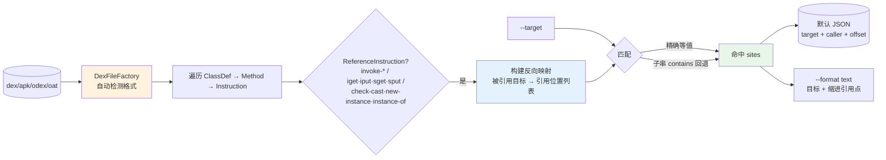

# 🔗 dex-xref — 反向交叉引用查询

`dex-xref` 是 smali-skills 的**反向引用查询**工具：给定一个方法、字段或类型，找出 dex 中所有引用它的位置。它是 `list`（正向列举「有哪些」）的补充——`list` 告诉你「有哪些方法」，`xref` 告诉你「谁调用了这个方法」。支持精确匹配与子串回退，输出 `target + 调用方法 + 字节偏移` 三元组，默认 JSON。

## 🧭 能力与工作流



三个子命令按引用类型分流，互不交叉报告：`callers` 只看 `invoke-*`，`field-refs` 只看字段访问指令，`type-refs` 只看类型引用指令。核心遍历逻辑见 `baksmali/src/main/java/org/jf/baksmali/ReferenceFinder.java`。

## 📦 前置条件

```bash
curl -fsSL -o baksmali.jar https://github.com/android-security-engineer/smali-skills/releases/latest/download/baksmali.jar
```

## 🚀 快速开始

```bash
# 谁调用了某方法（精确匹配）
java -jar baksmali.jar xref callers app.apk --target "Lcom/Example;->foo()V"

# 谁访问了某字段
java -jar baksmali.jar xref field-refs app.apk --target "Lcom/Example;->count:I"

# 谁引用了某类型（check-cast / new-instance / 类型引用）
java -jar baksmali.jar xref type-refs app.apk --target "Lcom/Example;"

# 子串匹配（不记得完整签名时）—— foo()V 会匹配任何含该子串的方法
java -jar baksmali.jar xref callers app.apk --target "foo()V"

# 默认就是 JSON（机器可读）；要人读文本显式 --format text
java -jar baksmali.jar xref callers app.apk --target "Lcom/Example;->foo()V" --format text

# 不指定 --target：列出该类型的所有目标及其引用点
java -jar baksmali.jar xref callers app.apk
```

## 📋 子命令

| 子命令 | 别名 | 匹配的引用类型 |
|--------|------|----------------|
| `callers` | `caller`, `c` | 方法引用（`invoke-*`） |
| `field-refs` | `field-ref`, `f` | 字段引用（`iget`/`iput`/`sget`/`sput`） |
| `type-refs` | `type-ref`, `t` | 类型引用（`check-cast`/`new-instance`/`instance-of` 等） |

## 📤 输出格式

默认 **JSON**（机器可读，面向 Agent / 脚本）。要人读文本加 `--format text`。

文本模式：先输出目标，再缩进列出每个引用点（调用方法 + 字节偏移）：

```
Lcom/Example;->foo()V
  Lcom/App;->onCreate()V @ offset 0x4
  Lcom/App;->onResume()V @ offset 0x10
```

JSON 模式（默认）：

```json
[{"target":"Lcom/Example;->foo()V","sites":[{"caller":"Lcom/App;->onCreate()V","offset":"0x4"}]}]
```

`offset` 是引用指令在方法体内的字节偏移（hex），可用于在反汇编输出中精确定位到具体行。

## 🔬 真实示例：合成访问器

用仓库自带的 `accessorTest.dex` fixture（一个含合成访问器的测试 dex）。其中 `AccessorTypes;->access$072(...)` 是内部类访问外部类私有成员时编译器生成的桥接方法：

```bash
# 默认 JSON 输出：谁调用了这个桥接方法
java -jar baksmali.jar xref callers \
  dexlib2/src/test/resources/accessorTest.dex \
  --target "Lorg/jf/dexlib2/AccessorTypes;->access\$072(Lorg/jf/dexlib2/AccessorTypes;I)Z"
```

实际输出：

```json
[{"target":"Lorg/jf/dexlib2/AccessorTypes;->access$072(Lorg/jf/dexlib2/AccessorTypes;I)Z","sites":[{"caller":"Lorg/jf/dexlib2/AccessorTypes$Accessors;->boolean_and(Z)V","offset":"0x2"}]}]
```

人读文本对照（`--format text`）：

```
Lorg/jf/dexlib2/AccessorTypes;->access$072(Lorg/jf/dexlib2/AccessorTypes;I)Z
  Lorg/jf/dexlib2/AccessorTypes$Accessors;->boolean_and(Z)V @ offset 0x2
```

可以看到 `boolean_and(Z)V` 在偏移 `0x2` 处调用了 `access$072`——这正是内部类访问外部类私有成员的标准编译产物。

## 📐 匹配规则

| 规则 | 说明 |
|------|------|
| 精确匹配优先 | `--target` 值等于格式化后的引用描述符时直接命中 |
| 子串回退 | 无精确匹配时，对每个已知目标做 `contains` 子串匹配；`foo()V` 能匹配 `Lcom/Example;->foo()V`、`Lcom/Other;->foo()V` 等 |
| 类型过滤 | 每个子命令只报告对应引用类型的目标（`callers` 不会报告字段命中） |

## 🎯 适用场景

| 场景 | 命令 |
|------|------|
| 找某 Activity 的所有启动点 | `xref callers --target "->startActivity(...)"` |
| 找某字段的写入点 | `xref field-refs --target "Lcom/Config;->token:Ljava/lang/String;"` |
| 找某类的所有实例化 | `xref type-refs --target "Lcom/Sensitive;"` |
| 找构造函数的所有调用者 | `xref callers --target "-><init>()V"` |
| 找某 SDK 方法的集成点 | `xref callers --target "Lcom/sdk/;->track("` |

## 🔗 与相关 skill 的关系

| Skill | 关系 |
|-------|------|
| [`dex-search`](./dex-search) | `search` 按 **opcode 模式** 正向搜索（找「什么样的指令」）；`xref` 按 **引用目标** 反向查询（找「谁调用了这个方法」）。互补不重叠 |
| [`dex-read`](./dex-read) | `xref` 复用 `dex-read` 的 `DexFileFactory → ClassDef → Method → Instruction` 访问链，叠加反向引用收集 |
| [`dex-list-structure`](./dex-list-structure) | `list` 正向列举「有哪些方法/字段/类型」；`xref` 反向回答「谁引用了它」。正反双向闭环 |

## 🛠️ 工作原理

`xref` 遍历 dex 的所有 `ClassDef → Method → Instruction`，对每条 `ReferenceInstruction` 收集 `(被引用目标 → 引用位置列表)` 的反向映射，再用 `--target` 在已知目标集合上做匹配。详见 `baksmali/src/main/java/org/jf/baksmali/ReferenceFinder.java`。

## 📚 延伸阅读

- [CLI: xref](../cli/xref.md) — `baksmali xref` 子命令完整用法
- [Reference: xref 命令](../reference/baksmali/commands/xref.md) — 命令分发与子命令源码剖析
- [Reference: xref callers](../reference/baksmali/commands/xref-callers.md) — 方法引用反向查询实现
- [Skill: dex-search](./dex-search.md) — 正向 opcode 模式搜索，与本 skill 互补
- [Skill: dex-list-structure](./dex-list-structure.md) — 正向列举，与 xref 构成正反闭环
- [SKILL.md 原文](https://github.com/android-security-engineer/smali-skills/blob/master/skills/dex-xref)
