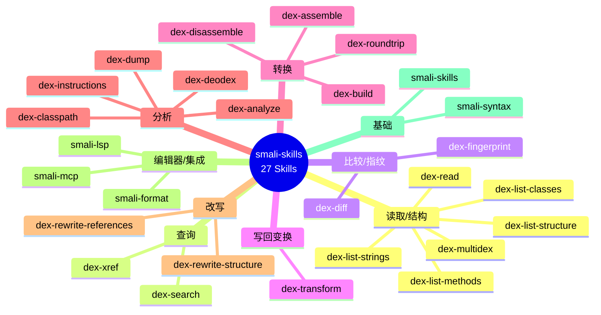
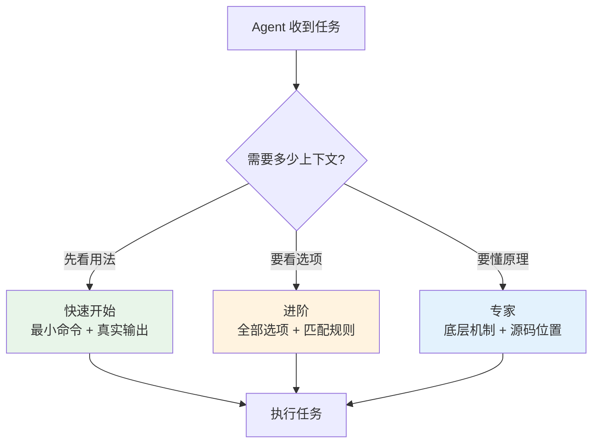

# Skills 索引

27 个 SKILL.md，按「快速开始 / 进阶 / 专家」三层渐进披露，覆盖每个 CLI 能力与 dexlib2 用法，
含真实命令→输出示例，供 AI Agent 按需加载。

## 能力地图



## 读取/结构

浏览 dex 的结构与内容。

| Skill | 作用 |
|-------|------|
| [`dex-read`](https://github.com/android-security-engineer/smali-skills/blob/master/skills/dex-read) | 用 dexlib2 编程读取 dex |
| [`dex-list-structure`](https://github.com/android-security-engineer/smali-skills/blob/master/skills/dex-list-structure) | 多 dex / vtable / 字段偏移 / odex 依赖 |
| [`dex-list-classes`](https://github.com/android-security-engineer/smali-skills/blob/master/skills/dex-list-classes) | 列举类/类型/字段 |
| [`dex-list-methods`](https://github.com/android-security-engineer/smali-skills/blob/master/skills/dex-list-methods) | 列举方法 + 聚合 |
| [`dex-list-strings`](https://github.com/android-security-engineer/smali-skills/blob/master/skills/dex-list-strings) | 列举字符串池 |
| [`dex-multidex`](https://github.com/android-security-engineer/smali-skills/blob/master/skills/dex-multidex) | 多 dex 容器处理 |

## 查询

| Skill | 作用 |
|-------|------|
| [`dex-xref`](https://github.com/android-security-engineer/smali-skills/blob/master/skills/dex-xref) | 反向交叉引用（谁调用了 X） |
| [`dex-search`](https://github.com/android-security-engineer/smali-skills/blob/master/skills/dex-search) | 指令模式搜索（opcode 序列） |

## 比较/指纹

| Skill | 作用 |
|-------|------|
| [`dex-diff`](https://github.com/android-security-engineer/smali-skills/blob/master/skills/dex-diff) | 两个 dex/apk 的语义差异 |
| [`dex-fingerprint`](https://github.com/android-security-engineer/smali-skills/blob/master/skills/dex-fingerprint) | opcode 指纹、库/克隆识别 |

## 写回变换

| Skill | 作用 |
|-------|------|
| [`dex-transform`](https://github.com/android-security-engineer/smali-skills/blob/master/skills/dex-transform) | unlock/replace/strip-debug/patch/callgraph |

## 转换

| Skill | 作用 |
|-------|------|
| [`dex-disassemble`](https://github.com/android-security-engineer/smali-skills/blob/master/skills/dex-disassemble) | 反汇编 dex → smali |
| [`dex-assemble`](https://github.com/android-security-engineer/smali-skills/blob/master/skills/dex-assemble) | 汇编 smali → dex |
| [`dex-roundtrip`](https://github.com/android-security-engineer/smali-skills/blob/master/skills/dex-roundtrip) | 反汇编→修改→重汇编完整工作流 |
| [`dex-build`](https://github.com/android-security-engineer/smali-skills/blob/master/skills/dex-build) | 从零构建 dex |

## 分析

| Skill | 作用 |
|-------|------|
| [`dex-dump`](https://github.com/android-security-engineer/smali-skills/blob/master/skills/dex-dump) | 带注释的十六进制转储 |
| [`dex-analyze`](https://github.com/android-security-engineer/smali-skills/blob/master/skills/dex-analyze) | 寄存器类型推断 |
| [`dex-instructions`](https://github.com/android-security-engineer/smali-skills/blob/master/skills/dex-instructions) | 指令类型与 Opcode 版本 |
| [`dex-classpath`](https://github.com/android-security-engineer/smali-skills/blob/master/skills/dex-classpath) | 类路径解析 |
| [`dex-deodex`](https://github.com/android-security-engineer/smali-skills/blob/master/skills/dex-deodex) | odex 去优化 |

## 改写

| Skill | 作用 |
|-------|------|
| [`dex-rewrite-references`](https://github.com/android-security-engineer/smali-skills/blob/master/skills/dex-rewrite-references) | 引用重映射 |
| [`dex-rewrite-structure`](https://github.com/android-security-engineer/smali-skills/blob/master/skills/dex-rewrite-structure) | 结构改写 |

## 编辑器/集成

| Skill | 作用 |
|-------|------|
| [`smali-lsp`](https://github.com/android-security-engineer/smali-skills/blob/master/skills/smali-lsp) | LSP 语言服务器：诊断/大纲/悬浮 |
| [`smali-format`](https://github.com/android-security-engineer/smali-skills/blob/master/skills/smali-format) | format 格式化 + lint 风格检查 |
| [`smali-mcp`](https://github.com/android-security-engineer/smali-skills/blob/master/skills/smali-mcp) | MCP 服务器：只读 dex 查询暴露为 Agent 工具 |

## 基础

| Skill | 作用 |
|-------|------|
| [`smali-syntax`](https://github.com/android-security-engineer/smali-skills/blob/master/skills/smali-syntax) | smali 语法参考 |
| [`smali-skills`](https://github.com/android-security-engineer/smali-skills/blob/master/skills/smali-skills) | 总索引 |

## 渐进式披露

每个 SKILL.md 按三层组织，Agent 按需加载对应深度：



## 作为 Claude Code 插件使用

```
/plugin marketplace add android-security-engineer/smali-skills
/plugin install smali-skills@smali-skills
```

安装后以 `/smali-skills:<skill>` 调用，例如 `/smali-skills:dex-xref`。详见 [安装](../guide/install)。
