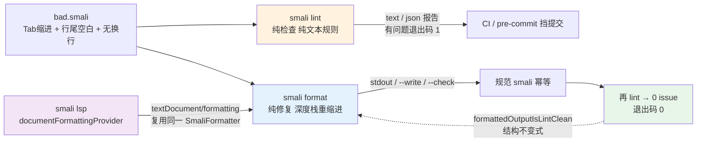

# 🧹 smali-format — smali 源码格式化 + 风格检查

两个**纯文本级**子命令，把 smali 源码整理成规范风格，并在 CI 里挡住不规范提交。核心保证：格式化**不解析字节码、不改语义、幂等**——`format(format(x)) == format(x)`。`lint` 报告的每一条，`format` 都能修掉，两者是同一套风格的「检查端」与「修复端」。

| 子命令 | 作用 |
|--------|------|
| `smali format` | 按块嵌套深度重新缩进（每级 4 空格）、去行尾空白、Tab→空格、折叠多余空行、保证结尾恰好一个换行 |
| `smali lint` | 只报告不修改：行尾空白 / Tab 缩进 / 缩进非 4 倍数 / 连续空行 / CRLF / 缺结尾换行，有问题则退出码 1 |

## 命令关系与工作流



`format` 与 `lint` 共享同一套 `leadingIndentWidth`（Tab 按 4 展开）与块深度模型，因此「修完再 lint 即 0 issue」是结构保证而非巧合。LSP 的 `textDocument/formatting` 复用同一个 `SmaliFormatter`，编辑器里的「Format Document」与本命令走同一条路径。

## 前置条件

`curl -fsSL -o smali.jar https://github.com/android-security-engineer/smali-skills/releases/latest/download/smali.jar`

## format：格式化

```bash
# 打印单个文件的格式化结果到 stdout（不改动文件）
java -jar smali.jar format A.smali

# 就地重写（可传目录，递归所有 .smali）
java -jar smali.jar format --write out/

# CI 模式：不改动，只要有文件未格式化就列出并以退出码 1 失败
java -jar smali.jar format --check out/
```

不带 `--write`/`--check` 时只接受**单个文件**，结果打到 stdout（便于管道/diff）；`--write` 就地重写并末尾打印 `N file(s) changed`；`--check` 适合 CI/pre-commit，打印需格式化的文件路径，任一未格式化则退出 1。

## lint：风格检查

```bash
# 文本报告：path:line:col: [rule] message，有问题则退出码 1
java -jar smali.jar lint out/
# JSON 报告（喂给脚本 / CI 注解）
java -jar smali.jar lint --format json out/
```

文本输出示例：`out/A.smali:5:13: [trailing-whitespace] line has trailing whitespace` / `out/A.smali:5:1: [tab-indentation] ...` / `2 issue(s) across 1 file(s).`。JSON（`--format json`）每条含 `file/line/column/rule/severity/message`，行列均 **1 基**。

### 规则一览

| rule | 含义 |
|------|------|
| `trailing-whitespace` | 行尾有空格 / Tab |
| `tab-indentation` | Tab 缩进（应用空格） |
| `indentation` | 前导缩进非 4 的倍数 |
| `multiple-blank-lines` | 连续 ≥2 空行 |
| `carriage-return` | 行内含 CR（CRLF 行尾） |
| `final-newline` | 文件结尾无换行 |

## 缩进模型（format 怎么判断层级）

- **无条件块开启**：`.method` / `.annotation` / `.subannotation` / `.array-data` / `.packed-switch` / `.sparse-switch` —— 一定有配对 `.end ...`，进入即 +1 层。**条件块开启**：`.field` / `.param` 可能单行也可能带 body，用前向 lookahead 判断（在方法边界 / 同类开启前遇到匹配 `.end` 才算块）。
- `.end ...` 闭合先 -1 层再输出该行，使闭合指令与开启指令对齐；`.local` / `.end local` **不改变**层级（非块分隔符）。

## 真实示例

构造一个含三类风格问题的 smali（Tab 缩进 + 行尾空白 + 无结尾换行，注意第4行 Tab、第5行行尾3空格、文件末尾无换行）：

```bash
printf '.class public LBad;\n.super Ljava/lang/Object;\n.method public static foo()V\n\t.registers 1\nconst/4 v0,0x0   \nreturn-void\n.end method' > bad.smali
```

**lint 文本报告**（默认 `--format text`，有问题则退出码 1）：

```bash
java -jar smali.jar lint bad.smali
```

```
bad.smali:4:1: [tab-indentation] line is indented with a tab; use spaces
bad.smali:5:15: [trailing-whitespace] line has trailing whitespace
bad.smali:7:12: [final-newline] file does not end with a newline
3 issue(s) across 1 file(s).
```

**lint JSON 报告**（`--format json`，喂给 CI 注解 / 脚本）：

```json
[
  {"file":"bad.smali","line":4,"column":1,"rule":"tab-indentation","severity":"warning","message":"line is indented with a tab; use spaces"},
  {"file":"bad.smali","line":5,"column":15,"rule":"trailing-whitespace","severity":"warning","message":"line has trailing whitespace"},
  {"file":"bad.smali","line":7,"column":12,"rule":"final-newline","severity":"warning","message":"file does not end with a newline"}
]
```

**format 修复**（打印到 stdout，对照可见 Tab→4 空格、行尾空白已去、补结尾换行）：

```bash
java -jar smali.jar format bad.smali
```

```smali
.class public LBad;
.super Ljava/lang/Object;
.method public static foo()V
    .registers 1
    const/4 v0,0x0
    return-void
.end method
```

## CI 用法

在 `smali lint --format json` 或 `smali format --check` 上挂一步即可挡下不规范提交：

```bash
java -jar smali.jar format --check src/ || {
  echo "run: java -jar smali.jar format --write src/"; exit 1;
}
```

## 编辑器集成（LSP）

`smali lsp` 已通告 `documentFormattingProvider: true`，`textDocument/formatting` 返回覆盖全文的单个 `TextEdit`（已格式化的文档返回空数组），编辑器里「Format Document」即走这条路径（见 [`smali-lsp`](./smali-lsp)）：`→ textDocument/formatting ← [ { range:{start:{0,0},end:{N,0}}, newText:"…规范化后的整份文本…" } ]`。

## 源码位置

| 组件 | 作用 | 源码 |
|------|------|------|
| 格式化核心 | 纯 `format(String)→String`，深度栈 + 开启 / 闭合集合 + 条件开启 lookahead，无 I/O、幂等 | `smali/src/main/java/org/jf/smali/format/SmaliFormatter.java` |
| 风格检查核心 | 纯 `lint(String)→List<Issue>`，每条规则文本级可判定 | `smali/src/main/java/org/jf/smali/format/SmaliLinter.java` |
| 文件展开 | 路径展开成 `.smali` 文件（目录递归、排序，确定性） | `smali/src/main/java/org/jf/smali/format/SmaliFiles.java` |
| format 子命令 | `--write` / `--check` | `smali/src/main/java/org/jf/smali/SmaliFormatCommand.java` |
| lint 子命令 | `--format text\|json` | `smali/src/main/java/org/jf/smali/SmaliLintCommand.java` |
| LSP 接线 | `textDocument/formatting` 复用 `SmaliFormatter` | `SmaliLanguageServer.formatting(...)` |

`SmaliFormatter` 的块深度逻辑落在主循环：`SmaliFormatter.java:117` 命中 `CLOSERS` 时先 -1 层对齐闭合指令；`SmaliFormatter.java:132` 处理无条件开启（`.method` / `.annotation` 等）直接 +1 层；`SmaliFormatter.java:134` 对条件开启 `.field` / `.param` 调 `hasBlockBody`（`SmaliFormatter.java:166`）前向 lookahead 判断是否有 body 再决定 +1 层。单元测试见 `smali/src/test/java/org/jf/smali/format/`（重缩进、嵌套注解 / 字段块、switch payload、幂等、`formattedOutputIsLintClean` 不变式）与 `smali/src/test/java/org/jf/smali/lsp/`。

## 适用场景

| 场景 | 用法 |
|------|------|
| 手工编辑后的 smali 重新对齐 | `smali format --write out/` |
| CI 挡下不规范提交 | `smali format --check src/` 或 `smali lint --format json src/` |
| 生成 PR 注解 / IDE 风格提示 | `smali lint --format json` 喂给脚本 |
| 统一反汇编输出再入库 | 反汇编后 `format --write` 再提交，避免 diff 噪声 |

## 与相关 skill 的关系

| Skill | 关系 |
|-------|------|
| [`smali-lsp`](./smali-lsp) | 同一 `SmaliFormatter` 在编辑器里的实时「Format Document」 |
| [`smali-syntax`](./smali-syntax) | 手写 smali 的语法参考（格式化不改语法，只调风格） |
| [`dex-disassemble`](./dex-disassemble) | 生成 `.smali` 文本（反汇编输出通常已规范，手工编辑后可再 format） |
| [`dex-assemble`](./dex-assemble) | 把格式化后的 smali 汇编回 dex（format 不改语义，汇编结果不变） |

## 延伸阅读

- [CLI: format 子命令](../cli/format) — `smali format` 完整选项与退出码语义；[CLI: lsp](../cli/lsp) — `documentFormattingProvider` 与编辑器接入
- [smali 语法参考](../internals/smali-syntax) / [skill: smali-syntax](./smali-syntax) — 格式化不改语法，只调风格
- [SKILL.md 原文](https://github.com/android-security-engineer/smali-skills/blob/master/skills/smali-format)
