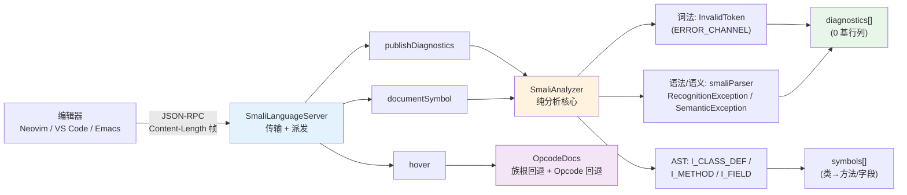

# 🖥️ smali-lsp — smali 语言服务器（LSP）

一个内置于 `smali.jar` 的 **Language Server**，通过 **stdio 上的 JSON-RPC**（标准 `Content-Length` 帧）与编辑器/IDE 通信。它把汇编器自身的词法/语法分析复用为实时能力，无需第三方依赖——在项目已有的 Gson 之上手写协议，未引入 LSP4J 或任何网络栈。

## 能力总览

| LSP 能力 | 效果 |
|----------|------|
| `publishDiagnostics` | 打开/修改文档时推送词法 + 语法 + 语义错误（含行列位置） |
| `textDocument/documentSymbol` | 类 → 方法/字段的层级大纲（方法名带 `(参数)返回类型` 签名） |
| `textDocument/hover` | 光标下 opcode/指令（`.method`、`invoke-virtual`…）的 Markdown 说明 |

`textDocumentSync` 为全量同步（每次改动发送整份文本），故无需增量位置计算。

## 工作流：从编辑器到分析核心



关键设计：**分析核心与传输解耦**——`SmaliAnalyzer` 无 I/O、无状态，可独立单测；传输层只负责帧编解码与请求派发。

## 启动

```bash
# 通过 jar 直接启动（编辑器客户端应以此为 LSP 命令）
java -jar smali.jar lsp

# 或用包装脚本（自动定位同目录的 smali.jar）
scripts/smali-lsp
```

服务器从 stdin 读取、向 stdout 写入，不应交互式运行——由编辑器客户端拉起。终端里直接敲上面命令会「卡住」（实则在等 JSON-RPC 输入），属正常现象。

### 指定 API level

默认 API level 为 15。客户端可在 `initialize` 的 `initializationOptions` 中覆盖，以启用更高版本特有的 opcode/格式校验：

```json
{"initializationOptions": {"apiLevel": 34}}
```

## 编辑器接入

### Neovim（内置 LSP）

```lua
vim.api.nvim_create_autocmd('FileType', {
  pattern = 'smali',
  callback = function(args)
    vim.lsp.start({
      name = 'smali-lsp',
      cmd = { 'java', '-jar', '/path/to/smali.jar', 'lsp' },
      root_dir = vim.fs.dirname(args.file),
      init_options = { apiLevel = 34 },
    })
  end,
})
```

### VS Code

用 `vscode-languageclient` 写一个薄扩展，`serverOptions` 指向
`{ command: 'java', args: ['-jar', '/path/to/smali.jar', 'lsp'] }`，`documentSelector` 设为 `smali`。

## 协议速览（手动验证）

一次最小会话（每条消息都带 `Content-Length` 帧）：

```
→ initialize            ← { capabilities: { documentSymbolProvider, hoverProvider, textDocumentSync:1 } }
→ initialized (notif)
→ textDocument/didOpen   ← textDocument/publishDiagnostics（notif，含 diagnostics[]）
→ textDocument/documentSymbol ← [ { name:"Lcom/E;", kind:5, children:[…] } ]
→ textDocument/hover     ← { contents: { kind:"markdown", value:"**return-void** …" } }
→ shutdown               ← null
→ exit (notif)
```

### 真实诊断输出

诊断示例（缺少 `.super` 时）：

```json
{"uri":"file:///F.smali","diagnostics":[
  {"range":{"start":{"line":0,"character":0},"end":{"line":0,"character":0}},
   "severity":1,"source":"smali","message":"The file must contain a .super directive"}]}
```

> 位置为 **0 基**（LSP 约定）：`line:0` 是第一行。底层 ANTLR 报的是 1 基行号，服务器已在输出时减 1。

## 源码位置

| 组件 | 作用 | 源码 |
|------|------|------|
| 分析核心 | 诊断 + 大纲，无 I/O 无状态 | `smali/src/main/java/org/jf/smali/lsp/SmaliAnalyzer.java` |
| 悬浮文档 | 精选 opcode 说明 + 族根回退 + `Opcode` 通用回退 | `smali/src/main/java/org/jf/smali/lsp/OpcodeDocs.java` |
| 传输/派发 | `Content-Length` 帧读写 + 请求路由 | `smali/src/main/java/org/jf/smali/lsp/SmaliLanguageServer.java` |
| 子命令入口 | `smali lsp` | `smali/src/main/java/org/jf/smali/LspCommand.java` |

`SmaliAnalyzer.diagnostics(source)` 收集 `ERROR_CHANNEL` 上的 `InvalidToken`（词法）与子类化 `smaliParser` 捕获的 `RecognitionException`/`SemanticException`（语法/语义）；`documentSymbols(source)` 遍历 `I_CLASS_DEF`/`I_METHOD`/`I_FIELD` AST 节点。`OpcodeDocs` 对未精确命中的 opcode 走「族根回退」（`iget-object` 复用 `iget` 说明），再退到 dexlib2 `Opcode` 校验的通用描述。

单元测试见 `smali/src/test/java/org/jf/smali/lsp/`（`SmaliAnalyzerTest` 分析、`OpcodeDocsTest` 文档、`SmaliLanguageServerTest` 帧编解码 + 端到端 stdio 派发）。

## 适用场景

| 场景 | 用法 |
|------|------|
| 编辑器里实时查 smali 语法错误 | `java -jar smali.jar lsp` 作为 LSP 命令接入 |
| 大型 `.smali` 文件快速定位方法 | `documentSymbol` 大纲，方法名带签名 |
| 忘记 opcode 语义 | 光标悬浮 `invoke-virtual`/`iget-object` 看 Markdown |
| 校验针对高版本 API 的 smali | `init_options.apiLevel = 34` |
| CI/脚本里做语法检查 | 直接复用 `SmaliAnalyzer.diagnostics` 单测入口 |

## 与相关 skill 的关系

| Skill | 关系 |
|-------|------|
| [`smali-syntax`](./smali-syntax) | 手写 smali 时的语法参考——本 LSP 诊断的正是这套语法 |
| [`dex-assemble`](./dex-assemble) | 把 LSP 辅助编辑后的 smali 重新汇编回 dex |
| [`dex-disassemble`](./dex-disassemble) | 从 dex/apk 生成可供本 LSP 编辑的 `.smali` 文本 |

## 延伸阅读

- [CLI: lsp 子命令](../cli/lsp) — `smali lsp` 启动与通告能力一览
- [smali 语法参考](../internals/smali-syntax) — LSP 诊断所依据的词法/语法规范
- [CLI: assemble](../cli/assemble) — 编辑完成后的汇编回 dex
- [SKILL.md 原文](https://github.com/android-security-engineer/smali-skills/blob/master/skills/smali-lsp)
