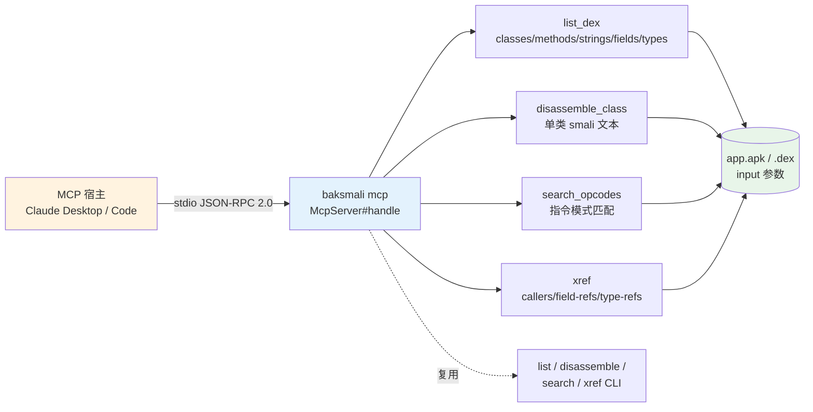

# 🔌 smali-mcp — 把 baksmali 只读查询暴露为 MCP 工具

`baksmali mcp` 启动一个 **Model Context Protocol** 服务器（stdio 上的 JSON-RPC 2.0），把 baksmali 的只读 dex 查询能力包装成 MCP **tools**，让支持 MCP 的 AI Agent 宿主（Claude Desktop、IDE agent 等）**直接调用**，而不必自己 shell 出去再正则解析文本。

- **传输**：逐行 JSON（一行一个 JSON-RPC 消息）over stdin/stdout —— MCP 在 stdio 上最常用的帧格式。
- **零依赖**：无第三方 MCP/JSON-RPC 库，协议手写在项目已有的 Gson 上（与 `smali lsp` 同一思路）。
- **路径即参数**：待检查的 dex/apk **不在命令行给**，而是每次 `tools/call` 时用 `input` 参数传路径——一个常驻进程可服务任意多个文件。

## 🧭 能力与工作流



工具实现复用现有能力：`list_dex` 复用 `output/JsonOutput` 的 schema，`search_opcodes` 复用 `PatternSearcher`，`xref` 复用 `ReferenceFinder`，`disassemble_class` 复用 `Adaptors/ClassDefinition` + `BaksmaliWriter`——与对应 CLI 子命令输出一致。

## 📦 前置条件

```bash
curl -fsSL -o baksmali.jar https://github.com/android-security-engineer/smali-skills/releases/latest/download/baksmali.jar
```

## 🚀 启动

```bash
java -jar baksmali.jar mcp            # 由 MCP 宿主拉起（不用于交互式手敲）
java -jar baksmali.jar mcp -a 30      # 指定 API level（影响反汇编输出/opcode 集）
```

### 接入 Claude Desktop

在 `claude_desktop_config.json` 的 `mcpServers` 中加入：

```json
{
  "mcpServers": {
    "baksmali": {
      "command": "java",
      "args": ["-jar", "/absolute/path/to/baksmali.jar", "mcp"]
    }
  }
}
```

重启宿主后，agent 即可看到并调用下列工具。Claude Code 则在 `.mcp.json` 中按同样结构注册。

## 🛠️ 暴露的工具（全部只读）

| 工具 | 参数 | 返回 | 对应 CLI |
|------|------|------|---------|
| `list_dex` | `input`（必填）、`type`=classes\|methods\|strings\|fields\|types（默认 classes） | JSON 数组 | `list` |
| `disassemble_class` | `input`、`class`（如 `Lcom/example/Foo;`） | 该类的 smali 文本 | `disassemble` |
| `search_opcodes` | `input`、`opcode`（如 `const-string,invoke-virtual`，`*` 匹配任意单条） | 命中方法列表 | `search` |
| `xref` | `input`、`target`、`kind`=callers\|field-refs\|type-refs（默认 callers） | 反向引用点列表 | `xref` |

工具执行错误（找不到类、参数缺失等）以 `isError: true` 的正常结果返回（MCP 约定），不是协议级错误——agent 能读到人类可读的错误文本并自我纠正。每个工具都带 JSON-Schema `inputSchema`，宿主据此校验/提示参数。

## 📡 协议速览

```
→ initialize                 ← {protocolVersion, capabilities:{tools}, serverInfo}
→ notifications/initialized  （通知，无响应）
→ tools/list                 ← {tools:[{name, description, inputSchema}]}
→ tools/call {name, arguments} ← {content:[{type:"text", text}], isError}
→ ping                       ← {}
```

## 🧪 手动冒烟测试（不接宿主）

直接把 JSON-RPC 行喂给 stdin 即可验证：

```bash
{
  echo '{"jsonrpc":"2.0","id":1,"method":"initialize","params":{}}'
  echo '{"jsonrpc":"2.0","id":2,"method":"tools/list"}'
  echo '{"jsonrpc":"2.0","id":3,"method":"tools/call","params":{"name":"list_dex","arguments":{"input":"app.apk","type":"methods"}}}'
} | java -jar baksmali.jar mcp
```

## 🎯 适用场景

| 场景 | 价值 |
|------|------|
| Agent 侦察陌生 APK | `list_dex`→`search_opcodes`→`xref`→`disassemble_class` 全程结构化 JSON |
| 多文件会话 | 一个 `mcp` 进程反复 `tools/call` 指向不同 `input`，跨样本对比 |
| 防 Agent 误改 dex | 只读工具集，无 unlock/replace/patch 写回变换 |
| 可注入测试 | `Function<String,DexFile>` loader，内存 fixture 端到端验证 |
| 零文本解析 | 返回 JSON 非 smali 文本，agent 无需正则 |

## 🔗 与相关 skill 的关系

| Skill / CLI | 关系 |
|-------------|------|
| [`dex-list-classes`](./dex-list-classes) | `list_dex` 的 skill 层等价，CLI 即 `list` |
| [`dex-search`](./dex-search) | `search_opcodes` 复用 `PatternSearcher` |
| [`dex-xref`](./dex-xref) | `xref` 工具复用 `ReferenceFinder` |
| [`dex-dump`](./dex-dump) / [`dex-read`](./dex-read) | 工具底层遍历共享的读侧能力 |
| [`dex-diff`](./dex-diff) / [`dex-fingerprint`](./dex-fingerprint) | 多文件会话中常配合做跨样本对比 |
| [`smali-lsp`](./smali-lsp) | 同为 Gson 手写协议，编辑器内写 smali 用 LSP |

## 🏗️ 底层机制

协议层 `org.jf.baksmali.mcp.McpServer#handle(JsonObject)` 见 `baksmali/src/main/java/org/jf/baksmali/mcp/McpServer.java:182`——纯函数、无副作用、可单测；`tools/list` 在 `:194`，`tools/call` 在 `:196`，四工具注册在 `:230`–`:246`。dex 加载走一个可注入的 `Function<String,DexFile>`（`:103`，默认 `DexFileFactory.loadDexFile`，`:130`），测试用内存 fixture 即可端到端验证工具。错误以 `isError` 标记的正常结果返回，构造见 `toolResult` `:505`。

## 📚 延伸阅读

- [CLI: mcp](../cli/mcp.md) — `baksmali mcp` 子命令速览
- [CLI: list](../cli/list.md) / [search](../cli/search.md) / [xref](../cli/xref.md) / [disassemble](../cli/disassemble.md) — 各工具对应的 CLI 等价物
- [Skill: dex-read](./dex-read.md) — 工具底层共享的 dexlib2 读侧能力
- [Skill: smali-lsp](./smali-lsp.md) — 同思路手写协议的 LSP 服务器
- [SKILL.md 原文](https://github.com/android-security-engineer/smali-skills/blob/master/skills/smali-mcp)
