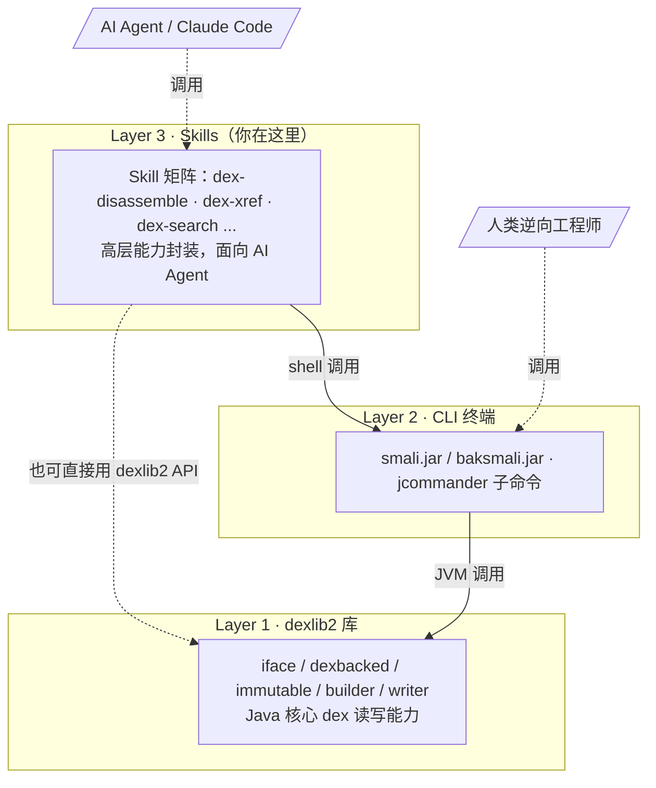

# 🧰 smali-skills — Android dex 字节码工具集

> Android Dalvik 字节码的**汇编 / 反汇编 / 分析 / 变换**工具集，底层基于 smali / baksmali / dexlib2，上层封装为面向 AI Agent 的 Skill 矩阵。源码入口：`skills/smali-skills:1`。

## 三层架构



三层各司其职：**dexlib2** 提供零拷贝读写；**CLI** 把能力暴露为子命令；**Skills** 按「你想做什么」重组子命令，并补齐 AI 友好的输出（JSON 默认、结构化分组）。

## 安装与启用

本仓库即一个 Claude Code marketplace，技能从 `skills/*/SKILL.md` 自动发现：

```bash
# 插件（Skill 矩阵）
/plugin marketplace add android-security-engineer/smali-skills
/plugin install smali-skills@smali-skills   # 之后以 /smali-skills:<skill> 调用

# CLI jar（一键安装，仍需另装）
curl -fsSL https://github.com/android-security-engineer/smali-skills/releases/latest/download/install.sh | bash
```

环境变量与典型调用：

```bash
export SMALI_JAR="$HOME/.local/share/smali-skills/smali.jar"
export BAKSMALI_JAR="$HOME/.local/share/smali-skills/baksmali.jar"
java -jar $SMALI_JAR assemble -o out.dex src/ && java -jar $BAKSMALI_JAR disassemble -o out app.apk
```

## Skill 索引（渐进式披露）

按使用频率与门槛分三层，Agent 按需逐层加载上下文。

### 🟢 快速入门 — 最常用操作

| 你想做什么 | Skill | 快速命令 |
|-----------|-------|---------|
| 反汇编 dex/apk → smali | `dex-disassemble` | `java -jar baksmali.jar d -o out app.apk` |
| smali → dex | `dex-assemble` | `java -jar smali.jar a -o out.dex src/` |
| 浏览字符串 / 方法 / 类 | `dex-list-*` | `baksmali.jar l s\|m\|c app.apk` |
| 谁调用了某方法 | `dex-xref` | `baksmali.jar xref callers --target "Lc;->foo()V" app.apk` |
| 搜索指令序列 | `dex-search` | `baksmali.jar search --opcode const-string,invoke-virtual app.apk` |
| 编辑器内诊断/大纲/悬浮 | `smali-lsp` | `java -jar smali.jar lsp` |
| 把 dex 查询暴露给 Agent | `smali-mcp` | `java -jar baksmali.jar mcp` |
| 格式化 / 风格检查 | `smali-format` | `smali.jar format --write out/` · `... lint out/` |
| 反汇编→修改→重汇编 | `dex-roundtrip` | 见下方工作流 |

### 🟡 进阶 — 分析与变换 / 🔴 专家级

| 你想做什么 | Skill | 说明 |
|-----------|-------|------|
| 去 odex（使可重汇编） | `dex-deodex` | 优化指令还原为标准指令 |
| 寄存器类型推断 | `dex-analyze` | 追踪寄存器在指令间的类型变化 |
| 重命名/重映射类型与引用 | `dex-rewrite-references` | 混淆/反混淆、API 重定向 |
| 修改方法体/注解/调试信息 | `dex-rewrite-structure` | 结构性元素变换 |
| 多 dex 处理 | `dex-multidex` | 指定 APK 中特定 dex 条目 |
| 类路径配置 | `dex-classpath` | deodex/分析所需框架依赖 |
| 二进制结构转储 | `dex-dump` | 带注释的十六进制转储 |
| vtable/偏移/依赖 | `dex-list-structure` | 虚方法表、字段偏移、odex 依赖 |
| smali 语法参考 | `smali-syntax` | 指令、类型描述符 |
| 用 dexlib2 读/建 dex | `dex-read` / `dex-build` | 数据模型遍历 / 从零构建 |
| 指令与 Opcode 版本 | `dex-instructions` | 指令接口、格式、版本映射 |

## 真实命令 → 输出示例

### 反汇编 → 修改 → 重汇编

```bash
java -jar baksmali.jar d -o smali_out app.apk      # 1. 反汇编
vim smali_out/com/example/Main.smali               # 2. 修改
java -jar smali.jar a -o modified.dex smali_out/   # 3. 重汇编
```

输出按类路径写文件：`smali_out/com/example/{Main,R$layout}.smali`。

### odex → 可编辑 smali

```bash
java -jar baksmali.jar deodex -o smali_out \
  -b /system/framework/boot.oat app.odex           # 需 boot.oat 框架
java -jar smali.jar a -o modified.dex smali_out/
```

### 列举方法（默认 JSON，机器可读）

```bash
java -jar baksmali.jar l m app.apk
```

```json
[
  {"class":"Lcom/example/Main;","method":"onCreate","descriptor":"(Landroid/os/Bundle;)V"}
]
```

配合 `--count` 仅得总数、`--group-by class` 按定义类分组 —— 专为 Agent 解析设计。`--format text` 切回人读。

### 反向交叉引用：谁调用了某方法

```bash
java -jar baksmali.jar xref callers \
  --target "Lcom/example/Main;->login(Ljava/lang/String;Ljava/lang/String;)V" app.apk
```

```json
[
  {"caller_class":"Lcom/example/AuthActivity;","caller_method":"onClick",
   "caller_descriptor":"(Landroid/view/View;)V"}
]
```

### 快速侦察 APK

```bash
java -jar baksmali.jar l s app.apk | grep "key"   # 字符串关键字
java -jar baksmali.jar l c app.apk                 # 列类
java -jar baksmali.jar l m app.apk | grep "login" # 列方法
java -jar baksmali.jar l d multi_dex.apk          # 多 dex 条目
```

## 适用场景

| 场景 | 推荐路径 |
|------|---------|
| 修改 APK 某方法逻辑 | `dex-disassemble`→编辑→`dex-assemble`（`dex-roundtrip`） |
| 分析被 odex 优化的系统应用 | `dex-deodex` + `dex-classpath` |
| 追踪某 API 调用方（漏洞/脱壳） | `dex-xref callers` |
| 定位加密字符串/密钥 | `dex-list-strings` + grep（默认 JSON） |
| 识别第三方库/克隆应用 | `dex-fingerprint` |
| 比较两版本 APK 字节码差异 | `dex-diff` |
| 让 LLM 直接查询 dex | `smali-mcp`（MCP over stdio） |
| smali 源码质量管控 | `smali-format` lint + `smali-lsp` |

## baksmali 子命令速查

| 子命令（别名） | 用途 | 关联 Skill |
|---------------|------|-----------|
| `disassemble`(`d`) / `deodex`(`x`) | 反汇编 / 去 odex | `dex-disassemble` / `dex-deodex` |
| `dump`(`du`) / `list`(`l`) | 转储 / 列举 | `dex-dump` / `dex-list-*` |
| `xref` / `search`(`find`) | 交叉引用 / 模式搜索 | `dex-xref` / `dex-search` |
| `diff` / `fingerprint`(`fp`) | 差异 / 指纹识别 | `dex-diff` / `dex-fingerprint` |
| `unlock`·`replace`·`patch`·`strip-debug`·`callgraph` | 批量变换 | `dex-transform` |

`list` 的 `classes`/`methods`/`strings`/`fields`/`types` 默认 JSON；`list dex`/`vtables`/`fieldoffsets`/`dependencies` 为纯文本，无 `--format`。

## 延伸阅读

- 安装与启用：[安装指南](../guide/install.md) · [快速上手](../guide/quickstart.md)
- 三层架构详解：[架构](../guide/architecture.md)
- 往返工作流：[反汇编 ↔ 汇编往返](../guide/roundtrip.md) · [dex-roundtrip](./dex-roundtrip.md)
- 查询能力：[查询与交叉引用](../guide/query.md) · [dex-xref](./dex-xref.md) · [dex-search](./dex-search.md)
- 写回变换：[写回变换](../guide/transform.md) · [dex-transform](./dex-transform.md)
- Agent 集成：[Agent 集成](../guide/agent-integration.md) · [MCP CLI](../cli/mcp.md)
- CLI 速查：[disassemble](../cli/disassemble.md) · [list](../cli/list.md) · [xref](../cli/xref.md) · [search](../cli/search.md) · [fingerprint](../cli/fingerprint.md) · [transform](../cli/transform.md)
- 逆向工程实战：[逆向工程](../guide/reverse-engineering.md) · [安全分析](../guide/security-analysis.md)
