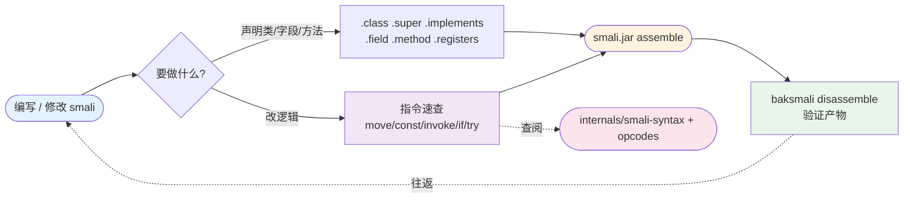

# 📝 smali-syntax — smali 语法参考与编写

smali 是 Jasmin/dedexer 风格的 dex 汇编语言：一个 `.smali` 文件即一个类，文件路径与类描述符一一对应（`src/com/example/Main.smali` → `Lcom/example/Main;`）。本 skill 是「写 / 改 smali」时的随身语法手册——覆盖文件结构、声明指令、寄存器映射、Dalvik 指令分类与类型描述符，配合 [`dex-assemble`](./dex-assemble) 把文本汇编成可被 ART 加载的 dex。回路很简单：**写 → assemble → disassemble 验证 → 回写**；指令细节不明确时下钻到 [`internals/smali-syntax`](../internals/smali-syntax) 的规范手册与 [`opcodes`](../internals/opcodes) 的 opcode 表。

## 能力与工作流



## 文件结构与类声明

```smali
.class public Lcom/example/Main;        # 必须在第一行
.super Ljava/lang/Object;               # 紧随 .class
.implements Lcom/example/Iface;         # 可多个
.source "Main.java"                     # 可选，调试用
```

文件路径 ↔ 类名：`src/com/example/Main.smali` → `Lcom/example/Main;`。最小类模板只需 `.class`+`.super`+`<init>`。

### 访问标志

| 标志 | 值 | 说明 |
|------|-----|------|
| `public` / `private` / `protected` | 0x01 / 0x02 / 0x04 | 访问控制 |
| `static` / `final` / `abstract` | 0x08 / 0x10 / 0x400 | 修饰 |
| `interface` / `enum` / `synthetic` | 0x200 / 0x4000 / 0x1000 | 类型标记 |

## 字段与方法

```smali
.field private mName:Ljava/lang/String;                       # 实例字段
.field public static final MAX_COUNT:I = 0x64                 # 带初值的静态字段

.method public constructor <init>(Ljava/lang/String;)V
    .registers 3                          # 总寄存器数（或 .locals）
    invoke-direct {p0}, Ljava/lang/Object;-><init>()V
    iput-object p1, p0, Lcom/example/Main;->mName:Ljava/lang/String;
    return-void
.end method

.method public static main([Ljava/lang/String;)V
    .registers 2
    sget-object v0, Ljava/lang/System;->out:Ljava/io/PrintStream;
    const-string v1, "Hello"
    invoke-virtual {v0, v1}, Ljava/io/PrintStream;->println(Ljava/lang/String;)V
    return-void
.end method
```

### 寄存器映射

`.registers N` 声明总寄存器数；`.locals L` 声明局部寄存器数（参数寄存器靠后）。非 static 方法 `p0 = this`，wide 类型（`J`/`D`）占两个寄存器：

```
.registers 4, 方法签名 foo(IJ)V (非static)
  v0/p0 = this          (Ljava/lang/Object;)
  v1/p1 = arg1          (I)
  v2,v3/p2,p3 = arg2    (J, wide=2寄存器)
```

> 算寄存器最易出错：参数总宽 = `this? + ΣargWidth`，`N ≥ locals + 参数总宽`。源码映射见 `baksmali` 的 `MethodDefinition` / `RegisterFormatter`。

## 指令分类速查

```smali
# 移动 / 取返回值
move-object v0, v1            # 对象移动
move-result-object v0         # 取前一个 invoke 的对象返回值
# 常量
const/4 v0, 0x5               # 4位常量 (-8 ~ 7)
const/16 v0, 0x100            # 16位常量
const-string v0, "text"       # 字符串常量
const-class v0, Lcom/Foo;     # 类引用
# 字段访问
iget v0, v1, Lcom/Foo;->bar:I                # 实例字段读
iput-object v0, v1, Lcom/Foo;->bar:Ljava/lang/String;
sget v0, Lcom/Foo;->bar:I                    # 静态字段读
sput v0, Lcom/Foo;->bar:I
# 方法调用
invoke-virtual {v0, v1}, Lcom/Foo;->bar(I)V  # 虚方法
invoke-direct {v0}, Lcom/Foo;-><init>()V     # 构造/private
invoke-static {v0}, Lcom/Foo;->bar(I)V       # 静态
invoke-interface {v0, v1}, Lcom/Foo;->bar(I)V# 接口
invoke-super {v0, v1}, Lcom/Foo;->bar(I)V    # 父类
# 算术 / 比较 / 跳转
add-int/lit8 v0, v1, 0x1      # v0 = v1 + 1
cmp-long v0, v1, v2           # v0 = (v1<v2)?-1:((==)?0:1)
if-eqz v0, :cond_0            # if (v0 == 0) goto :cond_0
if-lt v0, v1, :cond_0         # if (v0 < v1)
# try/catch
.try-start
    invoke-virtual {v0}, Lcom/Foo;->bar()V
.try-end
.catch Ljava/lang/Exception; { :try-start .. :try-end } :catch-handler
```

每条指令的寄存器元数与格式（`35c` / `3rc` / `22b` …）权威清单见 [`dex-instructions`](./dex-instructions) 与 [`internals/opcodes`](../internals/opcodes)。

## 类型描述符

| Smali | Java | Smali | Java |
|-------|------|-------|------|
| `V`/`Z`/`B`/`S`/`C`/`I` | void/boolean/byte/short/char/int | `J`/`F`/`D` | long/float/double |
| `Lcom/Foo;` | 对象 | `[I` / `[[B` | int[] / byte[][] |

类描述符以 `L` 开头、`;` 结尾，包名用 `/` 分隔；数组每加一维前置一个 `[`。

## 真实命令 → 输出

把 `examples/HelloWorld/` 的 smali 汇编成 dex，再反汇编验证语法往返：

```bash
# 1) 汇编（无输出即成功）
$ java -jar smali.jar assemble -o /tmp/hello.dex examples/HelloWorld/
$ ls -l /tmp/hello.dex
-rw-r--r-- 1 ... 652 ... /tmp/hello.dex

# 2) 反汇编验证 —— 取回的 smali 与源码逻辑等价
$ java -jar baksmali.jar disassemble -o /tmp/verified /tmp/hello.dex
$ head -3 /tmp/verified/HelloWorld.smali
.class public LHelloWorld;
.super Ljava/lang/Object;
.method public static main([Ljava/lang/String;)V  # .registers 2 → sget/const/invoke/return-void
```

源文件 `examples/HelloWorld/HelloWorld.smali`；汇编管线 `lexer → parser → tree walker → DexBuilder` 见 [`reference/smali/assembly-pipeline`](../reference/smali/assembly-pipeline)。

## 适用场景

| 场景 | 为什么查 smali-syntax |
|------|----------------------|
| 手写可运行的最小 dex / 教学复现字节码 | `.class/.method/.registers` 模板即抄即用；类型描述符表+方法签名拼接 |
| 修改 APK 反汇编出的 smali 后回写 | 改指令前确认助记符、寄存器映射与 wide 占位 |
| 复现/调试某条 Dalvik 指令 | 按分类速查（move/const/invoke/if/try）定位写法 |

> `examples/` 目录提供现成范本：`HelloWorld/`（最小程序）、`AnnotationTypes/`+`AnnotationValues/`（注解）、`Enums/`、`Interface/`、`InvokeCustom/`（Lambda/MethodHandle）、`MethodOverloading/`、`BracketedMemberNames/`（括号成员名）。

## 与相关 skill 的关系

| Skill | 关系 |
|-------|------|
| [dex-assemble](./dex-assemble) | 写完 smali 后用 `assemble` 汇编成 dex；本 skill 是其「语法侧」前置 |
| [dex-disassemble](./dex-disassemble) | 取 dex → smali 文本；本 skill 是其产物的「阅读/编辑侧」 |
| [dex-instructions](./dex-instructions) | 指令格式与寄存器元数权威表，写 smali 时的下钻参考 |
| [smali-format](./smali-format) | 把手写 smali 重新缩进、规范化，与本 skill 的「写对」互补 |
| [smali-lsp](./smali-lsp) | 编辑器内实时诊断 smali 语法错误，本 skill 是其规则来源 |
| [dex-roundtrip](./dex-roundtrip) | 反汇编→改→重汇编工作流，改这一步依赖本 skill 的语法 |

## 延伸阅读

- [CLI: smali assemble](../cli/assemble) — 把 `.smali` 汇编为 dex 的命令
- [CLI: baksmali disassemble](../cli/disassemble) — dex → smali 文本，验证编写结果
- [CLI: smali format / lint](../cli/format) — 规范化与 CI 检查手写 smali
- [CLI: smali lsp](../cli/lsp) — 编辑器内语法诊断、大纲、悬浮
- [内幕: smali 语法参考](../internals/smali-syntax) — 类型描述符/指令/寄存器的规范手册
- [内幕: Opcode 参考](../internals/opcodes) — 助记符、操作码、格式与版本支持
- [参考: 汇编流水线](../reference/smali/assembly-pipeline) — lexer→parser→tree walker→DexBuilder
- [指南: 反汇编↔汇编往返](../guide/roundtrip) — 修改-重汇编完整工作流
- [SKILL.md 原文](https://github.com/android-security-engineer/smali-skills/blob/master/skills/smali-syntax)
